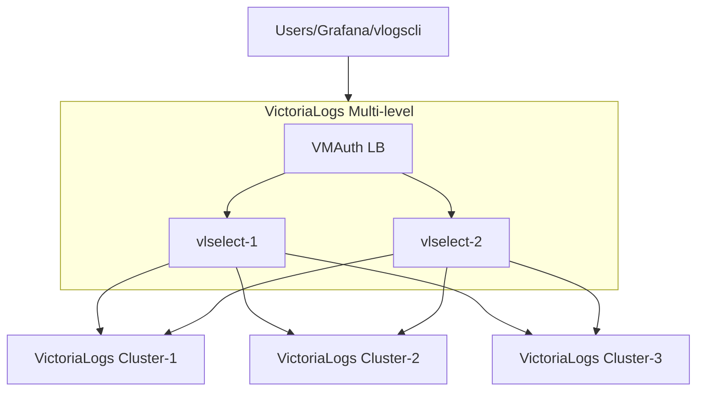

---
weight: 2
title: VictoriaLogs Multilevel
menu:
  docs:
    parent: helm
    weight: 18
    identifier: helm-victoria-logs-multilevel
url: /helm/victoria-logs-multilevel/
aliases:
  - /helm/victorialogs-multilevel/
tags:
  - logs
  - kubernetes
---


The VictoriaLogs multilevel Helm chart deploys global read for multiple storage groups.

## Prerequisites

Before installing this chart, ensure your environment meets the following requirements:

* **Kubernetes cluster** - A running Kubernetes cluster with sufficient resources
* **Helm** - Helm package manager installed and configured

Additional requirements depend on your configuration:

* **Persistent storage** - Required if you enable persistent volumes for data retention (enabled by default)
* **kubectl** - Needed for cluster management and troubleshooting

For installation instructions, refer to the official documentation:
* [Installing Helm](https://helm.sh/docs/intro/install/)
* [Installing kubectl](https://kubernetes.io/docs/tasks/tools/install-kubectl/)

## Quick start

The chart deploys VictoriaLogs read entrypoint for [multi-level cluster setup](https://docs.victoriametrics.com/victorialogs/cluster/#multi-level-cluster-setup).
It deploys the following components according to [VictoriaLogs cluster architecture](https://docs.victoriametrics.com/victorialogs/cluster/#architecture):

- [`vmauth`](https://docs.victoriametrics.com/victoriametrics/vmauth/) provides request balancing across `vlselect` instances
- `vlselect` provides "global querying view" [HTTP APIs](https://docs.victoriametrics.com/victorialogs/querying/#http-api) across
  the configured VictoriaLogs `selectNode` addresses of VictoriaLogs instances (both [single-node](https://docs.victoriametrics.com/helm/victoria-logs-single/)
  and [cluster](https://docs.victoriametrics.com/helm/victoria-logs-cluster/) can be queried at the same time).

Here is a typical architecture deployed by this chart:



The chart requires setting the list of VictoriaLogs addresses to query in order to get global querying view
according to [multi-level VictoriaLogs setup](https://docs.victoriametrics.com/victorialogs/cluster/#multi-level-cluster-setup).
The list of these addresses must be set via `.Values.storageNodes` option.

Let's deploy multilevel VictoriaLogs chart that queries three VictoriaLogs clusters deployed via [victoria-logs-cluster Helm chart](https://docs.victoriametrics.com/helm/victoria-logs-cluster/):
- `vl-cluster-1:8427`
- `vl-cluster-2:8427`
- `vl-cluster-3:8427`

```sh
export NAMESPACE=logging

# Install victoria-logs-multicluster chart
helm install vlm vm/victoria-logs-multilevel --namespace $NAMESPACE --wait \
    --set "storageNodes={vl-cluster-1:8427,vl-cluster-2:8427,vl-cluster-3:8427}"
```

The chart listens at `http://vlm-victoria-logs-multilevel-vmauth.logging.svc.cluster.local:8427` for incoming queries according
to [HTTP querying APIs for VictoriaLogs](https://docs.victoriametrics.com/victorialogs/querying/#http-api).

You can use this address as Data Source URL in Grafana.
The vmui interface is available at: `http://vlm-victoria-logs-multilevel-vmauth.logging.svc.cluster.local:8427/select/vmui/`.

To uninstall these charts, run: `helm uninstall vlm collector`.

For finer control and easier maintenance, it is recommended to set these
values in a separate `values` file and use it during installation.
See [how to install victoria-logs-single](https://docs.victoriametrics.com/helm/victoria-logs-single/#install-victoria-logs-single-chart) for an example.
You can do this later if you want to configure more settings than shown in the default example.

## How to install

Access a Kubernetes cluster.

### Setup chart repository (can be omitted for OCI repositories)

Add a chart helm repository with follow commands:

```console
helm repo add vm https://victoriametrics.github.io/helm-charts/

helm repo update
```
List versions of `vm/victoria-logs-multilevel` chart available to installation:

```console
helm search repo vm/victoria-logs-multilevel -l
```

### Install `victoria-logs-multilevel` chart

Export default values of `victoria-logs-multilevel` chart to file `values.yaml`:

  - For HTTPS repository

    ```console
    helm show values vm/victoria-logs-multilevel > values.yaml
    ```
  - For OCI repository

    ```console
    helm show values oci://ghcr.io/victoriametrics/helm-charts/victoria-logs-multilevel > values.yaml
    ```

Change the values according to the need of the environment in ``values.yaml`` file.

> Consider setting `.Values.nameOverride` to a small value like `vlm` to avoid hitting resource name limits of 63 characters

Test the installation with command:

  - For HTTPS repository

    ```console
    helm install vlm vm/victoria-logs-multilevel -f values.yaml -n NAMESPACE --debug
    ```

  - For OCI repository

    ```console
    helm install vlm oci://ghcr.io/victoriametrics/helm-charts/victoria-logs-multilevel -f values.yaml -n NAMESPACE --debug
    ```

Install chart with command:

  - For HTTPS repository

    ```console
    helm install vlm vm/victoria-logs-multilevel -f values.yaml -n NAMESPACE
    ```

  - For OCI repository

    ```console
    helm install vlm oci://ghcr.io/victoriametrics/helm-charts/victoria-logs-multilevel -f values.yaml -n NAMESPACE
    ```

Get the pods lists by running this commands:

```console
kubectl get pods -A | grep 'vlm'
```

Get the application by running this command:

```console
helm list -f vlm -n NAMESPACE
```

See the history of versions of `vlm` application with command.

```console
helm history vlm -n NAMESPACE
```

## How to uninstall

Remove application with command.

```console
helm uninstall vlm -n NAMESPACE
```

## Documentation of Helm Chart

Install ``helm-docs`` following the instructions on this [tutorial](https://docs.victoriametrics.com/helm/requirements/).

Generate docs with ``helm-docs`` command.

```bash
cd charts/victoria-logs-multilevel

helm-docs
```

The markdown generation is entirely go template driven. The tool parses metadata from charts and generates a number of sub-templates that can be referenced in a template file (by default ``README.md.gotmpl``). If no template file is provided, the tool has a default internal template that will generate a reasonably formatted README.

## Parameters

The following tables lists the configurable parameters of the chart and their default values.

Change the values according to the need of the environment in ``victoria-logs-multilevel/values.yaml`` file.

<table class="helm-vars">
  <thead>
    <th class="helm-vars-key">Key</th>
    <th class="helm-vars-description">Description</th>
  </thead>
  <tbody>
    <tr id="common-image">
      <td><a href="#common-image"><pre class="chroma"><code><span class="line"><span class="cl"><span class="nt">common.image</span><span class="p">:</span><span class="w">
</span></span></span><span class="line"><span class="cl"><span class="w">    </span><span class="nt">tag</span><span class="p">:</span><span class="w"> </span><span class="s2">&#34;&#34;</span></span></span></code></pre>
</a></td>
      <td><em><code>(object)</code></em><p>common for all components image configuration</p>
</td>
    </tr>
    <tr id="extraobjects">
      <td><a href="#extraobjects"><pre class="chroma"><code><span class="line"><span class="cl"><span class="nt">extraObjects</span><span class="p">:</span><span class="w"> </span><span class="p">[]</span></span></span></code></pre>
</a></td>
      <td><em><code>(list)</code></em><p>Add extra specs dynamically to this chart</p>
</td>
    </tr>
    <tr id="global-cluster">
      <td><a href="#global-cluster"><pre class="chroma"><code><span class="line"><span class="cl"><span class="nt">global.cluster</span><span class="p">:</span><span class="w">
</span></span></span><span class="line"><span class="cl"><span class="w">    </span><span class="nt">dnsDomain</span><span class="p">:</span><span class="w"> </span><span class="l">cluster.local.</span></span></span></code></pre>
</a></td>
      <td><em><code>(object)</code></em><p>k8s cluster domain suffix, uses for building storage pods&rsquo; FQDN. Details are <a href="https://kubernetes.io/docs/tasks/administer-cluster/dns-custom-nameservers/" target="_blank">here</a></p>
</td>
    </tr>
    <tr id="global-compatibility">
      <td><a href="#global-compatibility"><pre class="chroma"><code><span class="line"><span class="cl"><span class="nt">global.compatibility</span><span class="p">:</span><span class="w">
</span></span></span><span class="line"><span class="cl"><span class="w">    </span><span class="nt">openshift</span><span class="p">:</span><span class="w">
</span></span></span><span class="line"><span class="cl"><span class="w">        </span><span class="nt">adaptSecurityContext</span><span class="p">:</span><span class="w"> </span><span class="l">auto</span></span></span></code></pre>
</a></td>
      <td><em><code>(object)</code></em><p>Openshift security context compatibility configuration</p>
</td>
    </tr>
    <tr id="global-image-registry">
      <td><a href="#global-image-registry"><pre class="chroma"><code><span class="line"><span class="cl"><span class="nt">global.image.registry</span><span class="p">:</span><span class="w"> </span><span class="s2">&#34;&#34;</span></span></span></code></pre>
</a></td>
      <td><em><code>(string)</code></em><p>Image registry, that can be shared across multiple helm charts</p>
</td>
    </tr>
    <tr id="global-imagepullsecrets">
      <td><a href="#global-imagepullsecrets"><pre class="chroma"><code><span class="line"><span class="cl"><span class="nt">global.imagePullSecrets</span><span class="p">:</span><span class="w"> </span><span class="p">[]</span></span></span></code></pre>
</a></td>
      <td><em><code>(list)</code></em><p>Image pull secrets, that can be shared across multiple helm charts</p>
</td>
    </tr>
    <tr id="nameoverride">
      <td><a href="#nameoverride"><pre class="chroma"><code><span class="line"><span class="cl"><span class="nt">nameOverride</span><span class="p">:</span><span class="w"> </span><span class="s2">&#34;&#34;</span></span></span></code></pre>
</a></td>
      <td><em><code>(string)</code></em><p>Override chart name</p>
</td>
    </tr>
    <tr id="printnotes">
      <td><a href="#printnotes"><pre class="chroma"><code><span class="line"><span class="cl"><span class="nt">printNotes</span><span class="p">:</span><span class="w"> </span><span class="kc">true</span></span></span></code></pre>
</a></td>
      <td><em><code>(bool)</code></em><p>Print information after deployment</p>
</td>
    </tr>
    <tr id="serviceaccount-annotations">
      <td><a href="#serviceaccount-annotations"><pre class="chroma"><code><span class="line"><span class="cl"><span class="nt">serviceAccount.annotations</span><span class="p">:</span><span class="w"> </span>{}</span></span></code></pre>
</a></td>
      <td><em><code>(object)</code></em><p>Service account annotations</p>
</td>
    </tr>
    <tr id="serviceaccount-automounttoken">
      <td><a href="#serviceaccount-automounttoken"><pre class="chroma"><code><span class="line"><span class="cl"><span class="nt">serviceAccount.automountToken</span><span class="p">:</span><span class="w"> </span><span class="kc">true</span></span></span></code></pre>
</a></td>
      <td><em><code>(bool)</code></em><p>mount API token to pod directly</p>
</td>
    </tr>
    <tr id="serviceaccount-create">
      <td><a href="#serviceaccount-create"><pre class="chroma"><code><span class="line"><span class="cl"><span class="nt">serviceAccount.create</span><span class="p">:</span><span class="w"> </span><span class="kc">false</span></span></span></code></pre>
</a></td>
      <td><em><code>(bool)</code></em><p>Specifies whether a service account should be created</p>
</td>
    </tr>
    <tr id="serviceaccount-extralabels">
      <td><a href="#serviceaccount-extralabels"><pre class="chroma"><code><span class="line"><span class="cl"><span class="nt">serviceAccount.extraLabels</span><span class="p">:</span><span class="w"> </span>{}</span></span></code></pre>
</a></td>
      <td><em><code>(object)</code></em><p>Service account labels</p>
</td>
    </tr>
    <tr id="serviceaccount-name">
      <td><a href="#serviceaccount-name"><pre class="chroma"><code><span class="line"><span class="cl"><span class="nt">serviceAccount.name</span><span class="p">:</span><span class="w"> </span><span class="kc">null</span></span></span></code></pre>
</a></td>
      <td><em><code>(string)</code></em><p>The name of the service account to use. If not set and create is true, a name is generated using the fullname template</p>
</td>
    </tr>
    <tr id="storagenodes">
      <td><a href="#storagenodes"><pre class="chroma"><code><span class="line"><span class="cl"><span class="nt">storageNodes</span><span class="p">:</span><span class="w"> </span><span class="p">[]</span></span></span></code></pre>
</a></td>
      <td><em><code>(list)</code></em><p>Storage nodes for multilevel setuo</p>
</td>
    </tr>
    <tr id="vlselect-affinity">
      <td><a href="#vlselect-affinity"><pre class="chroma"><code><span class="line"><span class="cl"><span class="nt">vlselect.affinity</span><span class="p">:</span><span class="w"> </span>{}</span></span></code></pre>
</a></td>
      <td><em><code>(object)</code></em><p>Pod affinity</p>
</td>
    </tr>
    <tr id="vlselect-annotations">
      <td><a href="#vlselect-annotations"><pre class="chroma"><code><span class="line"><span class="cl"><span class="nt">vlselect.annotations</span><span class="p">:</span><span class="w"> </span>{}</span></span></code></pre>
</a></td>
      <td><em><code>(object)</code></em><p>Deployment annotations</p>
</td>
    </tr>
    <tr id="vlselect-containerworkingdir">
      <td><a href="#vlselect-containerworkingdir"><pre class="chroma"><code><span class="line"><span class="cl"><span class="nt">vlselect.containerWorkingDir</span><span class="p">:</span><span class="w"> </span><span class="s2">&#34;&#34;</span></span></span></code></pre>
</a></td>
      <td><em><code>(string)</code></em><p>Container workdir</p>
</td>
    </tr>
    <tr id="vlselect-enabled">
      <td><a href="#vlselect-enabled"><pre class="chroma"><code><span class="line"><span class="cl"><span class="nt">vlselect.enabled</span><span class="p">:</span><span class="w"> </span><span class="kc">true</span></span></span></code></pre>
</a></td>
      <td><em><code>(bool)</code></em><p>Enable deployment of vlselect component.</p>
</td>
    </tr>
    <tr id="vlselect-env">
      <td><a href="#vlselect-env"><pre class="chroma"><code><span class="line"><span class="cl"><span class="nt">vlselect.env</span><span class="p">:</span><span class="w"> </span><span class="p">[]</span></span></span></code></pre>
</a></td>
      <td><em><code>(list)</code></em><p>Additional environment variables (ex.: secret tokens, flags). Check <a href="https://docs.victoriametrics.com/victoriametrics/#environment-variables" target="_blank">here</a> for details.</p>
</td>
    </tr>
    <tr id="vlselect-envfrom">
      <td><a href="#vlselect-envfrom"><pre class="chroma"><code><span class="line"><span class="cl"><span class="nt">vlselect.envFrom</span><span class="p">:</span><span class="w"> </span><span class="p">[]</span></span></span></code></pre>
</a></td>
      <td><em><code>(list)</code></em><p>Specify alternative source for env variables</p>
</td>
    </tr>
    <tr id="vlselect-extraargs">
      <td><a href="#vlselect-extraargs"><pre class="chroma"><code><span class="line"><span class="cl"><span class="nt">vlselect.extraArgs</span><span class="p">:</span><span class="w">
</span></span></span><span class="line"><span class="cl"><span class="w">    </span><span class="nt">envflag.enable</span><span class="p">:</span><span class="w"> </span><span class="kc">true</span><span class="w">
</span></span></span><span class="line"><span class="cl"><span class="w">    </span><span class="nt">http.shutdownDelay</span><span class="p">:</span><span class="w"> </span><span class="l">15s</span><span class="w">
</span></span></span><span class="line"><span class="cl"><span class="w">    </span><span class="nt">httpListenAddr</span><span class="p">:</span><span class="w"> </span><span class="p">:</span><span class="m">9471</span><span class="w">
</span></span></span><span class="line"><span class="cl"><span class="w">    </span><span class="nt">loggerFormat</span><span class="p">:</span><span class="w"> </span><span class="l">json</span></span></span></code></pre>
</a></td>
      <td><em><code>(object)</code></em><p>Extra command line arguments for vlselect component</p>
</td>
    </tr>
    <tr id="vlselect-extracontainers">
      <td><a href="#vlselect-extracontainers"><pre class="chroma"><code><span class="line"><span class="cl"><span class="nt">vlselect.extraContainers</span><span class="p">:</span><span class="w"> </span><span class="p">[]</span></span></span></code></pre>
</a></td>
      <td><em><code>(list)</code></em><p>Extra containers to run in a pod with vlselect</p>
</td>
    </tr>
    <tr id="vlselect-extralabels">
      <td><a href="#vlselect-extralabels"><pre class="chroma"><code><span class="line"><span class="cl"><span class="nt">vlselect.extraLabels</span><span class="p">:</span><span class="w"> </span>{}</span></span></code></pre>
</a></td>
      <td><em><code>(object)</code></em><p>Deployment additional labels</p>
</td>
    </tr>
    <tr id="vlselect-extravolumemounts">
      <td><a href="#vlselect-extravolumemounts"><pre class="chroma"><code><span class="line"><span class="cl"><span class="nt">vlselect.extraVolumeMounts</span><span class="p">:</span><span class="w"> </span><span class="p">[]</span></span></span></code></pre>
</a></td>
      <td><em><code>(list)</code></em><p>Extra Volume Mounts for the container</p>
</td>
    </tr>
    <tr id="vlselect-extravolumes">
      <td><a href="#vlselect-extravolumes"><pre class="chroma"><code><span class="line"><span class="cl"><span class="nt">vlselect.extraVolumes</span><span class="p">:</span><span class="w"> </span><span class="p">[]</span></span></span></code></pre>
</a></td>
      <td><em><code>(list)</code></em><p>Extra Volumes for the pod</p>
</td>
    </tr>
    <tr id="vlselect-fullnameoverride">
      <td><a href="#vlselect-fullnameoverride"><pre class="chroma"><code><span class="line"><span class="cl"><span class="nt">vlselect.fullnameOverride</span><span class="p">:</span><span class="w"> </span><span class="s2">&#34;&#34;</span></span></span></code></pre>
</a></td>
      <td><em><code>(string)</code></em><p>Overrides the full name of vlselect component</p>
</td>
    </tr>
    <tr id="vlselect-horizontalpodautoscaler-behavior">
      <td><a href="#vlselect-horizontalpodautoscaler-behavior"><pre class="chroma"><code><span class="line"><span class="cl"><span class="nt">vlselect.horizontalPodAutoscaler.behavior</span><span class="p">:</span><span class="w"> </span>{}</span></span></code></pre>
</a></td>
      <td><em><code>(object)</code></em><p>Behavior settings for scaling by the HPA</p>
</td>
    </tr>
    <tr id="vlselect-horizontalpodautoscaler-enabled">
      <td><a href="#vlselect-horizontalpodautoscaler-enabled"><pre class="chroma"><code><span class="line"><span class="cl"><span class="nt">vlselect.horizontalPodAutoscaler.enabled</span><span class="p">:</span><span class="w"> </span><span class="kc">false</span></span></span></code></pre>
</a></td>
      <td><em><code>(bool)</code></em><p>Use HPA for vlselect component</p>
</td>
    </tr>
    <tr id="vlselect-horizontalpodautoscaler-maxreplicas">
      <td><a href="#vlselect-horizontalpodautoscaler-maxreplicas"><pre class="chroma"><code><span class="line"><span class="cl"><span class="nt">vlselect.horizontalPodAutoscaler.maxReplicas</span><span class="p">:</span><span class="w"> </span><span class="m">10</span></span></span></code></pre>
</a></td>
      <td><em><code>(int)</code></em><p>Maximum replicas for HPA to use to to scale the vlselect component</p>
</td>
    </tr>
    <tr id="vlselect-horizontalpodautoscaler-metrics">
      <td><a href="#vlselect-horizontalpodautoscaler-metrics"><pre class="chroma"><code><span class="line"><span class="cl"><span class="nt">vlselect.horizontalPodAutoscaler.metrics</span><span class="p">:</span><span class="w"> </span><span class="p">[]</span></span></span></code></pre>
</a></td>
      <td><em><code>(list)</code></em><p>Metric for HPA to use to scale the vlselect component</p>
</td>
    </tr>
    <tr id="vlselect-horizontalpodautoscaler-minreplicas">
      <td><a href="#vlselect-horizontalpodautoscaler-minreplicas"><pre class="chroma"><code><span class="line"><span class="cl"><span class="nt">vlselect.horizontalPodAutoscaler.minReplicas</span><span class="p">:</span><span class="w"> </span><span class="m">2</span></span></span></code></pre>
</a></td>
      <td><em><code>(int)</code></em><p>Minimum replicas for HPA to use to scale the vlselect component</p>
</td>
    </tr>
    <tr id="vlselect-image-pullpolicy">
      <td><a href="#vlselect-image-pullpolicy"><pre class="chroma"><code><span class="line"><span class="cl"><span class="nt">vlselect.image.pullPolicy</span><span class="p">:</span><span class="w"> </span><span class="l">IfNotPresent</span></span></span></code></pre>
</a></td>
      <td><em><code>(string)</code></em><p>Image pull policy</p>
</td>
    </tr>
    <tr id="vlselect-image-registry">
      <td><a href="#vlselect-image-registry"><pre class="chroma"><code><span class="line"><span class="cl"><span class="nt">vlselect.image.registry</span><span class="p">:</span><span class="w"> </span><span class="s2">&#34;&#34;</span></span></span></code></pre>
</a></td>
      <td><em><code>(string)</code></em><p>Image registry</p>
</td>
    </tr>
    <tr id="vlselect-image-repository">
      <td><a href="#vlselect-image-repository"><pre class="chroma"><code><span class="line"><span class="cl"><span class="nt">vlselect.image.repository</span><span class="p">:</span><span class="w"> </span><span class="l">victoriametrics/victoria-logs</span></span></span></code></pre>
</a></td>
      <td><em><code>(string)</code></em><p>Image repository</p>
</td>
    </tr>
    <tr id="vlselect-image-tag">
      <td><a href="#vlselect-image-tag"><pre class="chroma"><code><span class="line"><span class="cl"><span class="nt">vlselect.image.tag</span><span class="p">:</span><span class="w"> </span><span class="s2">&#34;&#34;</span></span></span></code></pre>
</a></td>
      <td><em><code>(string)</code></em><p>Image tag override Chart.AppVersion</p>
</td>
    </tr>
    <tr id="vlselect-image-variant">
      <td><a href="#vlselect-image-variant"><pre class="chroma"><code><span class="line"><span class="cl"><span class="nt">vlselect.image.variant</span><span class="p">:</span><span class="w"> </span><span class="s2">&#34;&#34;</span></span></span></code></pre>
</a></td>
      <td><em><code>(string)</code></em><p>Image tag suffix, which is appended to <code>Chart.AppVersion</code> if no <code>server.image.tag</code> is defined</p>
</td>
    </tr>
    <tr id="vlselect-ingress-annotations">
      <td><a href="#vlselect-ingress-annotations"><pre class="chroma"><code><span class="line"><span class="cl"><span class="nt">vlselect.ingress.annotations</span><span class="p">:</span><span class="w"> </span>{}</span></span></code></pre>
</a></td>
      <td><em><code>(object)</code></em><p>Ingress annotations</p>
</td>
    </tr>
    <tr id="vlselect-ingress-enabled">
      <td><a href="#vlselect-ingress-enabled"><pre class="chroma"><code><span class="line"><span class="cl"><span class="nt">vlselect.ingress.enabled</span><span class="p">:</span><span class="w"> </span><span class="kc">false</span></span></span></code></pre>
</a></td>
      <td><em><code>(bool)</code></em><p>Enable deployment of ingress for vlselect component</p>
</td>
    </tr>
    <tr id="vlselect-ingress-extralabels">
      <td><a href="#vlselect-ingress-extralabels"><pre class="chroma"><code><span class="line"><span class="cl"><span class="nt">vlselect.ingress.extraLabels</span><span class="p">:</span><span class="w"> </span>{}</span></span></code></pre>
</a></td>
      <td><em><code>(object)</code></em><p>Ingress extra labels</p>
</td>
    </tr>
    <tr id="vlselect-ingress-hosts">
      <td><a href="#vlselect-ingress-hosts"><pre class="chroma"><code><span class="line"><span class="cl"><span class="nt">vlselect.ingress.hosts</span><span class="p">:</span><span class="w">
</span></span></span><span class="line"><span class="cl"><span class="w">    </span>- <span class="nt">name</span><span class="p">:</span><span class="w"> </span><span class="l">vlselect.local</span><span class="w">
</span></span></span><span class="line"><span class="cl"><span class="w">      </span><span class="nt">path</span><span class="p">:</span><span class="w">
</span></span></span><span class="line"><span class="cl"><span class="w">        </span>- <span class="l">/select</span><span class="w">
</span></span></span><span class="line"><span class="cl"><span class="w">      </span><span class="nt">port</span><span class="p">:</span><span class="w"> </span><span class="l">http</span></span></span></code></pre>
</a></td>
      <td><em><code>(list)</code></em><p>Array of host objects</p>
</td>
    </tr>
    <tr id="vlselect-ingress-ingressclassname">
      <td><a href="#vlselect-ingress-ingressclassname"><pre class="chroma"><code><span class="line"><span class="cl"><span class="nt">vlselect.ingress.ingressClassName</span><span class="p">:</span><span class="w"> </span><span class="s2">&#34;&#34;</span></span></span></code></pre>
</a></td>
      <td><em><code>(string)</code></em><p>Ingress controller class name</p>
</td>
    </tr>
    <tr id="vlselect-ingress-pathtype">
      <td><a href="#vlselect-ingress-pathtype"><pre class="chroma"><code><span class="line"><span class="cl"><span class="nt">vlselect.ingress.pathType</span><span class="p">:</span><span class="w"> </span><span class="l">Prefix</span></span></span></code></pre>
</a></td>
      <td><em><code>(string)</code></em><p>Ingress path type</p>
</td>
    </tr>
    <tr id="vlselect-ingress-tls">
      <td><a href="#vlselect-ingress-tls"><pre class="chroma"><code><span class="line"><span class="cl"><span class="nt">vlselect.ingress.tls</span><span class="p">:</span><span class="w"> </span><span class="p">[]</span></span></span></code></pre>
</a></td>
      <td><em><code>(list)</code></em><p>Array of TLS objects</p>
</td>
    </tr>
    <tr id="vlselect-initcontainers">
      <td><a href="#vlselect-initcontainers"><pre class="chroma"><code><span class="line"><span class="cl"><span class="nt">vlselect.initContainers</span><span class="p">:</span><span class="w"> </span><span class="p">[]</span></span></span></code></pre>
</a></td>
      <td><em><code>(list)</code></em><p>Init containers for vlselect</p>
</td>
    </tr>
    <tr id="vlselect-lifecycle">
      <td><a href="#vlselect-lifecycle"><pre class="chroma"><code><span class="line"><span class="cl"><span class="nt">vlselect.lifecycle</span><span class="p">:</span><span class="w"> </span>{}</span></span></code></pre>
</a></td>
      <td><em><code>(object)</code></em><p>Specify pod lifecycle</p>
</td>
    </tr>
    <tr id="vlselect-name">
      <td><a href="#vlselect-name"><pre class="chroma"><code><span class="line"><span class="cl"><span class="nt">vlselect.name</span><span class="p">:</span><span class="w"> </span><span class="s2">&#34;&#34;</span></span></span></code></pre>
</a></td>
      <td><em><code>(string)</code></em><p>Override default <code>app</code> label name</p>
</td>
    </tr>
    <tr id="vlselect-nodeselector">
      <td><a href="#vlselect-nodeselector"><pre class="chroma"><code><span class="line"><span class="cl"><span class="nt">vlselect.nodeSelector</span><span class="p">:</span><span class="w"> </span>{}</span></span></code></pre>
</a></td>
      <td><em><code>(object)</code></em><p>Pod&rsquo;s node selector. Details are <a href="https://kubernetes.io/docs/concepts/scheduling-eviction/assign-pod-node/#nodeselector" target="_blank">here</a></p>
</td>
    </tr>
    <tr id="vlselect-podannotations">
      <td><a href="#vlselect-podannotations"><pre class="chroma"><code><span class="line"><span class="cl"><span class="nt">vlselect.podAnnotations</span><span class="p">:</span><span class="w"> </span>{}</span></span></code></pre>
</a></td>
      <td><em><code>(object)</code></em><p>Pod&rsquo;s annotations</p>
</td>
    </tr>
    <tr id="vlselect-poddisruptionbudget">
      <td><a href="#vlselect-poddisruptionbudget"><pre class="chroma"><code><span class="line"><span class="cl"><span class="nt">vlselect.podDisruptionBudget</span><span class="p">:</span><span class="w">
</span></span></span><span class="line"><span class="cl"><span class="w">    </span><span class="nt">enabled</span><span class="p">:</span><span class="w"> </span><span class="kc">false</span><span class="w">
</span></span></span><span class="line"><span class="cl"><span class="w">    </span><span class="nt">labels</span><span class="p">:</span><span class="w"> </span>{}</span></span></code></pre>
</a></td>
      <td><em><code>(object)</code></em><p>See <code>kubectl explain poddisruptionbudget.spec</code> for more. Details are <a href="https://kubernetes.io/docs/tasks/run-application/configure-pdb/" target="_blank">here</a></p>
</td>
    </tr>
    <tr id="vlselect-poddisruptionbudget-enabled">
      <td><a href="#vlselect-poddisruptionbudget-enabled"><pre class="chroma"><code><span class="line"><span class="cl"><span class="nt">vlselect.podDisruptionBudget.enabled</span><span class="p">:</span><span class="w"> </span><span class="kc">false</span></span></span></code></pre>
</a></td>
      <td><em><code>(bool)</code></em><p>See <code>kubectl explain poddisruptionbudget.spec</code> for more. Details are <a href="https://kubernetes.io/docs/tasks/run-application/configure-pdb/" target="_blank">here</a></p>
</td>
    </tr>
    <tr id="vlselect-podlabels">
      <td><a href="#vlselect-podlabels"><pre class="chroma"><code><span class="line"><span class="cl"><span class="nt">vlselect.podLabels</span><span class="p">:</span><span class="w"> </span>{}</span></span></code></pre>
</a></td>
      <td><em><code>(object)</code></em><p>Pod’s additional labels</p>
</td>
    </tr>
    <tr id="vlselect-podsecuritycontext">
      <td><a href="#vlselect-podsecuritycontext"><pre class="chroma"><code><span class="line"><span class="cl"><span class="nt">vlselect.podSecurityContext</span><span class="p">:</span><span class="w">
</span></span></span><span class="line"><span class="cl"><span class="w">    </span><span class="nt">enabled</span><span class="p">:</span><span class="w"> </span><span class="kc">true</span><span class="w">
</span></span></span><span class="line"><span class="cl"><span class="w">    </span><span class="nt">fsGroup</span><span class="p">:</span><span class="w"> </span><span class="m">1000</span></span></span></code></pre>
</a></td>
      <td><em><code>(object)</code></em><p>Pod&rsquo;s security context. Details are <a href="https://kubernetes.io/docs/tasks/configure-pod-container/security-context/" target="_blank">here</a></p>
</td>
    </tr>
    <tr id="vlselect-ports-name">
      <td><a href="#vlselect-ports-name"><pre class="chroma"><code><span class="line"><span class="cl"><span class="nt">vlselect.ports.name</span><span class="p">:</span><span class="w"> </span><span class="l">http</span></span></span></code></pre>
</a></td>
      <td><em><code>(string)</code></em><p>vlselect http port name</p>
</td>
    </tr>
    <tr id="vlselect-priorityclassname">
      <td><a href="#vlselect-priorityclassname"><pre class="chroma"><code><span class="line"><span class="cl"><span class="nt">vlselect.priorityClassName</span><span class="p">:</span><span class="w"> </span><span class="s2">&#34;&#34;</span></span></span></code></pre>
</a></td>
      <td><em><code>(string)</code></em><p>Name of Priority Class</p>
</td>
    </tr>
    <tr id="vlselect-probe">
      <td><a href="#vlselect-probe"><pre class="chroma"><code><span class="line"><span class="cl"><span class="nt">vlselect.probe</span><span class="p">:</span><span class="w">
</span></span></span><span class="line"><span class="cl"><span class="w">    </span><span class="nt">liveness</span><span class="p">:</span><span class="w">
</span></span></span><span class="line"><span class="cl"><span class="w">        </span><span class="nt">failureThreshold</span><span class="p">:</span><span class="w"> </span><span class="m">3</span><span class="w">
</span></span></span><span class="line"><span class="cl"><span class="w">        </span><span class="nt">initialDelaySeconds</span><span class="p">:</span><span class="w"> </span><span class="m">5</span><span class="w">
</span></span></span><span class="line"><span class="cl"><span class="w">        </span><span class="nt">periodSeconds</span><span class="p">:</span><span class="w"> </span><span class="m">15</span><span class="w">
</span></span></span><span class="line"><span class="cl"><span class="w">        </span><span class="nt">tcpSocket</span><span class="p">:</span><span class="w"> </span>{}<span class="w">
</span></span></span><span class="line"><span class="cl"><span class="w">        </span><span class="nt">timeoutSeconds</span><span class="p">:</span><span class="w"> </span><span class="m">5</span><span class="w">
</span></span></span><span class="line"><span class="cl"><span class="w">    </span><span class="nt">readiness</span><span class="p">:</span><span class="w">
</span></span></span><span class="line"><span class="cl"><span class="w">        </span><span class="nt">failureThreshold</span><span class="p">:</span><span class="w"> </span><span class="m">3</span><span class="w">
</span></span></span><span class="line"><span class="cl"><span class="w">        </span><span class="nt">httpGet</span><span class="p">:</span><span class="w"> </span>{}<span class="w">
</span></span></span><span class="line"><span class="cl"><span class="w">        </span><span class="nt">initialDelaySeconds</span><span class="p">:</span><span class="w"> </span><span class="m">5</span><span class="w">
</span></span></span><span class="line"><span class="cl"><span class="w">        </span><span class="nt">periodSeconds</span><span class="p">:</span><span class="w"> </span><span class="m">5</span><span class="w">
</span></span></span><span class="line"><span class="cl"><span class="w">        </span><span class="nt">timeoutSeconds</span><span class="p">:</span><span class="w"> </span><span class="m">5</span><span class="w">
</span></span></span><span class="line"><span class="cl"><span class="w">    </span><span class="nt">startup</span><span class="p">:</span><span class="w"> </span>{}</span></span></code></pre>
</a></td>
      <td><em><code>(object)</code></em><p>Readiness &amp; Liveness probes</p>
</td>
    </tr>
    <tr id="vlselect-probe-liveness">
      <td><a href="#vlselect-probe-liveness"><pre class="chroma"><code><span class="line"><span class="cl"><span class="nt">vlselect.probe.liveness</span><span class="p">:</span><span class="w">
</span></span></span><span class="line"><span class="cl"><span class="w">    </span><span class="nt">failureThreshold</span><span class="p">:</span><span class="w"> </span><span class="m">3</span><span class="w">
</span></span></span><span class="line"><span class="cl"><span class="w">    </span><span class="nt">initialDelaySeconds</span><span class="p">:</span><span class="w"> </span><span class="m">5</span><span class="w">
</span></span></span><span class="line"><span class="cl"><span class="w">    </span><span class="nt">periodSeconds</span><span class="p">:</span><span class="w"> </span><span class="m">15</span><span class="w">
</span></span></span><span class="line"><span class="cl"><span class="w">    </span><span class="nt">tcpSocket</span><span class="p">:</span><span class="w"> </span>{}<span class="w">
</span></span></span><span class="line"><span class="cl"><span class="w">    </span><span class="nt">timeoutSeconds</span><span class="p">:</span><span class="w"> </span><span class="m">5</span></span></span></code></pre>
</a></td>
      <td><em><code>(object)</code></em><p>vlselect liveness probe</p>
</td>
    </tr>
    <tr id="vlselect-probe-readiness">
      <td><a href="#vlselect-probe-readiness"><pre class="chroma"><code><span class="line"><span class="cl"><span class="nt">vlselect.probe.readiness</span><span class="p">:</span><span class="w">
</span></span></span><span class="line"><span class="cl"><span class="w">    </span><span class="nt">failureThreshold</span><span class="p">:</span><span class="w"> </span><span class="m">3</span><span class="w">
</span></span></span><span class="line"><span class="cl"><span class="w">    </span><span class="nt">httpGet</span><span class="p">:</span><span class="w"> </span>{}<span class="w">
</span></span></span><span class="line"><span class="cl"><span class="w">    </span><span class="nt">initialDelaySeconds</span><span class="p">:</span><span class="w"> </span><span class="m">5</span><span class="w">
</span></span></span><span class="line"><span class="cl"><span class="w">    </span><span class="nt">periodSeconds</span><span class="p">:</span><span class="w"> </span><span class="m">5</span><span class="w">
</span></span></span><span class="line"><span class="cl"><span class="w">    </span><span class="nt">timeoutSeconds</span><span class="p">:</span><span class="w"> </span><span class="m">5</span></span></span></code></pre>
</a></td>
      <td><em><code>(object)</code></em><p>vlselect readiness probe</p>
</td>
    </tr>
    <tr id="vlselect-probe-startup">
      <td><a href="#vlselect-probe-startup"><pre class="chroma"><code><span class="line"><span class="cl"><span class="nt">vlselect.probe.startup</span><span class="p">:</span><span class="w"> </span>{}</span></span></code></pre>
</a></td>
      <td><em><code>(object)</code></em><p>vlselect startup probe</p>
</td>
    </tr>
    <tr id="vlselect-replicacount">
      <td><a href="#vlselect-replicacount"><pre class="chroma"><code><span class="line"><span class="cl"><span class="nt">vlselect.replicaCount</span><span class="p">:</span><span class="w"> </span><span class="m">2</span></span></span></code></pre>
</a></td>
      <td><em><code>(int)</code></em><p>Count of vlselect pods</p>
</td>
    </tr>
    <tr id="vlselect-resources">
      <td><a href="#vlselect-resources"><pre class="chroma"><code><span class="line"><span class="cl"><span class="nt">vlselect.resources</span><span class="p">:</span><span class="w"> </span>{}</span></span></code></pre>
</a></td>
      <td><em><code>(object)</code></em><p>Resource object. Details are <a href="https://kubernetes.io/docs/concepts/configuration/manage-resources-containers/" target="_blank">here</a></p>
</td>
    </tr>
    <tr id="vlselect-route-annotations">
      <td><a href="#vlselect-route-annotations"><pre class="chroma"><code><span class="line"><span class="cl"><span class="nt">vlselect.route.annotations</span><span class="p">:</span><span class="w"> </span>{}</span></span></code></pre>
</a></td>
      <td><em><code>(object)</code></em><p>HTTPRoute annotations</p>
</td>
    </tr>
    <tr id="vlselect-route-enabled">
      <td><a href="#vlselect-route-enabled"><pre class="chroma"><code><span class="line"><span class="cl"><span class="nt">vlselect.route.enabled</span><span class="p">:</span><span class="w"> </span><span class="kc">false</span></span></span></code></pre>
</a></td>
      <td><em><code>(bool)</code></em><p>Enable deployment of HTTPRoute for select component</p>
</td>
    </tr>
    <tr id="vlselect-route-extrarules">
      <td><a href="#vlselect-route-extrarules"><pre class="chroma"><code><span class="line"><span class="cl"><span class="nt">vlselect.route.extraRules</span><span class="p">:</span><span class="w"> </span><span class="p">[]</span></span></span></code></pre>
</a></td>
      <td><em><code>(list)</code></em><p>Extra rules to prepend to route. This is useful when working with annotation based services.</p>
</td>
    </tr>
    <tr id="vlselect-route-filters">
      <td><a href="#vlselect-route-filters"><pre class="chroma"><code><span class="line"><span class="cl"><span class="nt">vlselect.route.filters</span><span class="p">:</span><span class="w"> </span><span class="p">[]</span></span></span></code></pre>
</a></td>
      <td><em><code>(list)</code></em><p>Filters for a default rule in HTTPRoute</p>
</td>
    </tr>
    <tr id="vlselect-route-hostnames">
      <td><a href="#vlselect-route-hostnames"><pre class="chroma"><code><span class="line"><span class="cl"><span class="nt">vlselect.route.hostnames</span><span class="p">:</span><span class="w"> </span><span class="p">[]</span></span></span></code></pre>
</a></td>
      <td><em><code>(list)</code></em><p>Array of hostnames</p>
</td>
    </tr>
    <tr id="vlselect-route-labels">
      <td><a href="#vlselect-route-labels"><pre class="chroma"><code><span class="line"><span class="cl"><span class="nt">vlselect.route.labels</span><span class="p">:</span><span class="w"> </span>{}</span></span></code></pre>
</a></td>
      <td><em><code>(object)</code></em><p>HTTPRoute extra labels</p>
</td>
    </tr>
    <tr id="vlselect-route-matches">
      <td><a href="#vlselect-route-matches"><pre class="chroma"><code><span class="line"><span class="cl"><span class="nt">vlselect.route.matches</span><span class="p">:</span><span class="w">
</span></span></span><span class="line"><span class="cl"><span class="w">    </span>- <span class="nt">path</span><span class="p">:</span><span class="w">
</span></span></span><span class="line"><span class="cl"><span class="w">        </span><span class="nt">type</span><span class="p">:</span><span class="w"> </span><span class="l">PathPrefix</span><span class="w">
</span></span></span><span class="line"><span class="cl"><span class="w">        </span><span class="nt">value</span><span class="p">:</span><span class="w"> </span><span class="s1">&#39;{{ dig &#34;extraArgs&#34; &#34;http.pathPrefix&#34; &#34;/select&#34; .Values.vlselect }}&#39;</span></span></span></code></pre>
</a></td>
      <td><em><code>(list)</code></em><p>Matches for a default rule in HTTPRoute</p>
</td>
    </tr>
    <tr id="vlselect-route-parentrefs">
      <td><a href="#vlselect-route-parentrefs"><pre class="chroma"><code><span class="line"><span class="cl"><span class="nt">vlselect.route.parentRefs</span><span class="p">:</span><span class="w"> </span><span class="p">[]</span></span></span></code></pre>
</a></td>
      <td><em><code>(list)</code></em><p>HTTPGateway objects refs</p>
</td>
    </tr>
    <tr id="vlselect-securitycontext">
      <td><a href="#vlselect-securitycontext"><pre class="chroma"><code><span class="line"><span class="cl"><span class="nt">vlselect.securityContext</span><span class="p">:</span><span class="w">
</span></span></span><span class="line"><span class="cl"><span class="w">    </span><span class="nt">enabled</span><span class="p">:</span><span class="w"> </span><span class="kc">true</span><span class="w">
</span></span></span><span class="line"><span class="cl"><span class="w">    </span><span class="nt">runAsGroup</span><span class="p">:</span><span class="w"> </span><span class="m">1000</span><span class="w">
</span></span></span><span class="line"><span class="cl"><span class="w">    </span><span class="nt">runAsNonRoot</span><span class="p">:</span><span class="w"> </span><span class="kc">true</span><span class="w">
</span></span></span><span class="line"><span class="cl"><span class="w">    </span><span class="nt">runAsUser</span><span class="p">:</span><span class="w"> </span><span class="m">1000</span></span></span></code></pre>
</a></td>
      <td><em><code>(object)</code></em><p>Check <a href="https://kubernetes.io/docs/tasks/configure-pod-container/security-context/" target="_blank">here</a> for details.</p>
</td>
    </tr>
    <tr id="vlselect-service-annotations">
      <td><a href="#vlselect-service-annotations"><pre class="chroma"><code><span class="line"><span class="cl"><span class="nt">vlselect.service.annotations</span><span class="p">:</span><span class="w"> </span>{}</span></span></code></pre>
</a></td>
      <td><em><code>(object)</code></em><p>Service annotations</p>
</td>
    </tr>
    <tr id="vlselect-service-clusterip">
      <td><a href="#vlselect-service-clusterip"><pre class="chroma"><code><span class="line"><span class="cl"><span class="nt">vlselect.service.clusterIP</span><span class="p">:</span><span class="w"> </span><span class="s2">&#34;&#34;</span></span></span></code></pre>
</a></td>
      <td><em><code>(string)</code></em><p>Service ClusterIP</p>
</td>
    </tr>
    <tr id="vlselect-service-enabled">
      <td><a href="#vlselect-service-enabled"><pre class="chroma"><code><span class="line"><span class="cl"><span class="nt">vlselect.service.enabled</span><span class="p">:</span><span class="w"> </span><span class="kc">true</span></span></span></code></pre>
</a></td>
      <td><em><code>(bool)</code></em><p>Create vlselect service</p>
</td>
    </tr>
    <tr id="vlselect-service-externalips">
      <td><a href="#vlselect-service-externalips"><pre class="chroma"><code><span class="line"><span class="cl"><span class="nt">vlselect.service.externalIPs</span><span class="p">:</span><span class="w"> </span><span class="p">[]</span></span></span></code></pre>
</a></td>
      <td><em><code>(list)</code></em><p>Service external IPs. Details are <a href="https://kubernetes.io/docs/concepts/services-networking/service/#external-ips" target="_blank">here</a></p>
</td>
    </tr>
    <tr id="vlselect-service-externaltrafficpolicy">
      <td><a href="#vlselect-service-externaltrafficpolicy"><pre class="chroma"><code><span class="line"><span class="cl"><span class="nt">vlselect.service.externalTrafficPolicy</span><span class="p">:</span><span class="w"> </span><span class="s2">&#34;&#34;</span></span></span></code></pre>
</a></td>
      <td><em><code>(string)</code></em><p>Service external traffic policy. Check <a href="https://kubernetes.io/docs/tasks/access-application-cluster/create-external-load-balancer/#preserving-the-client-source-ip" target="_blank">here</a> for details</p>
</td>
    </tr>
    <tr id="vlselect-service-extraports">
      <td><a href="#vlselect-service-extraports"><pre class="chroma"><code><span class="line"><span class="cl"><span class="nt">vlselect.service.extraPorts</span><span class="p">:</span><span class="w"> </span><span class="p">[]</span></span></span></code></pre>
</a></td>
      <td><em><code>(list)</code></em><p>Extra service ports</p>
</td>
    </tr>
    <tr id="vlselect-service-healthchecknodeport">
      <td><a href="#vlselect-service-healthchecknodeport"><pre class="chroma"><code><span class="line"><span class="cl"><span class="nt">vlselect.service.healthCheckNodePort</span><span class="p">:</span><span class="w"> </span><span class="s2">&#34;&#34;</span></span></span></code></pre>
</a></td>
      <td><em><code>(string)</code></em><p>Health check node port for a service. Check <a href="https://kubernetes.io/docs/tasks/access-application-cluster/create-external-load-balancer/#preserving-the-client-source-ip" target="_blank">here</a> for details</p>
</td>
    </tr>
    <tr id="vlselect-service-ipfamilies">
      <td><a href="#vlselect-service-ipfamilies"><pre class="chroma"><code><span class="line"><span class="cl"><span class="nt">vlselect.service.ipFamilies</span><span class="p">:</span><span class="w"> </span><span class="p">[]</span></span></span></code></pre>
</a></td>
      <td><em><code>(list)</code></em><p>List of service IP families. Check <a href="https://kubernetes.io/docs/concepts/services-networking/dual-stack/#services" target="_blank">here</a> for details.</p>
</td>
    </tr>
    <tr id="vlselect-service-ipfamilypolicy">
      <td><a href="#vlselect-service-ipfamilypolicy"><pre class="chroma"><code><span class="line"><span class="cl"><span class="nt">vlselect.service.ipFamilyPolicy</span><span class="p">:</span><span class="w"> </span><span class="s2">&#34;&#34;</span></span></span></code></pre>
</a></td>
      <td><em><code>(string)</code></em><p>Service IP family policy. Check <a href="https://kubernetes.io/docs/concepts/services-networking/dual-stack/#services" target="_blank">here</a> for details.</p>
</td>
    </tr>
    <tr id="vlselect-service-labels">
      <td><a href="#vlselect-service-labels"><pre class="chroma"><code><span class="line"><span class="cl"><span class="nt">vlselect.service.labels</span><span class="p">:</span><span class="w"> </span>{}</span></span></code></pre>
</a></td>
      <td><em><code>(object)</code></em><p>Service labels</p>
</td>
    </tr>
    <tr id="vlselect-service-loadbalancerip">
      <td><a href="#vlselect-service-loadbalancerip"><pre class="chroma"><code><span class="line"><span class="cl"><span class="nt">vlselect.service.loadBalancerIP</span><span class="p">:</span><span class="w"> </span><span class="s2">&#34;&#34;</span></span></span></code></pre>
</a></td>
      <td><em><code>(string)</code></em><p>Service load balancer IP</p>
</td>
    </tr>
    <tr id="vlselect-service-loadbalancersourceranges">
      <td><a href="#vlselect-service-loadbalancersourceranges"><pre class="chroma"><code><span class="line"><span class="cl"><span class="nt">vlselect.service.loadBalancerSourceRanges</span><span class="p">:</span><span class="w"> </span><span class="p">[]</span></span></span></code></pre>
</a></td>
      <td><em><code>(list)</code></em><p>Load balancer source range</p>
</td>
    </tr>
    <tr id="vlselect-service-serviceport">
      <td><a href="#vlselect-service-serviceport"><pre class="chroma"><code><span class="line"><span class="cl"><span class="nt">vlselect.service.servicePort</span><span class="p">:</span><span class="w"> </span><span class="m">9471</span></span></span></code></pre>
</a></td>
      <td><em><code>(int)</code></em><p>Service port</p>
</td>
    </tr>
    <tr id="vlselect-service-targetport">
      <td><a href="#vlselect-service-targetport"><pre class="chroma"><code><span class="line"><span class="cl"><span class="nt">vlselect.service.targetPort</span><span class="p">:</span><span class="w"> </span><span class="l">http</span></span></span></code></pre>
</a></td>
      <td><em><code>(string)</code></em><p>Target port</p>
</td>
    </tr>
    <tr id="vlselect-service-trafficdistribution">
      <td><a href="#vlselect-service-trafficdistribution"><pre class="chroma"><code><span class="line"><span class="cl"><span class="nt">vlselect.service.trafficDistribution</span><span class="p">:</span><span class="w"> </span><span class="s2">&#34;&#34;</span></span></span></code></pre>
</a></td>
      <td><em><code>(string)</code></em><p>Service traffic distribution. Details are <a href="https://kubernetes.io/docs/concepts/services-networking/service/#traffic-distribution" target="_blank">here</a></p>
</td>
    </tr>
    <tr id="vlselect-service-type">
      <td><a href="#vlselect-service-type"><pre class="chroma"><code><span class="line"><span class="cl"><span class="nt">vlselect.service.type</span><span class="p">:</span><span class="w"> </span><span class="l">ClusterIP</span></span></span></code></pre>
</a></td>
      <td><em><code>(string)</code></em><p>Service type</p>
</td>
    </tr>
    <tr id="vlselect-strategy">
      <td><a href="#vlselect-strategy"><pre class="chroma"><code><span class="line"><span class="cl"><span class="nt">vlselect.strategy</span><span class="p">:</span><span class="w"> </span>{}</span></span></code></pre>
</a></td>
      <td><em><code>(object)</code></em></td>
    </tr>
    <tr id="vlselect-terminationgraceperiodseconds">
      <td><a href="#vlselect-terminationgraceperiodseconds"><pre class="chroma"><code><span class="line"><span class="cl"><span class="nt">vlselect.terminationGracePeriodSeconds</span><span class="p">:</span><span class="w"> </span><span class="m">60</span></span></span></code></pre>
</a></td>
      <td><em><code>(int)</code></em><p>Pod&rsquo;s termination grace period in seconds</p>
</td>
    </tr>
    <tr id="vlselect-tolerations">
      <td><a href="#vlselect-tolerations"><pre class="chroma"><code><span class="line"><span class="cl"><span class="nt">vlselect.tolerations</span><span class="p">:</span><span class="w"> </span><span class="p">[]</span></span></span></code></pre>
</a></td>
      <td><em><code>(list)</code></em><p>Array of tolerations object. Details are <a href="https://kubernetes.io/docs/concepts/configuration/assign-pod-node/" target="_blank">here</a></p>
</td>
    </tr>
    <tr id="vlselect-topologyspreadconstraints">
      <td><a href="#vlselect-topologyspreadconstraints"><pre class="chroma"><code><span class="line"><span class="cl"><span class="nt">vlselect.topologySpreadConstraints</span><span class="p">:</span><span class="w"> </span><span class="p">[]</span></span></span></code></pre>
</a></td>
      <td><em><code>(list)</code></em><p>Pod topologySpreadConstraints</p>
</td>
    </tr>
    <tr id="vlselect-vmservicescrape-annotations">
      <td><a href="#vlselect-vmservicescrape-annotations"><pre class="chroma"><code><span class="line"><span class="cl"><span class="nt">vlselect.vmServiceScrape.annotations</span><span class="p">:</span><span class="w"> </span>{}</span></span></code></pre>
</a></td>
      <td><em><code>(object)</code></em><p>VMServiceScrape annotations</p>
</td>
    </tr>
    <tr id="vlselect-vmservicescrape-enabled">
      <td><a href="#vlselect-vmservicescrape-enabled"><pre class="chroma"><code><span class="line"><span class="cl"><span class="nt">vlselect.vmServiceScrape.enabled</span><span class="p">:</span><span class="w"> </span><span class="kc">false</span></span></span></code></pre>
</a></td>
      <td><em><code>(bool)</code></em><p>Enable VMServiceScrape for vlselect component, which is managed by <a href="https://docs.victoriametrics.com/operator/quick-start/" target="_blank">vm-operator</a>.</p>
</td>
    </tr>
    <tr id="vlselect-vmservicescrape-extralabels">
      <td><a href="#vlselect-vmservicescrape-extralabels"><pre class="chroma"><code><span class="line"><span class="cl"><span class="nt">vlselect.vmServiceScrape.extraLabels</span><span class="p">:</span><span class="w"> </span>{}</span></span></code></pre>
</a></td>
      <td><em><code>(object)</code></em><p>VMServiceScrape labels</p>
</td>
    </tr>
    <tr id="vlselect-vmservicescrape-namespace">
      <td><a href="#vlselect-vmservicescrape-namespace"><pre class="chroma"><code><span class="line"><span class="cl"><span class="nt">vlselect.vmServiceScrape.namespace</span><span class="p">:</span><span class="w"> </span><span class="s2">&#34;&#34;</span></span></span></code></pre>
</a></td>
      <td><em><code>(string)</code></em><p>Target namespace of VMServiceScrape manifest</p>
</td>
    </tr>
    <tr id="vlselect-vmservicescrape-spec-endpoints[0]-port">
      <td><a href="#vlselect-vmservicescrape-spec-endpoints[0]-port"><pre class="chroma"><code><span class="line"><span class="cl"><span class="nt">vlselect.vmServiceScrape.spec.endpoints[0].port</span><span class="p">:</span><span class="w"> </span><span class="l">http</span></span></span></code></pre>
</a></td>
      <td><em><code>(string)</code></em></td>
    </tr>
    <tr id="vlselect-vmservicescrape-useservicemonitor">
      <td><a href="#vlselect-vmservicescrape-useservicemonitor"><pre class="chroma"><code><span class="line"><span class="cl"><span class="nt">vlselect.vmServiceScrape.useServiceMonitor</span><span class="p">:</span><span class="w"> </span><span class="kc">false</span></span></span></code></pre>
</a></td>
      <td><em><code>(bool)</code></em><p>Create ServiceMonitor instead of VMServiceScrape, which is managed by <a href="https://prometheus-operator.dev/docs/api-reference/api/#monitoring.coreos.com/v1.ServiceMonitor" target="_blank">prometheus-operator</a></p>
</td>
    </tr>
    <tr id="vmauth-affinity">
      <td><a href="#vmauth-affinity"><pre class="chroma"><code><span class="line"><span class="cl"><span class="nt">vmauth.affinity</span><span class="p">:</span><span class="w"> </span>{}</span></span></code></pre>
</a></td>
      <td><em><code>(object)</code></em><p>Pod affinity</p>
</td>
    </tr>
    <tr id="vmauth-annotations">
      <td><a href="#vmauth-annotations"><pre class="chroma"><code><span class="line"><span class="cl"><span class="nt">vmauth.annotations</span><span class="p">:</span><span class="w"> </span>{}</span></span></code></pre>
</a></td>
      <td><em><code>(object)</code></em><p>VMAuth annotations</p>
</td>
    </tr>
    <tr id="vmauth-config">
      <td><a href="#vmauth-config"><pre class="chroma"><code><span class="line"><span class="cl"><span class="nt">vmauth.config</span><span class="p">:</span><span class="w"> </span>{}</span></span></code></pre>
</a></td>
      <td><em><code>(object)</code></em></td>
    </tr>
    <tr id="vmauth-configsecretname">
      <td><a href="#vmauth-configsecretname"><pre class="chroma"><code><span class="line"><span class="cl"><span class="nt">vmauth.configSecretName</span><span class="p">:</span><span class="w"> </span><span class="s2">&#34;&#34;</span></span></span></code></pre>
</a></td>
      <td><em><code>(string)</code></em><p>VMAuth configuration secret name</p>
</td>
    </tr>
    <tr id="vmauth-containerworkingdir">
      <td><a href="#vmauth-containerworkingdir"><pre class="chroma"><code><span class="line"><span class="cl"><span class="nt">vmauth.containerWorkingDir</span><span class="p">:</span><span class="w"> </span><span class="s2">&#34;&#34;</span></span></span></code></pre>
</a></td>
      <td><em><code>(string)</code></em><p>Container workdir</p>
</td>
    </tr>
    <tr id="vmauth-enabled">
      <td><a href="#vmauth-enabled"><pre class="chroma"><code><span class="line"><span class="cl"><span class="nt">vmauth.enabled</span><span class="p">:</span><span class="w"> </span><span class="kc">true</span></span></span></code></pre>
</a></td>
      <td><em><code>(bool)</code></em><p>Enable deployment of vmauth component, to help better balance the read and write requests to vlselect components. With vmauth enabled, please also set <code>service.clusterIP: None</code> and <code>service.type: ClusterIP</code> for <code>vlselect</code>.</p>
</td>
    </tr>
    <tr id="vmauth-env">
      <td><a href="#vmauth-env"><pre class="chroma"><code><span class="line"><span class="cl"><span class="nt">vmauth.env</span><span class="p">:</span><span class="w"> </span><span class="p">[]</span></span></span></code></pre>
</a></td>
      <td><em><code>(list)</code></em><p>Additional environment variables (ex.: secret tokens, flags). Check <a href="https://docs.victoriametrics.com/victoriametrics/#environment-variables" target="_blank">here</a> for details</p>
</td>
    </tr>
    <tr id="vmauth-envfrom">
      <td><a href="#vmauth-envfrom"><pre class="chroma"><code><span class="line"><span class="cl"><span class="nt">vmauth.envFrom</span><span class="p">:</span><span class="w"> </span><span class="p">[]</span></span></span></code></pre>
</a></td>
      <td><em><code>(list)</code></em><p>Specify alternative source for env variables</p>
</td>
    </tr>
    <tr id="vmauth-extraargs">
      <td><a href="#vmauth-extraargs"><pre class="chroma"><code><span class="line"><span class="cl"><span class="nt">vmauth.extraArgs</span><span class="p">:</span><span class="w">
</span></span></span><span class="line"><span class="cl"><span class="w">    </span><span class="nt">envflag.enable</span><span class="p">:</span><span class="w"> </span><span class="kc">true</span><span class="w">
</span></span></span><span class="line"><span class="cl"><span class="w">    </span><span class="nt">http.shutdownDelay</span><span class="p">:</span><span class="w"> </span><span class="l">15s</span><span class="w">
</span></span></span><span class="line"><span class="cl"><span class="w">    </span><span class="nt">httpListenAddr</span><span class="p">:</span><span class="w"> </span><span class="p">:</span><span class="m">8427</span><span class="w">
</span></span></span><span class="line"><span class="cl"><span class="w">    </span><span class="nt">loggerFormat</span><span class="p">:</span><span class="w"> </span><span class="l">json</span></span></span></code></pre>
</a></td>
      <td><em><code>(object)</code></em><p>Extra command line arguments for vmauth component</p>
</td>
    </tr>
    <tr id="vmauth-extracontainers">
      <td><a href="#vmauth-extracontainers"><pre class="chroma"><code><span class="line"><span class="cl"><span class="nt">vmauth.extraContainers</span><span class="p">:</span><span class="w"> </span><span class="p">[]</span></span></span></code></pre>
</a></td>
      <td><em><code>(list)</code></em><p>Extra containers to run in a pod with vmauth</p>
</td>
    </tr>
    <tr id="vmauth-extralabels">
      <td><a href="#vmauth-extralabels"><pre class="chroma"><code><span class="line"><span class="cl"><span class="nt">vmauth.extraLabels</span><span class="p">:</span><span class="w"> </span>{}</span></span></code></pre>
</a></td>
      <td><em><code>(object)</code></em><p>VMAuth additional labels</p>
</td>
    </tr>
    <tr id="vmauth-extravolumemounts">
      <td><a href="#vmauth-extravolumemounts"><pre class="chroma"><code><span class="line"><span class="cl"><span class="nt">vmauth.extraVolumeMounts</span><span class="p">:</span><span class="w"> </span><span class="p">[]</span></span></span></code></pre>
</a></td>
      <td><em><code>(list)</code></em><p>Extra Volume Mounts for the container</p>
</td>
    </tr>
    <tr id="vmauth-extravolumes">
      <td><a href="#vmauth-extravolumes"><pre class="chroma"><code><span class="line"><span class="cl"><span class="nt">vmauth.extraVolumes</span><span class="p">:</span><span class="w"> </span><span class="p">[]</span></span></span></code></pre>
</a></td>
      <td><em><code>(list)</code></em><p>Extra Volumes for the pod</p>
</td>
    </tr>
    <tr id="vmauth-fullnameoverride">
      <td><a href="#vmauth-fullnameoverride"><pre class="chroma"><code><span class="line"><span class="cl"><span class="nt">vmauth.fullnameOverride</span><span class="p">:</span><span class="w"> </span><span class="s2">&#34;&#34;</span></span></span></code></pre>
</a></td>
      <td><em><code>(string)</code></em><p>Overrides the full name of vmauth component</p>
</td>
    </tr>
    <tr id="vmauth-horizontalpodautoscaler-behavior">
      <td><a href="#vmauth-horizontalpodautoscaler-behavior"><pre class="chroma"><code><span class="line"><span class="cl"><span class="nt">vmauth.horizontalPodAutoscaler.behavior</span><span class="p">:</span><span class="w"> </span>{}</span></span></code></pre>
</a></td>
      <td><em><code>(object)</code></em><p>Behavior settings for scaling by the HPA</p>
</td>
    </tr>
    <tr id="vmauth-horizontalpodautoscaler-enabled">
      <td><a href="#vmauth-horizontalpodautoscaler-enabled"><pre class="chroma"><code><span class="line"><span class="cl"><span class="nt">vmauth.horizontalPodAutoscaler.enabled</span><span class="p">:</span><span class="w"> </span><span class="kc">false</span></span></span></code></pre>
</a></td>
      <td><em><code>(bool)</code></em><p>Use HPA for vmauth component</p>
</td>
    </tr>
    <tr id="vmauth-horizontalpodautoscaler-maxreplicas">
      <td><a href="#vmauth-horizontalpodautoscaler-maxreplicas"><pre class="chroma"><code><span class="line"><span class="cl"><span class="nt">vmauth.horizontalPodAutoscaler.maxReplicas</span><span class="p">:</span><span class="w"> </span><span class="m">10</span></span></span></code></pre>
</a></td>
      <td><em><code>(int)</code></em><p>Maximum replicas for HPA to use to to scale the vmauth component</p>
</td>
    </tr>
    <tr id="vmauth-horizontalpodautoscaler-metrics">
      <td><a href="#vmauth-horizontalpodautoscaler-metrics"><pre class="chroma"><code><span class="line"><span class="cl"><span class="nt">vmauth.horizontalPodAutoscaler.metrics</span><span class="p">:</span><span class="w"> </span><span class="p">[]</span></span></span></code></pre>
</a></td>
      <td><em><code>(list)</code></em><p>Metric for HPA to use to scale the vmauth component</p>
</td>
    </tr>
    <tr id="vmauth-horizontalpodautoscaler-minreplicas">
      <td><a href="#vmauth-horizontalpodautoscaler-minreplicas"><pre class="chroma"><code><span class="line"><span class="cl"><span class="nt">vmauth.horizontalPodAutoscaler.minReplicas</span><span class="p">:</span><span class="w"> </span><span class="m">2</span></span></span></code></pre>
</a></td>
      <td><em><code>(int)</code></em><p>Minimum replicas for HPA to use to scale the vmauth component</p>
</td>
    </tr>
    <tr id="vmauth-image-pullpolicy">
      <td><a href="#vmauth-image-pullpolicy"><pre class="chroma"><code><span class="line"><span class="cl"><span class="nt">vmauth.image.pullPolicy</span><span class="p">:</span><span class="w"> </span><span class="l">IfNotPresent</span></span></span></code></pre>
</a></td>
      <td><em><code>(string)</code></em><p>Image pull policy</p>
</td>
    </tr>
    <tr id="vmauth-image-registry">
      <td><a href="#vmauth-image-registry"><pre class="chroma"><code><span class="line"><span class="cl"><span class="nt">vmauth.image.registry</span><span class="p">:</span><span class="w"> </span><span class="s2">&#34;&#34;</span></span></span></code></pre>
</a></td>
      <td><em><code>(string)</code></em><p>Image registry</p>
</td>
    </tr>
    <tr id="vmauth-image-repository">
      <td><a href="#vmauth-image-repository"><pre class="chroma"><code><span class="line"><span class="cl"><span class="nt">vmauth.image.repository</span><span class="p">:</span><span class="w"> </span><span class="l">victoriametrics/vmauth</span></span></span></code></pre>
</a></td>
      <td><em><code>(string)</code></em><p>Image repository</p>
</td>
    </tr>
    <tr id="vmauth-image-tag">
      <td><a href="#vmauth-image-tag"><pre class="chroma"><code><span class="line"><span class="cl"><span class="nt">vmauth.image.tag</span><span class="p">:</span><span class="w"> </span><span class="l">v1.116.0</span></span></span></code></pre>
</a></td>
      <td><em><code>(string)</code></em><p>Image tag override the default Chart.AppVersion, which is for vlogs components</p>
</td>
    </tr>
    <tr id="vmauth-ingress-annotations">
      <td><a href="#vmauth-ingress-annotations"><pre class="chroma"><code><span class="line"><span class="cl"><span class="nt">vmauth.ingress.annotations</span><span class="p">:</span><span class="w"> </span>{}</span></span></code></pre>
</a></td>
      <td><em><code>(object)</code></em><p>Ingress annotations</p>
</td>
    </tr>
    <tr id="vmauth-ingress-enabled">
      <td><a href="#vmauth-ingress-enabled"><pre class="chroma"><code><span class="line"><span class="cl"><span class="nt">vmauth.ingress.enabled</span><span class="p">:</span><span class="w"> </span><span class="kc">false</span></span></span></code></pre>
</a></td>
      <td><em><code>(bool)</code></em><p>Enable deployment of ingress for vmauth component</p>
</td>
    </tr>
    <tr id="vmauth-ingress-extralabels">
      <td><a href="#vmauth-ingress-extralabels"><pre class="chroma"><code><span class="line"><span class="cl"><span class="nt">vmauth.ingress.extraLabels</span><span class="p">:</span><span class="w"> </span>{}</span></span></code></pre>
</a></td>
      <td><em><code>(object)</code></em></td>
    </tr>
    <tr id="vmauth-ingress-hosts">
      <td><a href="#vmauth-ingress-hosts"><pre class="chroma"><code><span class="line"><span class="cl"><span class="nt">vmauth.ingress.hosts</span><span class="p">:</span><span class="w">
</span></span></span><span class="line"><span class="cl"><span class="w">    </span>- <span class="nt">name</span><span class="p">:</span><span class="w"> </span><span class="l">vmauth.local</span><span class="w">
</span></span></span><span class="line"><span class="cl"><span class="w">      </span><span class="nt">path</span><span class="p">:</span><span class="w">
</span></span></span><span class="line"><span class="cl"><span class="w">        </span>- <span class="l">/insert</span><span class="w">
</span></span></span><span class="line"><span class="cl"><span class="w">      </span><span class="nt">port</span><span class="p">:</span><span class="w"> </span><span class="l">http</span></span></span></code></pre>
</a></td>
      <td><em><code>(list)</code></em><p>Array of host objects</p>
</td>
    </tr>
    <tr id="vmauth-ingress-pathtype">
      <td><a href="#vmauth-ingress-pathtype"><pre class="chroma"><code><span class="line"><span class="cl"><span class="nt">vmauth.ingress.pathType</span><span class="p">:</span><span class="w"> </span><span class="l">Prefix</span></span></span></code></pre>
</a></td>
      <td><em><code>(string)</code></em><p>pathType is only for k8s &gt;= 1.1=</p>
</td>
    </tr>
    <tr id="vmauth-ingress-tls">
      <td><a href="#vmauth-ingress-tls"><pre class="chroma"><code><span class="line"><span class="cl"><span class="nt">vmauth.ingress.tls</span><span class="p">:</span><span class="w"> </span><span class="p">[]</span></span></span></code></pre>
</a></td>
      <td><em><code>(list)</code></em><p>Array of TLS objects</p>
</td>
    </tr>
    <tr id="vmauth-initcontainers">
      <td><a href="#vmauth-initcontainers"><pre class="chroma"><code><span class="line"><span class="cl"><span class="nt">vmauth.initContainers</span><span class="p">:</span><span class="w"> </span><span class="p">[]</span></span></span></code></pre>
</a></td>
      <td><em><code>(list)</code></em><p>Init containers for vmauth</p>
</td>
    </tr>
    <tr id="vmauth-lifecycle">
      <td><a href="#vmauth-lifecycle"><pre class="chroma"><code><span class="line"><span class="cl"><span class="nt">vmauth.lifecycle</span><span class="p">:</span><span class="w"> </span>{}</span></span></code></pre>
</a></td>
      <td><em><code>(object)</code></em><p>Specify pod lifecycle</p>
</td>
    </tr>
    <tr id="vmauth-name">
      <td><a href="#vmauth-name"><pre class="chroma"><code><span class="line"><span class="cl"><span class="nt">vmauth.name</span><span class="p">:</span><span class="w"> </span><span class="s2">&#34;&#34;</span></span></span></code></pre>
</a></td>
      <td><em><code>(string)</code></em><p>Override default <code>app</code> label name</p>
</td>
    </tr>
    <tr id="vmauth-nodeselector">
      <td><a href="#vmauth-nodeselector"><pre class="chroma"><code><span class="line"><span class="cl"><span class="nt">vmauth.nodeSelector</span><span class="p">:</span><span class="w"> </span>{}</span></span></code></pre>
</a></td>
      <td><em><code>(object)</code></em><p>Pod&rsquo;s node selector. Details are <a href="https://kubernetes.io/docs/concepts/scheduling-eviction/assign-pod-node/#nodeselector" target="_blank">here</a></p>
</td>
    </tr>
    <tr id="vmauth-podannotations">
      <td><a href="#vmauth-podannotations"><pre class="chroma"><code><span class="line"><span class="cl"><span class="nt">vmauth.podAnnotations</span><span class="p">:</span><span class="w"> </span>{}</span></span></code></pre>
</a></td>
      <td><em><code>(object)</code></em><p>Pod&rsquo;s annotations</p>
</td>
    </tr>
    <tr id="vmauth-poddisruptionbudget">
      <td><a href="#vmauth-poddisruptionbudget"><pre class="chroma"><code><span class="line"><span class="cl"><span class="nt">vmauth.podDisruptionBudget</span><span class="p">:</span><span class="w">
</span></span></span><span class="line"><span class="cl"><span class="w">    </span><span class="nt">enabled</span><span class="p">:</span><span class="w"> </span><span class="kc">false</span><span class="w">
</span></span></span><span class="line"><span class="cl"><span class="w">    </span><span class="nt">labels</span><span class="p">:</span><span class="w"> </span>{}</span></span></code></pre>
</a></td>
      <td><em><code>(object)</code></em><p>See <code>kubectl explain poddisruptionbudget.spec</code> for more. Details are <a href="https://kubernetes.io/docs/tasks/run-application/configure-pdb/" target="_blank">here</a></p>
</td>
    </tr>
    <tr id="vmauth-podlabels">
      <td><a href="#vmauth-podlabels"><pre class="chroma"><code><span class="line"><span class="cl"><span class="nt">vmauth.podLabels</span><span class="p">:</span><span class="w"> </span>{}</span></span></code></pre>
</a></td>
      <td><em><code>(object)</code></em><p>VMAuth pod labels</p>
</td>
    </tr>
    <tr id="vmauth-podsecuritycontext">
      <td><a href="#vmauth-podsecuritycontext"><pre class="chroma"><code><span class="line"><span class="cl"><span class="nt">vmauth.podSecurityContext</span><span class="p">:</span><span class="w">
</span></span></span><span class="line"><span class="cl"><span class="w">    </span><span class="nt">enabled</span><span class="p">:</span><span class="w"> </span><span class="kc">true</span><span class="w">
</span></span></span><span class="line"><span class="cl"><span class="w">    </span><span class="nt">fsGroup</span><span class="p">:</span><span class="w"> </span><span class="m">1000</span></span></span></code></pre>
</a></td>
      <td><em><code>(object)</code></em><p>Pod&rsquo;s security context. Details are <a href="https://kubernetes.io/docs/tasks/configure-pod-container/security-context/" target="_blank">here</a></p>
</td>
    </tr>
    <tr id="vmauth-ports-name">
      <td><a href="#vmauth-ports-name"><pre class="chroma"><code><span class="line"><span class="cl"><span class="nt">vmauth.ports.name</span><span class="p">:</span><span class="w"> </span><span class="l">http</span></span></span></code></pre>
</a></td>
      <td><em><code>(string)</code></em><p>VMAuth http port name</p>
</td>
    </tr>
    <tr id="vmauth-priorityclassname">
      <td><a href="#vmauth-priorityclassname"><pre class="chroma"><code><span class="line"><span class="cl"><span class="nt">vmauth.priorityClassName</span><span class="p">:</span><span class="w"> </span><span class="s2">&#34;&#34;</span></span></span></code></pre>
</a></td>
      <td><em><code>(string)</code></em><p>Name of Priority Class</p>
</td>
    </tr>
    <tr id="vmauth-probe-liveness">
      <td><a href="#vmauth-probe-liveness"><pre class="chroma"><code><span class="line"><span class="cl"><span class="nt">vmauth.probe.liveness</span><span class="p">:</span><span class="w">
</span></span></span><span class="line"><span class="cl"><span class="w">    </span><span class="nt">failureThreshold</span><span class="p">:</span><span class="w"> </span><span class="m">3</span><span class="w">
</span></span></span><span class="line"><span class="cl"><span class="w">    </span><span class="nt">initialDelaySeconds</span><span class="p">:</span><span class="w"> </span><span class="m">5</span><span class="w">
</span></span></span><span class="line"><span class="cl"><span class="w">    </span><span class="nt">periodSeconds</span><span class="p">:</span><span class="w"> </span><span class="m">15</span><span class="w">
</span></span></span><span class="line"><span class="cl"><span class="w">    </span><span class="nt">tcpSocket</span><span class="p">:</span><span class="w"> </span>{}<span class="w">
</span></span></span><span class="line"><span class="cl"><span class="w">    </span><span class="nt">timeoutSeconds</span><span class="p">:</span><span class="w"> </span><span class="m">5</span></span></span></code></pre>
</a></td>
      <td><em><code>(object)</code></em><p>VMAuth liveness probe</p>
</td>
    </tr>
    <tr id="vmauth-probe-readiness">
      <td><a href="#vmauth-probe-readiness"><pre class="chroma"><code><span class="line"><span class="cl"><span class="nt">vmauth.probe.readiness</span><span class="p">:</span><span class="w">
</span></span></span><span class="line"><span class="cl"><span class="w">    </span><span class="nt">failureThreshold</span><span class="p">:</span><span class="w"> </span><span class="m">3</span><span class="w">
</span></span></span><span class="line"><span class="cl"><span class="w">    </span><span class="nt">httpGet</span><span class="p">:</span><span class="w"> </span>{}<span class="w">
</span></span></span><span class="line"><span class="cl"><span class="w">    </span><span class="nt">initialDelaySeconds</span><span class="p">:</span><span class="w"> </span><span class="m">5</span><span class="w">
</span></span></span><span class="line"><span class="cl"><span class="w">    </span><span class="nt">periodSeconds</span><span class="p">:</span><span class="w"> </span><span class="m">5</span><span class="w">
</span></span></span><span class="line"><span class="cl"><span class="w">    </span><span class="nt">timeoutSeconds</span><span class="p">:</span><span class="w"> </span><span class="m">5</span></span></span></code></pre>
</a></td>
      <td><em><code>(object)</code></em><p>VMAuth readiness probe</p>
</td>
    </tr>
    <tr id="vmauth-probe-startup">
      <td><a href="#vmauth-probe-startup"><pre class="chroma"><code><span class="line"><span class="cl"><span class="nt">vmauth.probe.startup</span><span class="p">:</span><span class="w"> </span>{}</span></span></code></pre>
</a></td>
      <td><em><code>(object)</code></em><p>VMAuth startup probe</p>
</td>
    </tr>
    <tr id="vmauth-replicacount">
      <td><a href="#vmauth-replicacount"><pre class="chroma"><code><span class="line"><span class="cl"><span class="nt">vmauth.replicaCount</span><span class="p">:</span><span class="w"> </span><span class="m">2</span></span></span></code></pre>
</a></td>
      <td><em><code>(int)</code></em><p>Count of vmauth pods</p>
</td>
    </tr>
    <tr id="vmauth-resources">
      <td><a href="#vmauth-resources"><pre class="chroma"><code><span class="line"><span class="cl"><span class="nt">vmauth.resources</span><span class="p">:</span><span class="w"> </span>{}</span></span></code></pre>
</a></td>
      <td><em><code>(object)</code></em><p>Resource object</p>
</td>
    </tr>
    <tr id="vmauth-route-annotations">
      <td><a href="#vmauth-route-annotations"><pre class="chroma"><code><span class="line"><span class="cl"><span class="nt">vmauth.route.annotations</span><span class="p">:</span><span class="w"> </span>{}</span></span></code></pre>
</a></td>
      <td><em><code>(object)</code></em><p>HTTPRoute annotations</p>
</td>
    </tr>
    <tr id="vmauth-route-enabled">
      <td><a href="#vmauth-route-enabled"><pre class="chroma"><code><span class="line"><span class="cl"><span class="nt">vmauth.route.enabled</span><span class="p">:</span><span class="w"> </span><span class="kc">false</span></span></span></code></pre>
</a></td>
      <td><em><code>(bool)</code></em><p>Enable deployment of HTTPRoute for vmauth component</p>
</td>
    </tr>
    <tr id="vmauth-route-extrarules">
      <td><a href="#vmauth-route-extrarules"><pre class="chroma"><code><span class="line"><span class="cl"><span class="nt">vmauth.route.extraRules</span><span class="p">:</span><span class="w"> </span><span class="p">[]</span></span></span></code></pre>
</a></td>
      <td><em><code>(list)</code></em><p>Extra rules to prepend to route. This is useful when working with annotation based services.</p>
</td>
    </tr>
    <tr id="vmauth-route-filters">
      <td><a href="#vmauth-route-filters"><pre class="chroma"><code><span class="line"><span class="cl"><span class="nt">vmauth.route.filters</span><span class="p">:</span><span class="w"> </span><span class="p">[]</span></span></span></code></pre>
</a></td>
      <td><em><code>(list)</code></em><p>Filters for a default rule in HTTPRoute</p>
</td>
    </tr>
    <tr id="vmauth-route-hostnames">
      <td><a href="#vmauth-route-hostnames"><pre class="chroma"><code><span class="line"><span class="cl"><span class="nt">vmauth.route.hostnames</span><span class="p">:</span><span class="w"> </span><span class="p">[]</span></span></span></code></pre>
</a></td>
      <td><em><code>(list)</code></em><p>Array of hostnames</p>
</td>
    </tr>
    <tr id="vmauth-route-labels">
      <td><a href="#vmauth-route-labels"><pre class="chroma"><code><span class="line"><span class="cl"><span class="nt">vmauth.route.labels</span><span class="p">:</span><span class="w"> </span>{}</span></span></code></pre>
</a></td>
      <td><em><code>(object)</code></em><p>HTTPRoute extra labels</p>
</td>
    </tr>
    <tr id="vmauth-route-matches">
      <td><a href="#vmauth-route-matches"><pre class="chroma"><code><span class="line"><span class="cl"><span class="nt">vmauth.route.matches</span><span class="p">:</span><span class="w">
</span></span></span><span class="line"><span class="cl"><span class="w">    </span>- <span class="nt">path</span><span class="p">:</span><span class="w">
</span></span></span><span class="line"><span class="cl"><span class="w">        </span><span class="nt">type</span><span class="p">:</span><span class="w"> </span><span class="l">PathPrefix</span><span class="w">
</span></span></span><span class="line"><span class="cl"><span class="w">        </span><span class="nt">value</span><span class="p">:</span><span class="w"> </span><span class="s1">&#39;{{ dig &#34;extraArgs&#34; &#34;http.pathPrefix&#34; &#34;/&#34; .Values.vmauth }}&#39;</span></span></span></code></pre>
</a></td>
      <td><em><code>(list)</code></em><p>Matches for a default rule in HTTPRoute</p>
</td>
    </tr>
    <tr id="vmauth-route-parentrefs">
      <td><a href="#vmauth-route-parentrefs"><pre class="chroma"><code><span class="line"><span class="cl"><span class="nt">vmauth.route.parentRefs</span><span class="p">:</span><span class="w"> </span><span class="p">[]</span></span></span></code></pre>
</a></td>
      <td><em><code>(list)</code></em><p>HTTPGateway objects refs</p>
</td>
    </tr>
    <tr id="vmauth-securitycontext">
      <td><a href="#vmauth-securitycontext"><pre class="chroma"><code><span class="line"><span class="cl"><span class="nt">vmauth.securityContext</span><span class="p">:</span><span class="w">
</span></span></span><span class="line"><span class="cl"><span class="w">    </span><span class="nt">enabled</span><span class="p">:</span><span class="w"> </span><span class="kc">true</span><span class="w">
</span></span></span><span class="line"><span class="cl"><span class="w">    </span><span class="nt">runAsGroup</span><span class="p">:</span><span class="w"> </span><span class="m">1000</span><span class="w">
</span></span></span><span class="line"><span class="cl"><span class="w">    </span><span class="nt">runAsNonRoot</span><span class="p">:</span><span class="w"> </span><span class="kc">true</span><span class="w">
</span></span></span><span class="line"><span class="cl"><span class="w">    </span><span class="nt">runAsUser</span><span class="p">:</span><span class="w"> </span><span class="m">1000</span></span></span></code></pre>
</a></td>
      <td><em><code>(object)</code></em><p>Check <a href="https://kubernetes.io/docs/tasks/configure-pod-container/security-context/" target="_blank">here</a> for details.</p>
</td>
    </tr>
    <tr id="vmauth-service-annotations">
      <td><a href="#vmauth-service-annotations"><pre class="chroma"><code><span class="line"><span class="cl"><span class="nt">vmauth.service.annotations</span><span class="p">:</span><span class="w"> </span>{}</span></span></code></pre>
</a></td>
      <td><em><code>(object)</code></em><p>Service annotations</p>
</td>
    </tr>
    <tr id="vmauth-service-clusterip">
      <td><a href="#vmauth-service-clusterip"><pre class="chroma"><code><span class="line"><span class="cl"><span class="nt">vmauth.service.clusterIP</span><span class="p">:</span><span class="w"> </span><span class="s2">&#34;&#34;</span></span></span></code></pre>
</a></td>
      <td><em><code>(string)</code></em><p>Service ClusterIP</p>
</td>
    </tr>
    <tr id="vmauth-service-enabled">
      <td><a href="#vmauth-service-enabled"><pre class="chroma"><code><span class="line"><span class="cl"><span class="nt">vmauth.service.enabled</span><span class="p">:</span><span class="w"> </span><span class="kc">true</span></span></span></code></pre>
</a></td>
      <td><em><code>(bool)</code></em><p>Create VMAuth service</p>
</td>
    </tr>
    <tr id="vmauth-service-externalips">
      <td><a href="#vmauth-service-externalips"><pre class="chroma"><code><span class="line"><span class="cl"><span class="nt">vmauth.service.externalIPs</span><span class="p">:</span><span class="w"> </span><span class="p">[]</span></span></span></code></pre>
</a></td>
      <td><em><code>(list)</code></em><p>Service External IPs. Details are <a href="https://kubernetes.io/docs/concepts/services-networking/service/#external-ips" target="_blank">here</a></p>
</td>
    </tr>
    <tr id="vmauth-service-externaltrafficpolicy">
      <td><a href="#vmauth-service-externaltrafficpolicy"><pre class="chroma"><code><span class="line"><span class="cl"><span class="nt">vmauth.service.externalTrafficPolicy</span><span class="p">:</span><span class="w"> </span><span class="s2">&#34;&#34;</span></span></span></code></pre>
</a></td>
      <td><em><code>(string)</code></em><p>Service external traffic policy. Check <a href="https://kubernetes.io/docs/tasks/access-application-cluster/create-external-load-balancer/#preserving-the-client-source-ip" target="_blank">here</a> for details</p>
</td>
    </tr>
    <tr id="vmauth-service-extraports">
      <td><a href="#vmauth-service-extraports"><pre class="chroma"><code><span class="line"><span class="cl"><span class="nt">vmauth.service.extraPorts</span><span class="p">:</span><span class="w"> </span><span class="p">[]</span></span></span></code></pre>
</a></td>
      <td><em><code>(list)</code></em><p>Extra service ports</p>
</td>
    </tr>
    <tr id="vmauth-service-healthchecknodeport">
      <td><a href="#vmauth-service-healthchecknodeport"><pre class="chroma"><code><span class="line"><span class="cl"><span class="nt">vmauth.service.healthCheckNodePort</span><span class="p">:</span><span class="w"> </span><span class="s2">&#34;&#34;</span></span></span></code></pre>
</a></td>
      <td><em><code>(string)</code></em><p>Health check node port for a service. Check <a href="https://kubernetes.io/docs/tasks/access-application-cluster/create-external-load-balancer/#preserving-the-client-source-ip" target="_blank">here</a> for details</p>
</td>
    </tr>
    <tr id="vmauth-service-ipfamilies">
      <td><a href="#vmauth-service-ipfamilies"><pre class="chroma"><code><span class="line"><span class="cl"><span class="nt">vmauth.service.ipFamilies</span><span class="p">:</span><span class="w"> </span><span class="p">[]</span></span></span></code></pre>
</a></td>
      <td><em><code>(list)</code></em><p>List of service IP families. Check <a href="https://kubernetes.io/docs/concepts/services-networking/dual-stack/#services" target="_blank">here</a> for details.</p>
</td>
    </tr>
    <tr id="vmauth-service-ipfamilypolicy">
      <td><a href="#vmauth-service-ipfamilypolicy"><pre class="chroma"><code><span class="line"><span class="cl"><span class="nt">vmauth.service.ipFamilyPolicy</span><span class="p">:</span><span class="w"> </span><span class="s2">&#34;&#34;</span></span></span></code></pre>
</a></td>
      <td><em><code>(string)</code></em><p>Service IP family policy. Check <a href="https://kubernetes.io/docs/concepts/services-networking/dual-stack/#services" target="_blank">here</a> for details.</p>
</td>
    </tr>
    <tr id="vmauth-service-labels">
      <td><a href="#vmauth-service-labels"><pre class="chroma"><code><span class="line"><span class="cl"><span class="nt">vmauth.service.labels</span><span class="p">:</span><span class="w"> </span>{}</span></span></code></pre>
</a></td>
      <td><em><code>(object)</code></em><p>Service labels</p>
</td>
    </tr>
    <tr id="vmauth-service-loadbalancerip">
      <td><a href="#vmauth-service-loadbalancerip"><pre class="chroma"><code><span class="line"><span class="cl"><span class="nt">vmauth.service.loadBalancerIP</span><span class="p">:</span><span class="w"> </span><span class="s2">&#34;&#34;</span></span></span></code></pre>
</a></td>
      <td><em><code>(string)</code></em><p>Service load balancer IP</p>
</td>
    </tr>
    <tr id="vmauth-service-loadbalancersourceranges">
      <td><a href="#vmauth-service-loadbalancersourceranges"><pre class="chroma"><code><span class="line"><span class="cl"><span class="nt">vmauth.service.loadBalancerSourceRanges</span><span class="p">:</span><span class="w"> </span><span class="p">[]</span></span></span></code></pre>
</a></td>
      <td><em><code>(list)</code></em><p>Load balancer source range</p>
</td>
    </tr>
    <tr id="vmauth-service-serviceport">
      <td><a href="#vmauth-service-serviceport"><pre class="chroma"><code><span class="line"><span class="cl"><span class="nt">vmauth.service.servicePort</span><span class="p">:</span><span class="w"> </span><span class="m">8427</span></span></span></code></pre>
</a></td>
      <td><em><code>(int)</code></em><p>Service port</p>
</td>
    </tr>
    <tr id="vmauth-service-targetport">
      <td><a href="#vmauth-service-targetport"><pre class="chroma"><code><span class="line"><span class="cl"><span class="nt">vmauth.service.targetPort</span><span class="p">:</span><span class="w"> </span><span class="l">http</span></span></span></code></pre>
</a></td>
      <td><em><code>(string)</code></em><p>Target port</p>
</td>
    </tr>
    <tr id="vmauth-service-trafficdistribution">
      <td><a href="#vmauth-service-trafficdistribution"><pre class="chroma"><code><span class="line"><span class="cl"><span class="nt">vmauth.service.trafficDistribution</span><span class="p">:</span><span class="w"> </span><span class="s2">&#34;&#34;</span></span></span></code></pre>
</a></td>
      <td><em><code>(string)</code></em><p>Service traffic distribution. Details are <a href="https://kubernetes.io/docs/concepts/services-networking/service/#traffic-distribution" target="_blank">here</a></p>
</td>
    </tr>
    <tr id="vmauth-service-type">
      <td><a href="#vmauth-service-type"><pre class="chroma"><code><span class="line"><span class="cl"><span class="nt">vmauth.service.type</span><span class="p">:</span><span class="w"> </span><span class="l">ClusterIP</span></span></span></code></pre>
</a></td>
      <td><em><code>(string)</code></em><p>Service type</p>
</td>
    </tr>
    <tr id="vmauth-strategy">
      <td><a href="#vmauth-strategy"><pre class="chroma"><code><span class="line"><span class="cl"><span class="nt">vmauth.strategy</span><span class="p">:</span><span class="w"> </span>{}</span></span></code></pre>
</a></td>
      <td><em><code>(object)</code></em><p>VMAuth Deployment strategy</p>
</td>
    </tr>
    <tr id="vmauth-tolerations">
      <td><a href="#vmauth-tolerations"><pre class="chroma"><code><span class="line"><span class="cl"><span class="nt">vmauth.tolerations</span><span class="p">:</span><span class="w"> </span><span class="p">[]</span></span></span></code></pre>
</a></td>
      <td><em><code>(list)</code></em><p>Array of tolerations object. Details are <a href="https://kubernetes.io/docs/concepts/configuration/assign-pod-node/" target="_blank">here</a></p>
</td>
    </tr>
    <tr id="vmauth-topologyspreadconstraints">
      <td><a href="#vmauth-topologyspreadconstraints"><pre class="chroma"><code><span class="line"><span class="cl"><span class="nt">vmauth.topologySpreadConstraints</span><span class="p">:</span><span class="w"> </span><span class="p">[]</span></span></span></code></pre>
</a></td>
      <td><em><code>(list)</code></em><p>Pod topologySpreadConstraints</p>
</td>
    </tr>
    <tr id="vmauth-vmservicescrape-annotations">
      <td><a href="#vmauth-vmservicescrape-annotations"><pre class="chroma"><code><span class="line"><span class="cl"><span class="nt">vmauth.vmServiceScrape.annotations</span><span class="p">:</span><span class="w"> </span>{}</span></span></code></pre>
</a></td>
      <td><em><code>(object)</code></em><p>VMServiceScrape annotations</p>
</td>
    </tr>
    <tr id="vmauth-vmservicescrape-enabled">
      <td><a href="#vmauth-vmservicescrape-enabled"><pre class="chroma"><code><span class="line"><span class="cl"><span class="nt">vmauth.vmServiceScrape.enabled</span><span class="p">:</span><span class="w"> </span><span class="kc">false</span></span></span></code></pre>
</a></td>
      <td><em><code>(bool)</code></em><p>Enable VMServiceScrape for vmauth component, which is managed by <a href="https://docs.victoriametrics.com/operator/quick-start/" target="_blank">vm-operator</a>.</p>
</td>
    </tr>
    <tr id="vmauth-vmservicescrape-extralabels">
      <td><a href="#vmauth-vmservicescrape-extralabels"><pre class="chroma"><code><span class="line"><span class="cl"><span class="nt">vmauth.vmServiceScrape.extraLabels</span><span class="p">:</span><span class="w"> </span>{}</span></span></code></pre>
</a></td>
      <td><em><code>(object)</code></em><p>VMServiceScrape labels</p>
</td>
    </tr>
    <tr id="vmauth-vmservicescrape-namespace">
      <td><a href="#vmauth-vmservicescrape-namespace"><pre class="chroma"><code><span class="line"><span class="cl"><span class="nt">vmauth.vmServiceScrape.namespace</span><span class="p">:</span><span class="w"> </span><span class="s2">&#34;&#34;</span></span></span></code></pre>
</a></td>
      <td><em><code>(string)</code></em><p>Target namespace of VMServiceScrape manifest</p>
</td>
    </tr>
    <tr id="vmauth-vmservicescrape-spec-endpoints[0]-port">
      <td><a href="#vmauth-vmservicescrape-spec-endpoints[0]-port"><pre class="chroma"><code><span class="line"><span class="cl"><span class="nt">vmauth.vmServiceScrape.spec.endpoints[0].port</span><span class="p">:</span><span class="w"> </span><span class="l">http</span></span></span></code></pre>
</a></td>
      <td><em><code>(string)</code></em></td>
    </tr>
    <tr id="vmauth-vmservicescrape-useservicemonitor">
      <td><a href="#vmauth-vmservicescrape-useservicemonitor"><pre class="chroma"><code><span class="line"><span class="cl"><span class="nt">vmauth.vmServiceScrape.useServiceMonitor</span><span class="p">:</span><span class="w"> </span><span class="kc">false</span></span></span></code></pre>
</a></td>
      <td><em><code>(bool)</code></em><p>Create ServiceMonitor instead of VMServiceScrape, which is managed by <a href="https://prometheus-operator.dev/docs/api-reference/api/#monitoring.coreos.com/v1.ServiceMonitor" target="_blank">prometheus-operator</a></p>
</td>
    </tr>
  </tbody>
</table>

