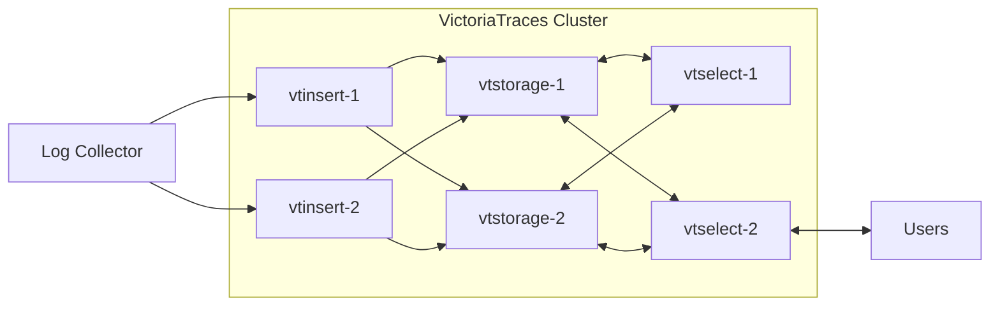
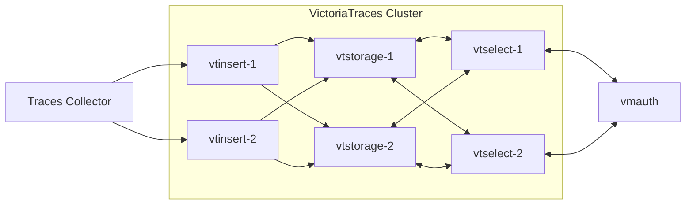

---
weight: 2
title: VictoriaTraces Cluster
menu:
  docs:
    parent: helm
    weight: 2
    identifier: helm-victoria-traces-cluster
url: /helm/victoria-traces-cluster/
aliases:
  - /helm/victoriatraces-cluster/
tags:
  - traces
  - kubernetes
---


The VictoriaTraces cluster Helm chart deploys VictoriaTraces cluster database in Kubernetes.

## Prerequisites

Before installing this chart, ensure your environment meets the following requirements:

* **Kubernetes cluster** - A running Kubernetes cluster with sufficient resources
* **Helm** - Helm package manager installed and configured

Additional requirements depend on your configuration:

* **Persistent storage** - Required if you enable persistent volumes for data retention (enabled by default)
* **kubectl** - Needed for cluster management and troubleshooting

For installation instructions, refer to the official documentation:
* [Installing Helm](https://helm.sh/docs/intro/install/)
* [Installing kubectl](https://kubernetes.io/docs/tasks/tools/install-kubectl/)

## Quick start

The chart deploys VictoriaTraces cluster database.
It deploys the following components according to [VictoriaTraces cluster architecture](https://docs.victoriametrics.com/victoriatraces/cluster/#architecture):

- `vtstorage` stores the ingested traces to the configured persistent volumes
- `vtinsert` receives incoming traces and spreads them evenly across `vtstorage` nodes
- `vtselect` provides API for querying the ingested traces

The default chart setup is shown below:



For a quick start, install `victoria-traces-cluster` using the following commands,
making sure to replace the environment variables with your own values:

```sh
export RETENTION=30d
export PVC_SIZE=10Gi
export VTSTORAGE_REPLICAS=2
export NAMESPACE=traces

# Install victoria-traces-cluster chart
helm install vtc vm/victoria-traces-cluster --namespace $NAMESPACE --wait \
    --set "vtstorage.retentionPeriod=$RETENTION" --set "vtstorage.persistentVolume.size=$PVC_SIZE" \
    --set vmauth.enabled=true \
    --set vtstorage.replicaCount=$VTSTORAGE_REPLICAS

In the example above, two `vtstorage` instances are deployed, each with a 30-day retention period and a 10 Gi PVC.

To access the data within the cluster, use the vmauth address: `http://vtc-victoria-traces-cluster-vmauth.logging.svc.cluster.local:8427`.
You can use this address as Data Source URL in Grafana.
The vmui interface is available at: `http://vtc-victoria-traces-cluster-vmauth.logging.svc.cluster.local:8427/select/vmui/`.

To uninstall these charts, run: `helm uninstall vts`.
Note that this *will not* remove the PVCs, so you will need to delete them manually if no longer needed.

For finer control and easier maintenance, it is recommended to set these
values in a separate `values` file and use it during installation.
See [how to install victoria-traces-single](https://docs.victoriametrics.com/helm/victoria-traces-single/#install-victoria-traces-single-chart) for an example.
You can do this later if you want to configure more settings than shown in the default example.

## Chart configuration

### vmauth

When you enable `vmauth` with:

```yaml
vmauth:
  enabled: true
```

The chart launches an [`vmauth`](https://docs.victoriametrics.com/victoriametrics/vmauth/) service
for proxying and load-balancing incoming data ingestion requests to `vtinsert` nodes and for proxying and load-balancing incoming queries to `vtselect` nodes.

So, the chart can now be thought of as:



## How to install

Access a Kubernetes cluster.

### Setup chart repository (can be omitted for OCI repositories)

Add a chart helm repository with follow commands:

```console
helm repo add vm https://victoriametrics.github.io/helm-charts/

helm repo update
```
List versions of `vm/victoria-traces-cluster` chart available to installation:

```console
helm search repo vm/victoria-traces-cluster -l
```

### Install `victoria-traces-cluster` chart

Export default values of `victoria-traces-cluster` chart to file `values.yaml`:

  - For HTTPS repository

    ```console
    helm show values vm/victoria-traces-cluster > values.yaml
    ```
  - For OCI repository

    ```console
    helm show values oci://ghcr.io/victoriametrics/helm-charts/victoria-traces-cluster > values.yaml
    ```

Change the values according to the need of the environment in ``values.yaml`` file.

> Consider setting `.Values.nameOverride` to a small value like `vtc` to avoid hitting resource name limits of 63 characters

Test the installation with command:

  - For HTTPS repository

    ```console
    helm install vtc vm/victoria-traces-cluster -f values.yaml -n NAMESPACE --debug
    ```

  - For OCI repository

    ```console
    helm install vtc oci://ghcr.io/victoriametrics/helm-charts/victoria-traces-cluster -f values.yaml -n NAMESPACE --debug
    ```

Install chart with command:

  - For HTTPS repository

    ```console
    helm install vtc vm/victoria-traces-cluster -f values.yaml -n NAMESPACE
    ```

  - For OCI repository

    ```console
    helm install vtc oci://ghcr.io/victoriametrics/helm-charts/victoria-traces-cluster -f values.yaml -n NAMESPACE
    ```

Get the pods lists by running this commands:

```console
kubectl get pods -A | grep 'vtc'
```

Get the application by running this command:

```console
helm list -f vtc -n NAMESPACE
```

See the history of versions of `vtc` application with command.

```console
helm history vtc -n NAMESPACE
```

## How to uninstall

Remove application with command.

```console
helm uninstall vtc -n NAMESPACE
```

## Documentation of Helm Chart

Install ``helm-docs`` following the instructions on this [tutorial](https://docs.victoriametrics.com/helm/requirements/).

Generate docs with ``helm-docs`` command.

```bash
cd charts/victoria-traces-cluster

helm-docs
```

The markdown generation is entirely go template driven. The tool parses metadata from charts and generates a number of sub-templates that can be referenced in a template file (by default ``README.md.gotmpl``). If no template file is provided, the tool has a default internal template that will generate a reasonably formatted README.

## Parameters

The following tables lists the configurable parameters of the chart and their default values.

Change the values according to the need of the environment in ``victoria-traces-cluster/values.yaml`` file.

<table class="helm-vars">
  <thead>
    <th class="helm-vars-key">Key</th>
    <th class="helm-vars-description">Description</th>
  </thead>
  <tbody>
    <tr id="common-image">
      <td><a href="#common-image"><pre class="chroma"><code><span class="line"><span class="cl"><span class="nt">common.image</span><span class="p">:</span><span class="w">
</span></span></span><span class="line"><span class="cl"><span class="w">    </span><span class="nt">tag</span><span class="p">:</span><span class="w"> </span><span class="s2">&#34;&#34;</span></span></span></code></pre>
</a></td>
      <td><em><code>(object)</code></em><p>common for all components image configuration</p>
</td>
    </tr>
    <tr id="extraobjects">
      <td><a href="#extraobjects"><pre class="chroma"><code><span class="line"><span class="cl"><span class="nt">extraObjects</span><span class="p">:</span><span class="w"> </span><span class="p">[]</span></span></span></code></pre>
</a></td>
      <td><em><code>(list)</code></em><p>Add extra specs dynamically to this chart</p>
</td>
    </tr>
    <tr id="global-cluster">
      <td><a href="#global-cluster"><pre class="chroma"><code><span class="line"><span class="cl"><span class="nt">global.cluster</span><span class="p">:</span><span class="w">
</span></span></span><span class="line"><span class="cl"><span class="w">    </span><span class="nt">dnsDomain</span><span class="p">:</span><span class="w"> </span><span class="l">cluster.local.</span></span></span></code></pre>
</a></td>
      <td><em><code>(object)</code></em><p>k8s cluster domain suffix, uses for building storage pods&rsquo; FQDN. Details are <a href="https://kubernetes.io/docs/tasks/administer-cluster/dns-custom-nameservers/" target="_blank">here</a></p>
</td>
    </tr>
    <tr id="global-compatibility">
      <td><a href="#global-compatibility"><pre class="chroma"><code><span class="line"><span class="cl"><span class="nt">global.compatibility</span><span class="p">:</span><span class="w">
</span></span></span><span class="line"><span class="cl"><span class="w">    </span><span class="nt">openshift</span><span class="p">:</span><span class="w">
</span></span></span><span class="line"><span class="cl"><span class="w">        </span><span class="nt">adaptSecurityContext</span><span class="p">:</span><span class="w"> </span><span class="l">auto</span></span></span></code></pre>
</a></td>
      <td><em><code>(object)</code></em><p>Openshift security context compatibility configuration</p>
</td>
    </tr>
    <tr id="global-image-registry">
      <td><a href="#global-image-registry"><pre class="chroma"><code><span class="line"><span class="cl"><span class="nt">global.image.registry</span><span class="p">:</span><span class="w"> </span><span class="s2">&#34;&#34;</span></span></span></code></pre>
</a></td>
      <td><em><code>(string)</code></em><p>Image registry, that can be shared across multiple helm charts</p>
</td>
    </tr>
    <tr id="global-imagepullsecrets">
      <td><a href="#global-imagepullsecrets"><pre class="chroma"><code><span class="line"><span class="cl"><span class="nt">global.imagePullSecrets</span><span class="p">:</span><span class="w"> </span><span class="p">[]</span></span></span></code></pre>
</a></td>
      <td><em><code>(list)</code></em><p>Image pull secrets, that can be shared across multiple helm charts</p>
</td>
    </tr>
    <tr id="nameoverride">
      <td><a href="#nameoverride"><pre class="chroma"><code><span class="line"><span class="cl"><span class="nt">nameOverride</span><span class="p">:</span><span class="w"> </span><span class="l">vt-cluster</span></span></span></code></pre>
</a></td>
      <td><em><code>(string)</code></em><p>Override chart name</p>
</td>
    </tr>
    <tr id="printnotes">
      <td><a href="#printnotes"><pre class="chroma"><code><span class="line"><span class="cl"><span class="nt">printNotes</span><span class="p">:</span><span class="w"> </span><span class="kc">true</span></span></span></code></pre>
</a></td>
      <td><em><code>(bool)</code></em><p>Print information after deployment</p>
</td>
    </tr>
    <tr id="serviceaccount-annotations">
      <td><a href="#serviceaccount-annotations"><pre class="chroma"><code><span class="line"><span class="cl"><span class="nt">serviceAccount.annotations</span><span class="p">:</span><span class="w"> </span>{}</span></span></code></pre>
</a></td>
      <td><em><code>(object)</code></em><p>Service account annotations</p>
</td>
    </tr>
    <tr id="serviceaccount-automounttoken">
      <td><a href="#serviceaccount-automounttoken"><pre class="chroma"><code><span class="line"><span class="cl"><span class="nt">serviceAccount.automountToken</span><span class="p">:</span><span class="w"> </span><span class="kc">true</span></span></span></code></pre>
</a></td>
      <td><em><code>(bool)</code></em><p>mount API token to pod directly</p>
</td>
    </tr>
    <tr id="serviceaccount-create">
      <td><a href="#serviceaccount-create"><pre class="chroma"><code><span class="line"><span class="cl"><span class="nt">serviceAccount.create</span><span class="p">:</span><span class="w"> </span><span class="kc">false</span></span></span></code></pre>
</a></td>
      <td><em><code>(bool)</code></em><p>Specifies whether a service account should be created</p>
</td>
    </tr>
    <tr id="serviceaccount-extralabels">
      <td><a href="#serviceaccount-extralabels"><pre class="chroma"><code><span class="line"><span class="cl"><span class="nt">serviceAccount.extraLabels</span><span class="p">:</span><span class="w"> </span>{}</span></span></code></pre>
</a></td>
      <td><em><code>(object)</code></em><p>Service account labels</p>
</td>
    </tr>
    <tr id="serviceaccount-name">
      <td><a href="#serviceaccount-name"><pre class="chroma"><code><span class="line"><span class="cl"><span class="nt">serviceAccount.name</span><span class="p">:</span><span class="w"> </span><span class="kc">null</span></span></span></code></pre>
</a></td>
      <td><em><code>(string)</code></em><p>The name of the service account to use. If not set and create is true, a name is generated using the fullname template</p>
</td>
    </tr>
    <tr id="vmauth-affinity">
      <td><a href="#vmauth-affinity"><pre class="chroma"><code><span class="line"><span class="cl"><span class="nt">vmauth.affinity</span><span class="p">:</span><span class="w"> </span>{}</span></span></code></pre>
</a></td>
      <td><em><code>(object)</code></em><p>Pod affinity</p>
</td>
    </tr>
    <tr id="vmauth-annotations">
      <td><a href="#vmauth-annotations"><pre class="chroma"><code><span class="line"><span class="cl"><span class="nt">vmauth.annotations</span><span class="p">:</span><span class="w"> </span>{}</span></span></code></pre>
</a></td>
      <td><em><code>(object)</code></em><p>VMAuth annotations</p>
</td>
    </tr>
    <tr id="vmauth-config">
      <td><a href="#vmauth-config"><pre class="chroma"><code><span class="line"><span class="cl"><span class="nt">vmauth.config</span><span class="p">:</span><span class="w"> </span>{}</span></span></code></pre>
</a></td>
      <td><em><code>(object)</code></em></td>
    </tr>
    <tr id="vmauth-configsecretname">
      <td><a href="#vmauth-configsecretname"><pre class="chroma"><code><span class="line"><span class="cl"><span class="nt">vmauth.configSecretName</span><span class="p">:</span><span class="w"> </span><span class="s2">&#34;&#34;</span></span></span></code></pre>
</a></td>
      <td><em><code>(string)</code></em><p>VMAuth configuration secret name</p>
</td>
    </tr>
    <tr id="vmauth-containerworkingdir">
      <td><a href="#vmauth-containerworkingdir"><pre class="chroma"><code><span class="line"><span class="cl"><span class="nt">vmauth.containerWorkingDir</span><span class="p">:</span><span class="w"> </span><span class="s2">&#34;&#34;</span></span></span></code></pre>
</a></td>
      <td><em><code>(string)</code></em><p>Container workdir</p>
</td>
    </tr>
    <tr id="vmauth-enabled">
      <td><a href="#vmauth-enabled"><pre class="chroma"><code><span class="line"><span class="cl"><span class="nt">vmauth.enabled</span><span class="p">:</span><span class="w"> </span><span class="kc">false</span></span></span></code></pre>
</a></td>
      <td><em><code>(bool)</code></em><p>Enable deployment of vmauth component, to help better balance the read and write requests to vtinsert and vtselect components. With vmauth enabled, please also set <code>service.clusterIP: None</code> and <code>service.type: ClusterIP</code> for <code>vtinsert</code> and <code>vtselect</code>.</p>
</td>
    </tr>
    <tr id="vmauth-env">
      <td><a href="#vmauth-env"><pre class="chroma"><code><span class="line"><span class="cl"><span class="nt">vmauth.env</span><span class="p">:</span><span class="w"> </span><span class="p">[]</span></span></span></code></pre>
</a></td>
      <td><em><code>(list)</code></em><p>Additional environment variables (ex.: secret tokens, flags). Check <a href="https://docs.victoriametrics.com/#environment-variables" target="_blank">here</a> for details</p>
</td>
    </tr>
    <tr id="vmauth-envfrom">
      <td><a href="#vmauth-envfrom"><pre class="chroma"><code><span class="line"><span class="cl"><span class="nt">vmauth.envFrom</span><span class="p">:</span><span class="w"> </span><span class="p">[]</span></span></span></code></pre>
</a></td>
      <td><em><code>(list)</code></em><p>Specify alternative source for env variables</p>
</td>
    </tr>
    <tr id="vmauth-extraargs">
      <td><a href="#vmauth-extraargs"><pre class="chroma"><code><span class="line"><span class="cl"><span class="nt">vmauth.extraArgs</span><span class="p">:</span><span class="w">
</span></span></span><span class="line"><span class="cl"><span class="w">    </span><span class="nt">envflag.enable</span><span class="p">:</span><span class="w"> </span><span class="kc">true</span><span class="w">
</span></span></span><span class="line"><span class="cl"><span class="w">    </span><span class="nt">http.shutdownDelay</span><span class="p">:</span><span class="w"> </span><span class="l">15s</span><span class="w">
</span></span></span><span class="line"><span class="cl"><span class="w">    </span><span class="nt">httpListenAddr</span><span class="p">:</span><span class="w"> </span><span class="p">:</span><span class="m">8427</span><span class="w">
</span></span></span><span class="line"><span class="cl"><span class="w">    </span><span class="nt">loggerFormat</span><span class="p">:</span><span class="w"> </span><span class="l">json</span></span></span></code></pre>
</a></td>
      <td><em><code>(object)</code></em><p>Extra command line arguments for vmauth component</p>
</td>
    </tr>
    <tr id="vmauth-extracontainers">
      <td><a href="#vmauth-extracontainers"><pre class="chroma"><code><span class="line"><span class="cl"><span class="nt">vmauth.extraContainers</span><span class="p">:</span><span class="w"> </span><span class="p">[]</span></span></span></code></pre>
</a></td>
      <td><em><code>(list)</code></em><p>Extra containers to run in a pod with vmauth</p>
</td>
    </tr>
    <tr id="vmauth-extralabels">
      <td><a href="#vmauth-extralabels"><pre class="chroma"><code><span class="line"><span class="cl"><span class="nt">vmauth.extraLabels</span><span class="p">:</span><span class="w"> </span>{}</span></span></code></pre>
</a></td>
      <td><em><code>(object)</code></em><p>VMAuth additional labels</p>
</td>
    </tr>
    <tr id="vmauth-extravolumemounts">
      <td><a href="#vmauth-extravolumemounts"><pre class="chroma"><code><span class="line"><span class="cl"><span class="nt">vmauth.extraVolumeMounts</span><span class="p">:</span><span class="w"> </span><span class="p">[]</span></span></span></code></pre>
</a></td>
      <td><em><code>(list)</code></em><p>Extra Volume Mounts for the container</p>
</td>
    </tr>
    <tr id="vmauth-extravolumes">
      <td><a href="#vmauth-extravolumes"><pre class="chroma"><code><span class="line"><span class="cl"><span class="nt">vmauth.extraVolumes</span><span class="p">:</span><span class="w"> </span><span class="p">[]</span></span></span></code></pre>
</a></td>
      <td><em><code>(list)</code></em><p>Extra Volumes for the pod</p>
</td>
    </tr>
    <tr id="vmauth-fullnameoverride">
      <td><a href="#vmauth-fullnameoverride"><pre class="chroma"><code><span class="line"><span class="cl"><span class="nt">vmauth.fullnameOverride</span><span class="p">:</span><span class="w"> </span><span class="s2">&#34;&#34;</span></span></span></code></pre>
</a></td>
      <td><em><code>(string)</code></em><p>Overrides the full name of vmauth component</p>
</td>
    </tr>
    <tr id="vmauth-horizontalpodautoscaler-behavior">
      <td><a href="#vmauth-horizontalpodautoscaler-behavior"><pre class="chroma"><code><span class="line"><span class="cl"><span class="nt">vmauth.horizontalPodAutoscaler.behavior</span><span class="p">:</span><span class="w"> </span>{}</span></span></code></pre>
</a></td>
      <td><em><code>(object)</code></em><p>Behavior settings for scaling by the HPA</p>
</td>
    </tr>
    <tr id="vmauth-horizontalpodautoscaler-enabled">
      <td><a href="#vmauth-horizontalpodautoscaler-enabled"><pre class="chroma"><code><span class="line"><span class="cl"><span class="nt">vmauth.horizontalPodAutoscaler.enabled</span><span class="p">:</span><span class="w"> </span><span class="kc">false</span></span></span></code></pre>
</a></td>
      <td><em><code>(bool)</code></em><p>Use HPA for vmauth component</p>
</td>
    </tr>
    <tr id="vmauth-horizontalpodautoscaler-maxreplicas">
      <td><a href="#vmauth-horizontalpodautoscaler-maxreplicas"><pre class="chroma"><code><span class="line"><span class="cl"><span class="nt">vmauth.horizontalPodAutoscaler.maxReplicas</span><span class="p">:</span><span class="w"> </span><span class="m">10</span></span></span></code></pre>
</a></td>
      <td><em><code>(int)</code></em><p>Maximum replicas for HPA to use to to scale the vmauth component</p>
</td>
    </tr>
    <tr id="vmauth-horizontalpodautoscaler-metrics">
      <td><a href="#vmauth-horizontalpodautoscaler-metrics"><pre class="chroma"><code><span class="line"><span class="cl"><span class="nt">vmauth.horizontalPodAutoscaler.metrics</span><span class="p">:</span><span class="w"> </span><span class="p">[]</span></span></span></code></pre>
</a></td>
      <td><em><code>(list)</code></em><p>Metric for HPA to use to scale the vmauth component</p>
</td>
    </tr>
    <tr id="vmauth-horizontalpodautoscaler-minreplicas">
      <td><a href="#vmauth-horizontalpodautoscaler-minreplicas"><pre class="chroma"><code><span class="line"><span class="cl"><span class="nt">vmauth.horizontalPodAutoscaler.minReplicas</span><span class="p">:</span><span class="w"> </span><span class="m">2</span></span></span></code></pre>
</a></td>
      <td><em><code>(int)</code></em><p>Minimum replicas for HPA to use to scale the vmauth component</p>
</td>
    </tr>
    <tr id="vmauth-image-pullpolicy">
      <td><a href="#vmauth-image-pullpolicy"><pre class="chroma"><code><span class="line"><span class="cl"><span class="nt">vmauth.image.pullPolicy</span><span class="p">:</span><span class="w"> </span><span class="l">IfNotPresent</span></span></span></code></pre>
</a></td>
      <td><em><code>(string)</code></em><p>Image pull policy</p>
</td>
    </tr>
    <tr id="vmauth-image-registry">
      <td><a href="#vmauth-image-registry"><pre class="chroma"><code><span class="line"><span class="cl"><span class="nt">vmauth.image.registry</span><span class="p">:</span><span class="w"> </span><span class="s2">&#34;&#34;</span></span></span></code></pre>
</a></td>
      <td><em><code>(string)</code></em><p>Image registry</p>
</td>
    </tr>
    <tr id="vmauth-image-repository">
      <td><a href="#vmauth-image-repository"><pre class="chroma"><code><span class="line"><span class="cl"><span class="nt">vmauth.image.repository</span><span class="p">:</span><span class="w"> </span><span class="l">victoriametrics/vmauth</span></span></span></code></pre>
</a></td>
      <td><em><code>(string)</code></em><p>Image repository</p>
</td>
    </tr>
    <tr id="vmauth-image-tag">
      <td><a href="#vmauth-image-tag"><pre class="chroma"><code><span class="line"><span class="cl"><span class="nt">vmauth.image.tag</span><span class="p">:</span><span class="w"> </span><span class="l">v1.116.0</span></span></span></code></pre>
</a></td>
      <td><em><code>(string)</code></em><p>Image tag override the default Chart.AppVersion, which is for vtraces components</p>
</td>
    </tr>
    <tr id="vmauth-ingress-annotations">
      <td><a href="#vmauth-ingress-annotations"><pre class="chroma"><code><span class="line"><span class="cl"><span class="nt">vmauth.ingress.annotations</span><span class="p">:</span><span class="w"> </span>{}</span></span></code></pre>
</a></td>
      <td><em><code>(object)</code></em><p>Ingress annotations</p>
</td>
    </tr>
    <tr id="vmauth-ingress-enabled">
      <td><a href="#vmauth-ingress-enabled"><pre class="chroma"><code><span class="line"><span class="cl"><span class="nt">vmauth.ingress.enabled</span><span class="p">:</span><span class="w"> </span><span class="kc">false</span></span></span></code></pre>
</a></td>
      <td><em><code>(bool)</code></em><p>Enable deployment of ingress for vmauth component</p>
</td>
    </tr>
    <tr id="vmauth-ingress-extralabels">
      <td><a href="#vmauth-ingress-extralabels"><pre class="chroma"><code><span class="line"><span class="cl"><span class="nt">vmauth.ingress.extraLabels</span><span class="p">:</span><span class="w"> </span>{}</span></span></code></pre>
</a></td>
      <td><em><code>(object)</code></em></td>
    </tr>
    <tr id="vmauth-ingress-hosts">
      <td><a href="#vmauth-ingress-hosts"><pre class="chroma"><code><span class="line"><span class="cl"><span class="nt">vmauth.ingress.hosts</span><span class="p">:</span><span class="w">
</span></span></span><span class="line"><span class="cl"><span class="w">    </span>- <span class="nt">name</span><span class="p">:</span><span class="w"> </span><span class="l">vmauth.local</span><span class="w">
</span></span></span><span class="line"><span class="cl"><span class="w">      </span><span class="nt">path</span><span class="p">:</span><span class="w">
</span></span></span><span class="line"><span class="cl"><span class="w">        </span>- <span class="l">/insert</span><span class="w">
</span></span></span><span class="line"><span class="cl"><span class="w">      </span><span class="nt">port</span><span class="p">:</span><span class="w"> </span><span class="l">http</span></span></span></code></pre>
</a></td>
      <td><em><code>(list)</code></em><p>Array of host objects</p>
</td>
    </tr>
    <tr id="vmauth-ingress-pathtype">
      <td><a href="#vmauth-ingress-pathtype"><pre class="chroma"><code><span class="line"><span class="cl"><span class="nt">vmauth.ingress.pathType</span><span class="p">:</span><span class="w"> </span><span class="l">Prefix</span></span></span></code></pre>
</a></td>
      <td><em><code>(string)</code></em><p>pathType is only for k8s &gt;= 1.1=</p>
</td>
    </tr>
    <tr id="vmauth-ingress-tls">
      <td><a href="#vmauth-ingress-tls"><pre class="chroma"><code><span class="line"><span class="cl"><span class="nt">vmauth.ingress.tls</span><span class="p">:</span><span class="w"> </span><span class="p">[]</span></span></span></code></pre>
</a></td>
      <td><em><code>(list)</code></em><p>Array of TLS objects</p>
</td>
    </tr>
    <tr id="vmauth-initcontainers">
      <td><a href="#vmauth-initcontainers"><pre class="chroma"><code><span class="line"><span class="cl"><span class="nt">vmauth.initContainers</span><span class="p">:</span><span class="w"> </span><span class="p">[]</span></span></span></code></pre>
</a></td>
      <td><em><code>(list)</code></em><p>Init containers for vmauth</p>
</td>
    </tr>
    <tr id="vmauth-lifecycle">
      <td><a href="#vmauth-lifecycle"><pre class="chroma"><code><span class="line"><span class="cl"><span class="nt">vmauth.lifecycle</span><span class="p">:</span><span class="w"> </span>{}</span></span></code></pre>
</a></td>
      <td><em><code>(object)</code></em><p>Specify pod lifecycle</p>
</td>
    </tr>
    <tr id="vmauth-name">
      <td><a href="#vmauth-name"><pre class="chroma"><code><span class="line"><span class="cl"><span class="nt">vmauth.name</span><span class="p">:</span><span class="w"> </span><span class="s2">&#34;&#34;</span></span></span></code></pre>
</a></td>
      <td><em><code>(string)</code></em><p>Override default <code>app</code> label name</p>
</td>
    </tr>
    <tr id="vmauth-nodeselector">
      <td><a href="#vmauth-nodeselector"><pre class="chroma"><code><span class="line"><span class="cl"><span class="nt">vmauth.nodeSelector</span><span class="p">:</span><span class="w"> </span>{}</span></span></code></pre>
</a></td>
      <td><em><code>(object)</code></em><p>Pod&rsquo;s node selector. Details are <a href="https://kubernetes.io/docs/concepts/scheduling-eviction/assign-pod-node/#nodeselector" target="_blank">here</a></p>
</td>
    </tr>
    <tr id="vmauth-podannotations">
      <td><a href="#vmauth-podannotations"><pre class="chroma"><code><span class="line"><span class="cl"><span class="nt">vmauth.podAnnotations</span><span class="p">:</span><span class="w"> </span>{}</span></span></code></pre>
</a></td>
      <td><em><code>(object)</code></em><p>Pod&rsquo;s annotations</p>
</td>
    </tr>
    <tr id="vmauth-poddisruptionbudget">
      <td><a href="#vmauth-poddisruptionbudget"><pre class="chroma"><code><span class="line"><span class="cl"><span class="nt">vmauth.podDisruptionBudget</span><span class="p">:</span><span class="w">
</span></span></span><span class="line"><span class="cl"><span class="w">    </span><span class="nt">enabled</span><span class="p">:</span><span class="w"> </span><span class="kc">false</span><span class="w">
</span></span></span><span class="line"><span class="cl"><span class="w">    </span><span class="nt">labels</span><span class="p">:</span><span class="w"> </span>{}</span></span></code></pre>
</a></td>
      <td><em><code>(object)</code></em><p>See <code>kubectl explain poddisruptionbudget.spec</code> for more. Details are <a href="https://kubernetes.io/docs/tasks/run-application/configure-pdb/" target="_blank">here</a></p>
</td>
    </tr>
    <tr id="vmauth-podlabels">
      <td><a href="#vmauth-podlabels"><pre class="chroma"><code><span class="line"><span class="cl"><span class="nt">vmauth.podLabels</span><span class="p">:</span><span class="w"> </span>{}</span></span></code></pre>
</a></td>
      <td><em><code>(object)</code></em><p>VMAuth pod labels</p>
</td>
    </tr>
    <tr id="vmauth-podsecuritycontext">
      <td><a href="#vmauth-podsecuritycontext"><pre class="chroma"><code><span class="line"><span class="cl"><span class="nt">vmauth.podSecurityContext</span><span class="p">:</span><span class="w">
</span></span></span><span class="line"><span class="cl"><span class="w">    </span><span class="nt">enabled</span><span class="p">:</span><span class="w"> </span><span class="kc">true</span><span class="w">
</span></span></span><span class="line"><span class="cl"><span class="w">    </span><span class="nt">fsGroup</span><span class="p">:</span><span class="w"> </span><span class="m">1000</span></span></span></code></pre>
</a></td>
      <td><em><code>(object)</code></em><p>Pod&rsquo;s security context. Details are <a href="https://kubernetes.io/docs/tasks/configure-pod-container/security-context/" target="_blank">here</a></p>
</td>
    </tr>
    <tr id="vmauth-ports-name">
      <td><a href="#vmauth-ports-name"><pre class="chroma"><code><span class="line"><span class="cl"><span class="nt">vmauth.ports.name</span><span class="p">:</span><span class="w"> </span><span class="l">http</span></span></span></code></pre>
</a></td>
      <td><em><code>(string)</code></em><p>VMAuth http port name</p>
</td>
    </tr>
    <tr id="vmauth-priorityclassname">
      <td><a href="#vmauth-priorityclassname"><pre class="chroma"><code><span class="line"><span class="cl"><span class="nt">vmauth.priorityClassName</span><span class="p">:</span><span class="w"> </span><span class="s2">&#34;&#34;</span></span></span></code></pre>
</a></td>
      <td><em><code>(string)</code></em><p>Name of Priority Class</p>
</td>
    </tr>
    <tr id="vmauth-probe-liveness">
      <td><a href="#vmauth-probe-liveness"><pre class="chroma"><code><span class="line"><span class="cl"><span class="nt">vmauth.probe.liveness</span><span class="p">:</span><span class="w">
</span></span></span><span class="line"><span class="cl"><span class="w">    </span><span class="nt">failureThreshold</span><span class="p">:</span><span class="w"> </span><span class="m">3</span><span class="w">
</span></span></span><span class="line"><span class="cl"><span class="w">    </span><span class="nt">initialDelaySeconds</span><span class="p">:</span><span class="w"> </span><span class="m">5</span><span class="w">
</span></span></span><span class="line"><span class="cl"><span class="w">    </span><span class="nt">periodSeconds</span><span class="p">:</span><span class="w"> </span><span class="m">15</span><span class="w">
</span></span></span><span class="line"><span class="cl"><span class="w">    </span><span class="nt">tcpSocket</span><span class="p">:</span><span class="w"> </span>{}<span class="w">
</span></span></span><span class="line"><span class="cl"><span class="w">    </span><span class="nt">timeoutSeconds</span><span class="p">:</span><span class="w"> </span><span class="m">5</span></span></span></code></pre>
</a></td>
      <td><em><code>(object)</code></em><p>VMAuth liveness probe</p>
</td>
    </tr>
    <tr id="vmauth-probe-readiness">
      <td><a href="#vmauth-probe-readiness"><pre class="chroma"><code><span class="line"><span class="cl"><span class="nt">vmauth.probe.readiness</span><span class="p">:</span><span class="w">
</span></span></span><span class="line"><span class="cl"><span class="w">    </span><span class="nt">failureThreshold</span><span class="p">:</span><span class="w"> </span><span class="m">3</span><span class="w">
</span></span></span><span class="line"><span class="cl"><span class="w">    </span><span class="nt">httpGet</span><span class="p">:</span><span class="w"> </span>{}<span class="w">
</span></span></span><span class="line"><span class="cl"><span class="w">    </span><span class="nt">initialDelaySeconds</span><span class="p">:</span><span class="w"> </span><span class="m">5</span><span class="w">
</span></span></span><span class="line"><span class="cl"><span class="w">    </span><span class="nt">periodSeconds</span><span class="p">:</span><span class="w"> </span><span class="m">5</span><span class="w">
</span></span></span><span class="line"><span class="cl"><span class="w">    </span><span class="nt">timeoutSeconds</span><span class="p">:</span><span class="w"> </span><span class="m">5</span></span></span></code></pre>
</a></td>
      <td><em><code>(object)</code></em><p>VMAuth readiness probe</p>
</td>
    </tr>
    <tr id="vmauth-probe-startup">
      <td><a href="#vmauth-probe-startup"><pre class="chroma"><code><span class="line"><span class="cl"><span class="nt">vmauth.probe.startup</span><span class="p">:</span><span class="w"> </span>{}</span></span></code></pre>
</a></td>
      <td><em><code>(object)</code></em><p>VMAuth startup probe</p>
</td>
    </tr>
    <tr id="vmauth-replicacount">
      <td><a href="#vmauth-replicacount"><pre class="chroma"><code><span class="line"><span class="cl"><span class="nt">vmauth.replicaCount</span><span class="p">:</span><span class="w"> </span><span class="m">2</span></span></span></code></pre>
</a></td>
      <td><em><code>(int)</code></em><p>Count of vmauth pods</p>
</td>
    </tr>
    <tr id="vmauth-resources">
      <td><a href="#vmauth-resources"><pre class="chroma"><code><span class="line"><span class="cl"><span class="nt">vmauth.resources</span><span class="p">:</span><span class="w"> </span>{}</span></span></code></pre>
</a></td>
      <td><em><code>(object)</code></em><p>Resource object</p>
</td>
    </tr>
    <tr id="vmauth-route-annotations">
      <td><a href="#vmauth-route-annotations"><pre class="chroma"><code><span class="line"><span class="cl"><span class="nt">vmauth.route.annotations</span><span class="p">:</span><span class="w"> </span>{}</span></span></code></pre>
</a></td>
      <td><em><code>(object)</code></em><p>HTTPRoute annotations</p>
</td>
    </tr>
    <tr id="vmauth-route-enabled">
      <td><a href="#vmauth-route-enabled"><pre class="chroma"><code><span class="line"><span class="cl"><span class="nt">vmauth.route.enabled</span><span class="p">:</span><span class="w"> </span><span class="kc">false</span></span></span></code></pre>
</a></td>
      <td><em><code>(bool)</code></em><p>Enable deployment of HTTPRoute for vmauth component</p>
</td>
    </tr>
    <tr id="vmauth-route-extrarules">
      <td><a href="#vmauth-route-extrarules"><pre class="chroma"><code><span class="line"><span class="cl"><span class="nt">vmauth.route.extraRules</span><span class="p">:</span><span class="w"> </span><span class="p">[]</span></span></span></code></pre>
</a></td>
      <td><em><code>(list)</code></em><p>Extra rules to prepend to route. This is useful when working with annotation based services.</p>
</td>
    </tr>
    <tr id="vmauth-route-filters">
      <td><a href="#vmauth-route-filters"><pre class="chroma"><code><span class="line"><span class="cl"><span class="nt">vmauth.route.filters</span><span class="p">:</span><span class="w"> </span><span class="p">[]</span></span></span></code></pre>
</a></td>
      <td><em><code>(list)</code></em><p>Filters for a default rule in HTTPRoute</p>
</td>
    </tr>
    <tr id="vmauth-route-hostnames">
      <td><a href="#vmauth-route-hostnames"><pre class="chroma"><code><span class="line"><span class="cl"><span class="nt">vmauth.route.hostnames</span><span class="p">:</span><span class="w"> </span><span class="p">[]</span></span></span></code></pre>
</a></td>
      <td><em><code>(list)</code></em><p>Array of hostnames</p>
</td>
    </tr>
    <tr id="vmauth-route-labels">
      <td><a href="#vmauth-route-labels"><pre class="chroma"><code><span class="line"><span class="cl"><span class="nt">vmauth.route.labels</span><span class="p">:</span><span class="w"> </span>{}</span></span></code></pre>
</a></td>
      <td><em><code>(object)</code></em><p>HTTPRoute extra labels</p>
</td>
    </tr>
    <tr id="vmauth-route-matches">
      <td><a href="#vmauth-route-matches"><pre class="chroma"><code><span class="line"><span class="cl"><span class="nt">vmauth.route.matches</span><span class="p">:</span><span class="w">
</span></span></span><span class="line"><span class="cl"><span class="w">    </span>- <span class="nt">path</span><span class="p">:</span><span class="w">
</span></span></span><span class="line"><span class="cl"><span class="w">        </span><span class="nt">type</span><span class="p">:</span><span class="w"> </span><span class="l">PathPrefix</span><span class="w">
</span></span></span><span class="line"><span class="cl"><span class="w">        </span><span class="nt">value</span><span class="p">:</span><span class="w"> </span><span class="s1">&#39;{{ dig &#34;extraArgs&#34; &#34;http.pathPrefix&#34; &#34;/&#34; .Values.vmauth }}&#39;</span></span></span></code></pre>
</a></td>
      <td><em><code>(list)</code></em><p>Matches for a default rule in HTTPRoute</p>
</td>
    </tr>
    <tr id="vmauth-route-parentrefs">
      <td><a href="#vmauth-route-parentrefs"><pre class="chroma"><code><span class="line"><span class="cl"><span class="nt">vmauth.route.parentRefs</span><span class="p">:</span><span class="w"> </span><span class="p">[]</span></span></span></code></pre>
</a></td>
      <td><em><code>(list)</code></em><p>HTTPGateway objects refs</p>
</td>
    </tr>
    <tr id="vmauth-securitycontext">
      <td><a href="#vmauth-securitycontext"><pre class="chroma"><code><span class="line"><span class="cl"><span class="nt">vmauth.securityContext</span><span class="p">:</span><span class="w">
</span></span></span><span class="line"><span class="cl"><span class="w">    </span><span class="nt">enabled</span><span class="p">:</span><span class="w"> </span><span class="kc">true</span><span class="w">
</span></span></span><span class="line"><span class="cl"><span class="w">    </span><span class="nt">runAsGroup</span><span class="p">:</span><span class="w"> </span><span class="m">1000</span><span class="w">
</span></span></span><span class="line"><span class="cl"><span class="w">    </span><span class="nt">runAsNonRoot</span><span class="p">:</span><span class="w"> </span><span class="kc">true</span><span class="w">
</span></span></span><span class="line"><span class="cl"><span class="w">    </span><span class="nt">runAsUser</span><span class="p">:</span><span class="w"> </span><span class="m">1000</span></span></span></code></pre>
</a></td>
      <td><em><code>(object)</code></em><p>Check <a href="https://kubernetes.io/docs/tasks/configure-pod-container/security-context/" target="_blank">here</a> for details.</p>
</td>
    </tr>
    <tr id="vmauth-service-annotations">
      <td><a href="#vmauth-service-annotations"><pre class="chroma"><code><span class="line"><span class="cl"><span class="nt">vmauth.service.annotations</span><span class="p">:</span><span class="w"> </span>{}</span></span></code></pre>
</a></td>
      <td><em><code>(object)</code></em><p>Service annotations</p>
</td>
    </tr>
    <tr id="vmauth-service-clusterip">
      <td><a href="#vmauth-service-clusterip"><pre class="chroma"><code><span class="line"><span class="cl"><span class="nt">vmauth.service.clusterIP</span><span class="p">:</span><span class="w"> </span><span class="s2">&#34;&#34;</span></span></span></code></pre>
</a></td>
      <td><em><code>(string)</code></em><p>Service ClusterIP</p>
</td>
    </tr>
    <tr id="vmauth-service-enabled">
      <td><a href="#vmauth-service-enabled"><pre class="chroma"><code><span class="line"><span class="cl"><span class="nt">vmauth.service.enabled</span><span class="p">:</span><span class="w"> </span><span class="kc">true</span></span></span></code></pre>
</a></td>
      <td><em><code>(bool)</code></em><p>Create VMAuth service</p>
</td>
    </tr>
    <tr id="vmauth-service-externalips">
      <td><a href="#vmauth-service-externalips"><pre class="chroma"><code><span class="line"><span class="cl"><span class="nt">vmauth.service.externalIPs</span><span class="p">:</span><span class="w"> </span><span class="p">[]</span></span></span></code></pre>
</a></td>
      <td><em><code>(list)</code></em><p>Service External IPs. Details are <a href="https://kubernetes.io/docs/concepts/services-networking/service/#external-ips" target="_blank">here</a></p>
</td>
    </tr>
    <tr id="vmauth-service-externaltrafficpolicy">
      <td><a href="#vmauth-service-externaltrafficpolicy"><pre class="chroma"><code><span class="line"><span class="cl"><span class="nt">vmauth.service.externalTrafficPolicy</span><span class="p">:</span><span class="w"> </span><span class="s2">&#34;&#34;</span></span></span></code></pre>
</a></td>
      <td><em><code>(string)</code></em><p>Service external traffic policy. Check <a href="https://kubernetes.io/docs/tasks/access-application-cluster/create-external-load-balancer/#preserving-the-client-source-ip" target="_blank">here</a> for details</p>
</td>
    </tr>
    <tr id="vmauth-service-extraports">
      <td><a href="#vmauth-service-extraports"><pre class="chroma"><code><span class="line"><span class="cl"><span class="nt">vmauth.service.extraPorts</span><span class="p">:</span><span class="w"> </span><span class="p">[]</span></span></span></code></pre>
</a></td>
      <td><em><code>(list)</code></em><p>Extra service ports</p>
</td>
    </tr>
    <tr id="vmauth-service-healthchecknodeport">
      <td><a href="#vmauth-service-healthchecknodeport"><pre class="chroma"><code><span class="line"><span class="cl"><span class="nt">vmauth.service.healthCheckNodePort</span><span class="p">:</span><span class="w"> </span><span class="s2">&#34;&#34;</span></span></span></code></pre>
</a></td>
      <td><em><code>(string)</code></em><p>Health check node port for a service. Check <a href="https://kubernetes.io/docs/tasks/access-application-cluster/create-external-load-balancer/#preserving-the-client-source-ip" target="_blank">here</a> for details</p>
</td>
    </tr>
    <tr id="vmauth-service-ipfamilies">
      <td><a href="#vmauth-service-ipfamilies"><pre class="chroma"><code><span class="line"><span class="cl"><span class="nt">vmauth.service.ipFamilies</span><span class="p">:</span><span class="w"> </span><span class="p">[]</span></span></span></code></pre>
</a></td>
      <td><em><code>(list)</code></em><p>List of service IP families. Check <a href="https://kubernetes.io/docs/concepts/services-networking/dual-stack/#services" target="_blank">here</a> for details.</p>
</td>
    </tr>
    <tr id="vmauth-service-ipfamilypolicy">
      <td><a href="#vmauth-service-ipfamilypolicy"><pre class="chroma"><code><span class="line"><span class="cl"><span class="nt">vmauth.service.ipFamilyPolicy</span><span class="p">:</span><span class="w"> </span><span class="s2">&#34;&#34;</span></span></span></code></pre>
</a></td>
      <td><em><code>(string)</code></em><p>Service IP family policy. Check <a href="https://kubernetes.io/docs/concepts/services-networking/dual-stack/#services" target="_blank">here</a> for details.</p>
</td>
    </tr>
    <tr id="vmauth-service-labels">
      <td><a href="#vmauth-service-labels"><pre class="chroma"><code><span class="line"><span class="cl"><span class="nt">vmauth.service.labels</span><span class="p">:</span><span class="w"> </span>{}</span></span></code></pre>
</a></td>
      <td><em><code>(object)</code></em><p>Service labels</p>
</td>
    </tr>
    <tr id="vmauth-service-loadbalancerip">
      <td><a href="#vmauth-service-loadbalancerip"><pre class="chroma"><code><span class="line"><span class="cl"><span class="nt">vmauth.service.loadBalancerIP</span><span class="p">:</span><span class="w"> </span><span class="s2">&#34;&#34;</span></span></span></code></pre>
</a></td>
      <td><em><code>(string)</code></em><p>Service load balancer IP</p>
</td>
    </tr>
    <tr id="vmauth-service-loadbalancersourceranges">
      <td><a href="#vmauth-service-loadbalancersourceranges"><pre class="chroma"><code><span class="line"><span class="cl"><span class="nt">vmauth.service.loadBalancerSourceRanges</span><span class="p">:</span><span class="w"> </span><span class="p">[]</span></span></span></code></pre>
</a></td>
      <td><em><code>(list)</code></em><p>Load balancer source range</p>
</td>
    </tr>
    <tr id="vmauth-service-serviceport">
      <td><a href="#vmauth-service-serviceport"><pre class="chroma"><code><span class="line"><span class="cl"><span class="nt">vmauth.service.servicePort</span><span class="p">:</span><span class="w"> </span><span class="m">8427</span></span></span></code></pre>
</a></td>
      <td><em><code>(int)</code></em><p>Service port</p>
</td>
    </tr>
    <tr id="vmauth-service-targetport">
      <td><a href="#vmauth-service-targetport"><pre class="chroma"><code><span class="line"><span class="cl"><span class="nt">vmauth.service.targetPort</span><span class="p">:</span><span class="w"> </span><span class="l">http</span></span></span></code></pre>
</a></td>
      <td><em><code>(string)</code></em><p>Target port</p>
</td>
    </tr>
    <tr id="vmauth-service-type">
      <td><a href="#vmauth-service-type"><pre class="chroma"><code><span class="line"><span class="cl"><span class="nt">vmauth.service.type</span><span class="p">:</span><span class="w"> </span><span class="l">ClusterIP</span></span></span></code></pre>
</a></td>
      <td><em><code>(string)</code></em><p>Service type</p>
</td>
    </tr>
    <tr id="vmauth-strategy">
      <td><a href="#vmauth-strategy"><pre class="chroma"><code><span class="line"><span class="cl"><span class="nt">vmauth.strategy</span><span class="p">:</span><span class="w"> </span>{}</span></span></code></pre>
</a></td>
      <td><em><code>(object)</code></em><p>VMAuth Deployment strategy</p>
</td>
    </tr>
    <tr id="vmauth-tolerations">
      <td><a href="#vmauth-tolerations"><pre class="chroma"><code><span class="line"><span class="cl"><span class="nt">vmauth.tolerations</span><span class="p">:</span><span class="w"> </span><span class="p">[]</span></span></span></code></pre>
</a></td>
      <td><em><code>(list)</code></em><p>Array of tolerations object. Details are <a href="https://kubernetes.io/docs/concepts/configuration/assign-pod-node/" target="_blank">here</a></p>
</td>
    </tr>
    <tr id="vmauth-topologyspreadconstraints">
      <td><a href="#vmauth-topologyspreadconstraints"><pre class="chroma"><code><span class="line"><span class="cl"><span class="nt">vmauth.topologySpreadConstraints</span><span class="p">:</span><span class="w"> </span><span class="p">[]</span></span></span></code></pre>
</a></td>
      <td><em><code>(list)</code></em><p>Pod topologySpreadConstraints</p>
</td>
    </tr>
    <tr id="vmauth-vmservicescrape-annotations">
      <td><a href="#vmauth-vmservicescrape-annotations"><pre class="chroma"><code><span class="line"><span class="cl"><span class="nt">vmauth.vmServiceScrape.annotations</span><span class="p">:</span><span class="w"> </span>{}</span></span></code></pre>
</a></td>
      <td><em><code>(object)</code></em><p>VMServiceScrape annotations</p>
</td>
    </tr>
    <tr id="vmauth-vmservicescrape-enabled">
      <td><a href="#vmauth-vmservicescrape-enabled"><pre class="chroma"><code><span class="line"><span class="cl"><span class="nt">vmauth.vmServiceScrape.enabled</span><span class="p">:</span><span class="w"> </span><span class="kc">false</span></span></span></code></pre>
</a></td>
      <td><em><code>(bool)</code></em><p>Enable VMServiceScrape for vmauth component, which is managed by <a href="https://docs.victoriametrics.com/operator/quick-start/" target="_blank">vm-operator</a>.</p>
</td>
    </tr>
    <tr id="vmauth-vmservicescrape-extralabels">
      <td><a href="#vmauth-vmservicescrape-extralabels"><pre class="chroma"><code><span class="line"><span class="cl"><span class="nt">vmauth.vmServiceScrape.extraLabels</span><span class="p">:</span><span class="w"> </span>{}</span></span></code></pre>
</a></td>
      <td><em><code>(object)</code></em><p>VMServiceScrape labels</p>
</td>
    </tr>
    <tr id="vmauth-vmservicescrape-namespace">
      <td><a href="#vmauth-vmservicescrape-namespace"><pre class="chroma"><code><span class="line"><span class="cl"><span class="nt">vmauth.vmServiceScrape.namespace</span><span class="p">:</span><span class="w"> </span><span class="s2">&#34;&#34;</span></span></span></code></pre>
</a></td>
      <td><em><code>(string)</code></em><p>Target namespace of VMServiceScrape manifest</p>
</td>
    </tr>
    <tr id="vmauth-vmservicescrape-spec-endpoints[0]-port">
      <td><a href="#vmauth-vmservicescrape-spec-endpoints[0]-port"><pre class="chroma"><code><span class="line"><span class="cl"><span class="nt">vmauth.vmServiceScrape.spec.endpoints[0].port</span><span class="p">:</span><span class="w"> </span><span class="l">http</span></span></span></code></pre>
</a></td>
      <td><em><code>(string)</code></em></td>
    </tr>
    <tr id="vmauth-vmservicescrape-useservicemonitor">
      <td><a href="#vmauth-vmservicescrape-useservicemonitor"><pre class="chroma"><code><span class="line"><span class="cl"><span class="nt">vmauth.vmServiceScrape.useServiceMonitor</span><span class="p">:</span><span class="w"> </span><span class="kc">false</span></span></span></code></pre>
</a></td>
      <td><em><code>(bool)</code></em><p>Create ServiceMonitor instead of VMServiceScrape, which is managed by <a href="https://prometheus-operator.dev/docs/api-reference/api/#monitoring.coreos.com/v1.ServiceMonitor" target="_blank">prometheus-operator</a></p>
</td>
    </tr>
    <tr id="vtinsert-affinity">
      <td><a href="#vtinsert-affinity"><pre class="chroma"><code><span class="line"><span class="cl"><span class="nt">vtinsert.affinity</span><span class="p">:</span><span class="w"> </span>{}</span></span></code></pre>
</a></td>
      <td><em><code>(object)</code></em><p>Pod affinity</p>
</td>
    </tr>
    <tr id="vtinsert-annotations">
      <td><a href="#vtinsert-annotations"><pre class="chroma"><code><span class="line"><span class="cl"><span class="nt">vtinsert.annotations</span><span class="p">:</span><span class="w"> </span>{}</span></span></code></pre>
</a></td>
      <td><em><code>(object)</code></em><p>Deployment annotations</p>
</td>
    </tr>
    <tr id="vtinsert-containerworkingdir">
      <td><a href="#vtinsert-containerworkingdir"><pre class="chroma"><code><span class="line"><span class="cl"><span class="nt">vtinsert.containerWorkingDir</span><span class="p">:</span><span class="w"> </span><span class="s2">&#34;&#34;</span></span></span></code></pre>
</a></td>
      <td><em><code>(string)</code></em><p>Container workdir</p>
</td>
    </tr>
    <tr id="vtinsert-enabled">
      <td><a href="#vtinsert-enabled"><pre class="chroma"><code><span class="line"><span class="cl"><span class="nt">vtinsert.enabled</span><span class="p">:</span><span class="w"> </span><span class="kc">true</span></span></span></code></pre>
</a></td>
      <td><em><code>(bool)</code></em><p>Enable deployment of vtinsert component.</p>
</td>
    </tr>
    <tr id="vtinsert-env">
      <td><a href="#vtinsert-env"><pre class="chroma"><code><span class="line"><span class="cl"><span class="nt">vtinsert.env</span><span class="p">:</span><span class="w"> </span><span class="p">[]</span></span></span></code></pre>
</a></td>
      <td><em><code>(list)</code></em><p>Additional environment variables (ex.: secret tokens, flags). Check <a href="https://docs.victoriametrics.com/#environment-variables" target="_blank">here</a> for details.</p>
</td>
    </tr>
    <tr id="vtinsert-envfrom">
      <td><a href="#vtinsert-envfrom"><pre class="chroma"><code><span class="line"><span class="cl"><span class="nt">vtinsert.envFrom</span><span class="p">:</span><span class="w"> </span><span class="p">[]</span></span></span></code></pre>
</a></td>
      <td><em><code>(list)</code></em><p>Specify alternative source for env variables</p>
</td>
    </tr>
    <tr id="vtinsert-excludestorageids">
      <td><a href="#vtinsert-excludestorageids"><pre class="chroma"><code><span class="line"><span class="cl"><span class="nt">vtinsert.excludeStorageIDs</span><span class="p">:</span><span class="w"> </span><span class="p">[]</span></span></span></code></pre>
</a></td>
      <td><em><code>(list)</code></em><p>IDs of vtstorage nodes to exclude from writing</p>
</td>
    </tr>
    <tr id="vtinsert-extraargs">
      <td><a href="#vtinsert-extraargs"><pre class="chroma"><code><span class="line"><span class="cl"><span class="nt">vtinsert.extraArgs</span><span class="p">:</span><span class="w">
</span></span></span><span class="line"><span class="cl"><span class="w">    </span><span class="nt">envflag.enable</span><span class="p">:</span><span class="w"> </span><span class="kc">true</span><span class="w">
</span></span></span><span class="line"><span class="cl"><span class="w">    </span><span class="nt">http.shutdownDelay</span><span class="p">:</span><span class="w"> </span><span class="l">15s</span><span class="w">
</span></span></span><span class="line"><span class="cl"><span class="w">    </span><span class="nt">httpListenAddr</span><span class="p">:</span><span class="w"> </span><span class="p">:</span><span class="m">10481</span><span class="w">
</span></span></span><span class="line"><span class="cl"><span class="w">    </span><span class="nt">loggerFormat</span><span class="p">:</span><span class="w"> </span><span class="l">json</span></span></span></code></pre>
</a></td>
      <td><em><code>(object)</code></em><p>Extra command line arguments for vtinsert component</p>
</td>
    </tr>
    <tr id="vtinsert-extracontainers">
      <td><a href="#vtinsert-extracontainers"><pre class="chroma"><code><span class="line"><span class="cl"><span class="nt">vtinsert.extraContainers</span><span class="p">:</span><span class="w"> </span><span class="p">[]</span></span></span></code></pre>
</a></td>
      <td><em><code>(list)</code></em><p>Extra containers to run in a pod with vtinsert</p>
</td>
    </tr>
    <tr id="vtinsert-extralabels">
      <td><a href="#vtinsert-extralabels"><pre class="chroma"><code><span class="line"><span class="cl"><span class="nt">vtinsert.extraLabels</span><span class="p">:</span><span class="w"> </span>{}</span></span></code></pre>
</a></td>
      <td><em><code>(object)</code></em><p>Deployment additional labels</p>
</td>
    </tr>
    <tr id="vtinsert-extravolumemounts">
      <td><a href="#vtinsert-extravolumemounts"><pre class="chroma"><code><span class="line"><span class="cl"><span class="nt">vtinsert.extraVolumeMounts</span><span class="p">:</span><span class="w"> </span><span class="p">[]</span></span></span></code></pre>
</a></td>
      <td><em><code>(list)</code></em><p>Extra Volume Mounts for the container</p>
</td>
    </tr>
    <tr id="vtinsert-extravolumes">
      <td><a href="#vtinsert-extravolumes"><pre class="chroma"><code><span class="line"><span class="cl"><span class="nt">vtinsert.extraVolumes</span><span class="p">:</span><span class="w"> </span><span class="p">[]</span></span></span></code></pre>
</a></td>
      <td><em><code>(list)</code></em><p>Extra Volumes for the pod</p>
</td>
    </tr>
    <tr id="vtinsert-fullnameoverride">
      <td><a href="#vtinsert-fullnameoverride"><pre class="chroma"><code><span class="line"><span class="cl"><span class="nt">vtinsert.fullnameOverride</span><span class="p">:</span><span class="w"> </span><span class="s2">&#34;&#34;</span></span></span></code></pre>
</a></td>
      <td><em><code>(string)</code></em><p>Overrides the full name of vtinsert component</p>
</td>
    </tr>
    <tr id="vtinsert-horizontalpodautoscaler-behavior">
      <td><a href="#vtinsert-horizontalpodautoscaler-behavior"><pre class="chroma"><code><span class="line"><span class="cl"><span class="nt">vtinsert.horizontalPodAutoscaler.behavior</span><span class="p">:</span><span class="w"> </span>{}</span></span></code></pre>
</a></td>
      <td><em><code>(object)</code></em><p>Behavior settings for scaling by the HPA</p>
</td>
    </tr>
    <tr id="vtinsert-horizontalpodautoscaler-enabled">
      <td><a href="#vtinsert-horizontalpodautoscaler-enabled"><pre class="chroma"><code><span class="line"><span class="cl"><span class="nt">vtinsert.horizontalPodAutoscaler.enabled</span><span class="p">:</span><span class="w"> </span><span class="kc">false</span></span></span></code></pre>
</a></td>
      <td><em><code>(bool)</code></em><p>Use HPA for vtinsert component</p>
</td>
    </tr>
    <tr id="vtinsert-horizontalpodautoscaler-maxreplicas">
      <td><a href="#vtinsert-horizontalpodautoscaler-maxreplicas"><pre class="chroma"><code><span class="line"><span class="cl"><span class="nt">vtinsert.horizontalPodAutoscaler.maxReplicas</span><span class="p">:</span><span class="w"> </span><span class="m">10</span></span></span></code></pre>
</a></td>
      <td><em><code>(int)</code></em><p>Maximum replicas for HPA to use to to scale the vtinsert component</p>
</td>
    </tr>
    <tr id="vtinsert-horizontalpodautoscaler-metrics">
      <td><a href="#vtinsert-horizontalpodautoscaler-metrics"><pre class="chroma"><code><span class="line"><span class="cl"><span class="nt">vtinsert.horizontalPodAutoscaler.metrics</span><span class="p">:</span><span class="w"> </span><span class="p">[]</span></span></span></code></pre>
</a></td>
      <td><em><code>(list)</code></em><p>Metric for HPA to use to scale the vtinsert component</p>
</td>
    </tr>
    <tr id="vtinsert-horizontalpodautoscaler-minreplicas">
      <td><a href="#vtinsert-horizontalpodautoscaler-minreplicas"><pre class="chroma"><code><span class="line"><span class="cl"><span class="nt">vtinsert.horizontalPodAutoscaler.minReplicas</span><span class="p">:</span><span class="w"> </span><span class="m">2</span></span></span></code></pre>
</a></td>
      <td><em><code>(int)</code></em><p>Minimum replicas for HPA to use to scale the vtinsert component</p>
</td>
    </tr>
    <tr id="vtinsert-image-pullpolicy">
      <td><a href="#vtinsert-image-pullpolicy"><pre class="chroma"><code><span class="line"><span class="cl"><span class="nt">vtinsert.image.pullPolicy</span><span class="p">:</span><span class="w"> </span><span class="l">IfNotPresent</span></span></span></code></pre>
</a></td>
      <td><em><code>(string)</code></em><p>Image pull policy</p>
</td>
    </tr>
    <tr id="vtinsert-image-registry">
      <td><a href="#vtinsert-image-registry"><pre class="chroma"><code><span class="line"><span class="cl"><span class="nt">vtinsert.image.registry</span><span class="p">:</span><span class="w"> </span><span class="s2">&#34;&#34;</span></span></span></code></pre>
</a></td>
      <td><em><code>(string)</code></em><p>Image registry</p>
</td>
    </tr>
    <tr id="vtinsert-image-repository">
      <td><a href="#vtinsert-image-repository"><pre class="chroma"><code><span class="line"><span class="cl"><span class="nt">vtinsert.image.repository</span><span class="p">:</span><span class="w"> </span><span class="l">victoriametrics/victoria-traces</span></span></span></code></pre>
</a></td>
      <td><em><code>(string)</code></em><p>Image repository</p>
</td>
    </tr>
    <tr id="vtinsert-image-tag">
      <td><a href="#vtinsert-image-tag"><pre class="chroma"><code><span class="line"><span class="cl"><span class="nt">vtinsert.image.tag</span><span class="p">:</span><span class="w"> </span><span class="s2">&#34;&#34;</span></span></span></code></pre>
</a></td>
      <td><em><code>(string)</code></em><p>Image tag override Chart.AppVersion</p>
</td>
    </tr>
    <tr id="vtinsert-image-variant">
      <td><a href="#vtinsert-image-variant"><pre class="chroma"><code><span class="line"><span class="cl"><span class="nt">vtinsert.image.variant</span><span class="p">:</span><span class="w"> </span><span class="s2">&#34;&#34;</span></span></span></code></pre>
</a></td>
      <td><em><code>(string)</code></em><p>Image tag suffix, which is appended to <code>Chart.AppVersion</code> if no <code>server.image.tag</code> is defined</p>
</td>
    </tr>
    <tr id="vtinsert-ingress-annotations">
      <td><a href="#vtinsert-ingress-annotations"><pre class="chroma"><code><span class="line"><span class="cl"><span class="nt">vtinsert.ingress.annotations</span><span class="p">:</span><span class="w"> </span>{}</span></span></code></pre>
</a></td>
      <td><em><code>(object)</code></em><p>Ingress annotations</p>
</td>
    </tr>
    <tr id="vtinsert-ingress-enabled">
      <td><a href="#vtinsert-ingress-enabled"><pre class="chroma"><code><span class="line"><span class="cl"><span class="nt">vtinsert.ingress.enabled</span><span class="p">:</span><span class="w"> </span><span class="kc">false</span></span></span></code></pre>
</a></td>
      <td><em><code>(bool)</code></em><p>Enable ingress for vtinsert component</p>
</td>
    </tr>
    <tr id="vtinsert-ingress-extralabels">
      <td><a href="#vtinsert-ingress-extralabels"><pre class="chroma"><code><span class="line"><span class="cl"><span class="nt">vtinsert.ingress.extraLabels</span><span class="p">:</span><span class="w"> </span>{}</span></span></code></pre>
</a></td>
      <td><em><code>(object)</code></em><p>Ingress extra labels</p>
</td>
    </tr>
    <tr id="vtinsert-ingress-hosts">
      <td><a href="#vtinsert-ingress-hosts"><pre class="chroma"><code><span class="line"><span class="cl"><span class="nt">vtinsert.ingress.hosts</span><span class="p">:</span><span class="w">
</span></span></span><span class="line"><span class="cl"><span class="w">    </span>- <span class="nt">name</span><span class="p">:</span><span class="w"> </span><span class="l">vtinsert.local</span><span class="w">
</span></span></span><span class="line"><span class="cl"><span class="w">      </span><span class="nt">path</span><span class="p">:</span><span class="w">
</span></span></span><span class="line"><span class="cl"><span class="w">        </span>- <span class="l">/insert</span><span class="w">
</span></span></span><span class="line"><span class="cl"><span class="w">      </span><span class="nt">port</span><span class="p">:</span><span class="w"> </span><span class="l">http</span></span></span></code></pre>
</a></td>
      <td><em><code>(list)</code></em><p>Array of host objects</p>
</td>
    </tr>
    <tr id="vtinsert-ingress-ingressclassname">
      <td><a href="#vtinsert-ingress-ingressclassname"><pre class="chroma"><code><span class="line"><span class="cl"><span class="nt">vtinsert.ingress.ingressClassName</span><span class="p">:</span><span class="w"> </span><span class="s2">&#34;&#34;</span></span></span></code></pre>
</a></td>
      <td><em><code>(string)</code></em><p>Ingress controller class name</p>
</td>
    </tr>
    <tr id="vtinsert-ingress-pathtype">
      <td><a href="#vtinsert-ingress-pathtype"><pre class="chroma"><code><span class="line"><span class="cl"><span class="nt">vtinsert.ingress.pathType</span><span class="p">:</span><span class="w"> </span><span class="l">Prefix</span></span></span></code></pre>
</a></td>
      <td><em><code>(string)</code></em><p>Ingress path type</p>
</td>
    </tr>
    <tr id="vtinsert-ingress-tls">
      <td><a href="#vtinsert-ingress-tls"><pre class="chroma"><code><span class="line"><span class="cl"><span class="nt">vtinsert.ingress.tls</span><span class="p">:</span><span class="w"> </span><span class="p">[]</span></span></span></code></pre>
</a></td>
      <td><em><code>(list)</code></em><p>Array of TLS objects</p>
</td>
    </tr>
    <tr id="vtinsert-initcontainers">
      <td><a href="#vtinsert-initcontainers"><pre class="chroma"><code><span class="line"><span class="cl"><span class="nt">vtinsert.initContainers</span><span class="p">:</span><span class="w"> </span><span class="p">[]</span></span></span></code></pre>
</a></td>
      <td><em><code>(list)</code></em><p>Init containers for vtinsert</p>
</td>
    </tr>
    <tr id="vtinsert-lifecycle">
      <td><a href="#vtinsert-lifecycle"><pre class="chroma"><code><span class="line"><span class="cl"><span class="nt">vtinsert.lifecycle</span><span class="p">:</span><span class="w"> </span>{}</span></span></code></pre>
</a></td>
      <td><em><code>(object)</code></em><p>Specify pod lifecycle</p>
</td>
    </tr>
    <tr id="vtinsert-name">
      <td><a href="#vtinsert-name"><pre class="chroma"><code><span class="line"><span class="cl"><span class="nt">vtinsert.name</span><span class="p">:</span><span class="w"> </span><span class="s2">&#34;&#34;</span></span></span></code></pre>
</a></td>
      <td><em><code>(string)</code></em><p>Override default <code>app</code> label name</p>
</td>
    </tr>
    <tr id="vtinsert-nodeselector">
      <td><a href="#vtinsert-nodeselector"><pre class="chroma"><code><span class="line"><span class="cl"><span class="nt">vtinsert.nodeSelector</span><span class="p">:</span><span class="w"> </span>{}</span></span></code></pre>
</a></td>
      <td><em><code>(object)</code></em><p>Pod&rsquo;s node selector. Details are <a href="https://kubernetes.io/docs/concepts/scheduling-eviction/assign-pod-node/#nodeselector" target="_blank">here</a></p>
</td>
    </tr>
    <tr id="vtinsert-podannotations">
      <td><a href="#vtinsert-podannotations"><pre class="chroma"><code><span class="line"><span class="cl"><span class="nt">vtinsert.podAnnotations</span><span class="p">:</span><span class="w"> </span>{}</span></span></code></pre>
</a></td>
      <td><em><code>(object)</code></em><p>Pod&rsquo;s annotations</p>
</td>
    </tr>
    <tr id="vtinsert-poddisruptionbudget">
      <td><a href="#vtinsert-poddisruptionbudget"><pre class="chroma"><code><span class="line"><span class="cl"><span class="nt">vtinsert.podDisruptionBudget</span><span class="p">:</span><span class="w">
</span></span></span><span class="line"><span class="cl"><span class="w">    </span><span class="nt">enabled</span><span class="p">:</span><span class="w"> </span><span class="kc">false</span><span class="w">
</span></span></span><span class="line"><span class="cl"><span class="w">    </span><span class="nt">labels</span><span class="p">:</span><span class="w"> </span>{}</span></span></code></pre>
</a></td>
      <td><em><code>(object)</code></em><p>See <code>kubectl explain poddisruptionbudget.spec</code> for more. Details are <a href="https://kubernetes.io/docs/tasks/run-application/configure-pdb/" target="_blank">here</a></p>
</td>
    </tr>
    <tr id="vtinsert-podlabels">
      <td><a href="#vtinsert-podlabels"><pre class="chroma"><code><span class="line"><span class="cl"><span class="nt">vtinsert.podLabels</span><span class="p">:</span><span class="w"> </span>{}</span></span></code></pre>
</a></td>
      <td><em><code>(object)</code></em><p>Pod’s additional labels</p>
</td>
    </tr>
    <tr id="vtinsert-podsecuritycontext">
      <td><a href="#vtinsert-podsecuritycontext"><pre class="chroma"><code><span class="line"><span class="cl"><span class="nt">vtinsert.podSecurityContext</span><span class="p">:</span><span class="w">
</span></span></span><span class="line"><span class="cl"><span class="w">    </span><span class="nt">enabled</span><span class="p">:</span><span class="w"> </span><span class="kc">true</span><span class="w">
</span></span></span><span class="line"><span class="cl"><span class="w">    </span><span class="nt">fsGroup</span><span class="p">:</span><span class="w"> </span><span class="m">1000</span></span></span></code></pre>
</a></td>
      <td><em><code>(object)</code></em><p>Pod&rsquo;s security context. Details are <a href="https://kubernetes.io/docs/tasks/configure-pod-container/security-context/" target="_blank">here</a></p>
</td>
    </tr>
    <tr id="vtinsert-ports-name">
      <td><a href="#vtinsert-ports-name"><pre class="chroma"><code><span class="line"><span class="cl"><span class="nt">vtinsert.ports.name</span><span class="p">:</span><span class="w"> </span><span class="l">http</span></span></span></code></pre>
</a></td>
      <td><em><code>(string)</code></em><p>vtinsert http port name</p>
</td>
    </tr>
    <tr id="vtinsert-priorityclassname">
      <td><a href="#vtinsert-priorityclassname"><pre class="chroma"><code><span class="line"><span class="cl"><span class="nt">vtinsert.priorityClassName</span><span class="p">:</span><span class="w"> </span><span class="s2">&#34;&#34;</span></span></span></code></pre>
</a></td>
      <td><em><code>(string)</code></em><p>Name of Priority Class</p>
</td>
    </tr>
    <tr id="vtinsert-probe">
      <td><a href="#vtinsert-probe"><pre class="chroma"><code><span class="line"><span class="cl"><span class="nt">vtinsert.probe</span><span class="p">:</span><span class="w">
</span></span></span><span class="line"><span class="cl"><span class="w">    </span><span class="nt">liveness</span><span class="p">:</span><span class="w">
</span></span></span><span class="line"><span class="cl"><span class="w">        </span><span class="nt">failureThreshold</span><span class="p">:</span><span class="w"> </span><span class="m">3</span><span class="w">
</span></span></span><span class="line"><span class="cl"><span class="w">        </span><span class="nt">initialDelaySeconds</span><span class="p">:</span><span class="w"> </span><span class="m">5</span><span class="w">
</span></span></span><span class="line"><span class="cl"><span class="w">        </span><span class="nt">periodSeconds</span><span class="p">:</span><span class="w"> </span><span class="m">15</span><span class="w">
</span></span></span><span class="line"><span class="cl"><span class="w">        </span><span class="nt">tcpSocket</span><span class="p">:</span><span class="w"> </span>{}<span class="w">
</span></span></span><span class="line"><span class="cl"><span class="w">        </span><span class="nt">timeoutSeconds</span><span class="p">:</span><span class="w"> </span><span class="m">5</span><span class="w">
</span></span></span><span class="line"><span class="cl"><span class="w">    </span><span class="nt">readiness</span><span class="p">:</span><span class="w">
</span></span></span><span class="line"><span class="cl"><span class="w">        </span><span class="nt">failureThreshold</span><span class="p">:</span><span class="w"> </span><span class="m">3</span><span class="w">
</span></span></span><span class="line"><span class="cl"><span class="w">        </span><span class="nt">httpGet</span><span class="p">:</span><span class="w"> </span>{}<span class="w">
</span></span></span><span class="line"><span class="cl"><span class="w">        </span><span class="nt">initialDelaySeconds</span><span class="p">:</span><span class="w"> </span><span class="m">5</span><span class="w">
</span></span></span><span class="line"><span class="cl"><span class="w">        </span><span class="nt">periodSeconds</span><span class="p">:</span><span class="w"> </span><span class="m">5</span><span class="w">
</span></span></span><span class="line"><span class="cl"><span class="w">        </span><span class="nt">timeoutSeconds</span><span class="p">:</span><span class="w"> </span><span class="m">5</span><span class="w">
</span></span></span><span class="line"><span class="cl"><span class="w">    </span><span class="nt">startup</span><span class="p">:</span><span class="w"> </span>{}</span></span></code></pre>
</a></td>
      <td><em><code>(object)</code></em><p>Readiness &amp; Liveness probes</p>
</td>
    </tr>
    <tr id="vtinsert-probe-liveness">
      <td><a href="#vtinsert-probe-liveness"><pre class="chroma"><code><span class="line"><span class="cl"><span class="nt">vtinsert.probe.liveness</span><span class="p">:</span><span class="w">
</span></span></span><span class="line"><span class="cl"><span class="w">    </span><span class="nt">failureThreshold</span><span class="p">:</span><span class="w"> </span><span class="m">3</span><span class="w">
</span></span></span><span class="line"><span class="cl"><span class="w">    </span><span class="nt">initialDelaySeconds</span><span class="p">:</span><span class="w"> </span><span class="m">5</span><span class="w">
</span></span></span><span class="line"><span class="cl"><span class="w">    </span><span class="nt">periodSeconds</span><span class="p">:</span><span class="w"> </span><span class="m">15</span><span class="w">
</span></span></span><span class="line"><span class="cl"><span class="w">    </span><span class="nt">tcpSocket</span><span class="p">:</span><span class="w"> </span>{}<span class="w">
</span></span></span><span class="line"><span class="cl"><span class="w">    </span><span class="nt">timeoutSeconds</span><span class="p">:</span><span class="w"> </span><span class="m">5</span></span></span></code></pre>
</a></td>
      <td><em><code>(object)</code></em><p>vtinsert liveness probe</p>
</td>
    </tr>
    <tr id="vtinsert-probe-readiness">
      <td><a href="#vtinsert-probe-readiness"><pre class="chroma"><code><span class="line"><span class="cl"><span class="nt">vtinsert.probe.readiness</span><span class="p">:</span><span class="w">
</span></span></span><span class="line"><span class="cl"><span class="w">    </span><span class="nt">failureThreshold</span><span class="p">:</span><span class="w"> </span><span class="m">3</span><span class="w">
</span></span></span><span class="line"><span class="cl"><span class="w">    </span><span class="nt">httpGet</span><span class="p">:</span><span class="w"> </span>{}<span class="w">
</span></span></span><span class="line"><span class="cl"><span class="w">    </span><span class="nt">initialDelaySeconds</span><span class="p">:</span><span class="w"> </span><span class="m">5</span><span class="w">
</span></span></span><span class="line"><span class="cl"><span class="w">    </span><span class="nt">periodSeconds</span><span class="p">:</span><span class="w"> </span><span class="m">5</span><span class="w">
</span></span></span><span class="line"><span class="cl"><span class="w">    </span><span class="nt">timeoutSeconds</span><span class="p">:</span><span class="w"> </span><span class="m">5</span></span></span></code></pre>
</a></td>
      <td><em><code>(object)</code></em><p>vtinsert readiness probe</p>
</td>
    </tr>
    <tr id="vtinsert-probe-startup">
      <td><a href="#vtinsert-probe-startup"><pre class="chroma"><code><span class="line"><span class="cl"><span class="nt">vtinsert.probe.startup</span><span class="p">:</span><span class="w"> </span>{}</span></span></code></pre>
</a></td>
      <td><em><code>(object)</code></em><p>vtinsert startup probe</p>
</td>
    </tr>
    <tr id="vtinsert-replicacount">
      <td><a href="#vtinsert-replicacount"><pre class="chroma"><code><span class="line"><span class="cl"><span class="nt">vtinsert.replicaCount</span><span class="p">:</span><span class="w"> </span><span class="m">2</span></span></span></code></pre>
</a></td>
      <td><em><code>(int)</code></em><p>Count of vtinsert pods</p>
</td>
    </tr>
    <tr id="vtinsert-resources">
      <td><a href="#vtinsert-resources"><pre class="chroma"><code><span class="line"><span class="cl"><span class="nt">vtinsert.resources</span><span class="p">:</span><span class="w"> </span>{}</span></span></code></pre>
</a></td>
      <td><em><code>(object)</code></em><p>Resource object. Details are <a href="https://kubernetes.io/docs/concepts/configuration/manage-resources-containers/" target="_blank">here</a></p>
</td>
    </tr>
    <tr id="vtinsert-route-annotations">
      <td><a href="#vtinsert-route-annotations"><pre class="chroma"><code><span class="line"><span class="cl"><span class="nt">vtinsert.route.annotations</span><span class="p">:</span><span class="w"> </span>{}</span></span></code></pre>
</a></td>
      <td><em><code>(object)</code></em><p>HTTPRoute annotations</p>
</td>
    </tr>
    <tr id="vtinsert-route-enabled">
      <td><a href="#vtinsert-route-enabled"><pre class="chroma"><code><span class="line"><span class="cl"><span class="nt">vtinsert.route.enabled</span><span class="p">:</span><span class="w"> </span><span class="kc">false</span></span></span></code></pre>
</a></td>
      <td><em><code>(bool)</code></em><p>Enable deployment of HTTPRoute for insert component</p>
</td>
    </tr>
    <tr id="vtinsert-route-extrarules">
      <td><a href="#vtinsert-route-extrarules"><pre class="chroma"><code><span class="line"><span class="cl"><span class="nt">vtinsert.route.extraRules</span><span class="p">:</span><span class="w"> </span><span class="p">[]</span></span></span></code></pre>
</a></td>
      <td><em><code>(list)</code></em><p>Extra rules to prepend to route. This is useful when working with annotation based services.</p>
</td>
    </tr>
    <tr id="vtinsert-route-filters">
      <td><a href="#vtinsert-route-filters"><pre class="chroma"><code><span class="line"><span class="cl"><span class="nt">vtinsert.route.filters</span><span class="p">:</span><span class="w"> </span><span class="p">[]</span></span></span></code></pre>
</a></td>
      <td><em><code>(list)</code></em><p>Filters for a default rule in HTTPRoute</p>
</td>
    </tr>
    <tr id="vtinsert-route-hostnames">
      <td><a href="#vtinsert-route-hostnames"><pre class="chroma"><code><span class="line"><span class="cl"><span class="nt">vtinsert.route.hostnames</span><span class="p">:</span><span class="w"> </span><span class="p">[]</span></span></span></code></pre>
</a></td>
      <td><em><code>(list)</code></em><p>Array of hostnames</p>
</td>
    </tr>
    <tr id="vtinsert-route-labels">
      <td><a href="#vtinsert-route-labels"><pre class="chroma"><code><span class="line"><span class="cl"><span class="nt">vtinsert.route.labels</span><span class="p">:</span><span class="w"> </span>{}</span></span></code></pre>
</a></td>
      <td><em><code>(object)</code></em><p>HTTPRoute extra labels</p>
</td>
    </tr>
    <tr id="vtinsert-route-matches">
      <td><a href="#vtinsert-route-matches"><pre class="chroma"><code><span class="line"><span class="cl"><span class="nt">vtinsert.route.matches</span><span class="p">:</span><span class="w">
</span></span></span><span class="line"><span class="cl"><span class="w">    </span>- <span class="nt">path</span><span class="p">:</span><span class="w">
</span></span></span><span class="line"><span class="cl"><span class="w">        </span><span class="nt">type</span><span class="p">:</span><span class="w"> </span><span class="l">PathPrefix</span><span class="w">
</span></span></span><span class="line"><span class="cl"><span class="w">        </span><span class="nt">value</span><span class="p">:</span><span class="w"> </span><span class="s1">&#39;{{ dig &#34;extraArgs&#34; &#34;http.pathPrefix&#34; &#34;/insert&#34; .Values.vtinsert }}&#39;</span></span></span></code></pre>
</a></td>
      <td><em><code>(list)</code></em><p>Matches for a default rule in HTTPRoute</p>
</td>
    </tr>
    <tr id="vtinsert-route-parentrefs">
      <td><a href="#vtinsert-route-parentrefs"><pre class="chroma"><code><span class="line"><span class="cl"><span class="nt">vtinsert.route.parentRefs</span><span class="p">:</span><span class="w"> </span><span class="p">[]</span></span></span></code></pre>
</a></td>
      <td><em><code>(list)</code></em><p>HTTPGateway objects refs</p>
</td>
    </tr>
    <tr id="vtinsert-securitycontext">
      <td><a href="#vtinsert-securitycontext"><pre class="chroma"><code><span class="line"><span class="cl"><span class="nt">vtinsert.securityContext</span><span class="p">:</span><span class="w">
</span></span></span><span class="line"><span class="cl"><span class="w">    </span><span class="nt">enabled</span><span class="p">:</span><span class="w"> </span><span class="kc">true</span><span class="w">
</span></span></span><span class="line"><span class="cl"><span class="w">    </span><span class="nt">runAsGroup</span><span class="p">:</span><span class="w"> </span><span class="m">1000</span><span class="w">
</span></span></span><span class="line"><span class="cl"><span class="w">    </span><span class="nt">runAsNonRoot</span><span class="p">:</span><span class="w"> </span><span class="kc">true</span><span class="w">
</span></span></span><span class="line"><span class="cl"><span class="w">    </span><span class="nt">runAsUser</span><span class="p">:</span><span class="w"> </span><span class="m">1000</span></span></span></code></pre>
</a></td>
      <td><em><code>(object)</code></em><p>Check <a href="https://kubernetes.io/docs/tasks/configure-pod-container/security-context/" target="_blank">here</a> for details.</p>
</td>
    </tr>
    <tr id="vtinsert-service-annotations">
      <td><a href="#vtinsert-service-annotations"><pre class="chroma"><code><span class="line"><span class="cl"><span class="nt">vtinsert.service.annotations</span><span class="p">:</span><span class="w"> </span>{}</span></span></code></pre>
</a></td>
      <td><em><code>(object)</code></em><p>Service annotations</p>
</td>
    </tr>
    <tr id="vtinsert-service-clusterip">
      <td><a href="#vtinsert-service-clusterip"><pre class="chroma"><code><span class="line"><span class="cl"><span class="nt">vtinsert.service.clusterIP</span><span class="p">:</span><span class="w"> </span><span class="s2">&#34;&#34;</span></span></span></code></pre>
</a></td>
      <td><em><code>(string)</code></em><p>Service ClusterIP</p>
</td>
    </tr>
    <tr id="vtinsert-service-enabled">
      <td><a href="#vtinsert-service-enabled"><pre class="chroma"><code><span class="line"><span class="cl"><span class="nt">vtinsert.service.enabled</span><span class="p">:</span><span class="w"> </span><span class="kc">true</span></span></span></code></pre>
</a></td>
      <td><em><code>(bool)</code></em><p>Create vtinsert service</p>
</td>
    </tr>
    <tr id="vtinsert-service-externalips">
      <td><a href="#vtinsert-service-externalips"><pre class="chroma"><code><span class="line"><span class="cl"><span class="nt">vtinsert.service.externalIPs</span><span class="p">:</span><span class="w"> </span><span class="p">[]</span></span></span></code></pre>
</a></td>
      <td><em><code>(list)</code></em><p>Service external IPs. Details are <a href="https://kubernetes.io/docs/concepts/services-networking/service/#external-ips" target="_blank">here</a></p>
</td>
    </tr>
    <tr id="vtinsert-service-externaltrafficpolicy">
      <td><a href="#vtinsert-service-externaltrafficpolicy"><pre class="chroma"><code><span class="line"><span class="cl"><span class="nt">vtinsert.service.externalTrafficPolicy</span><span class="p">:</span><span class="w"> </span><span class="s2">&#34;&#34;</span></span></span></code></pre>
</a></td>
      <td><em><code>(string)</code></em><p>Service external traffic policy. Check <a href="https://kubernetes.io/docs/tasks/access-application-cluster/create-external-load-balancer/#preserving-the-client-source-ip" target="_blank">here</a> for details</p>
</td>
    </tr>
    <tr id="vtinsert-service-extraports">
      <td><a href="#vtinsert-service-extraports"><pre class="chroma"><code><span class="line"><span class="cl"><span class="nt">vtinsert.service.extraPorts</span><span class="p">:</span><span class="w"> </span><span class="p">[]</span></span></span></code></pre>
</a></td>
      <td><em><code>(list)</code></em><p>Extra service ports</p>
</td>
    </tr>
    <tr id="vtinsert-service-healthchecknodeport">
      <td><a href="#vtinsert-service-healthchecknodeport"><pre class="chroma"><code><span class="line"><span class="cl"><span class="nt">vtinsert.service.healthCheckNodePort</span><span class="p">:</span><span class="w"> </span><span class="s2">&#34;&#34;</span></span></span></code></pre>
</a></td>
      <td><em><code>(string)</code></em><p>Health check node port for a service. Check <a href="https://kubernetes.io/docs/tasks/access-application-cluster/create-external-load-balancer/#preserving-the-client-source-ip" target="_blank">here</a> for details</p>
</td>
    </tr>
    <tr id="vtinsert-service-ipfamilies">
      <td><a href="#vtinsert-service-ipfamilies"><pre class="chroma"><code><span class="line"><span class="cl"><span class="nt">vtinsert.service.ipFamilies</span><span class="p">:</span><span class="w"> </span><span class="p">[]</span></span></span></code></pre>
</a></td>
      <td><em><code>(list)</code></em><p>List of service IP families. Check <a href="https://kubernetes.io/docs/concepts/services-networking/dual-stack/#services" target="_blank">here</a> for details.</p>
</td>
    </tr>
    <tr id="vtinsert-service-ipfamilypolicy">
      <td><a href="#vtinsert-service-ipfamilypolicy"><pre class="chroma"><code><span class="line"><span class="cl"><span class="nt">vtinsert.service.ipFamilyPolicy</span><span class="p">:</span><span class="w"> </span><span class="s2">&#34;&#34;</span></span></span></code></pre>
</a></td>
      <td><em><code>(string)</code></em><p>Service IP family policy. Check <a href="https://kubernetes.io/docs/concepts/services-networking/dual-stack/#services" target="_blank">here</a> for details.</p>
</td>
    </tr>
    <tr id="vtinsert-service-labels">
      <td><a href="#vtinsert-service-labels"><pre class="chroma"><code><span class="line"><span class="cl"><span class="nt">vtinsert.service.labels</span><span class="p">:</span><span class="w"> </span>{}</span></span></code></pre>
</a></td>
      <td><em><code>(object)</code></em><p>Service labels</p>
</td>
    </tr>
    <tr id="vtinsert-service-loadbalancerip">
      <td><a href="#vtinsert-service-loadbalancerip"><pre class="chroma"><code><span class="line"><span class="cl"><span class="nt">vtinsert.service.loadBalancerIP</span><span class="p">:</span><span class="w"> </span><span class="s2">&#34;&#34;</span></span></span></code></pre>
</a></td>
      <td><em><code>(string)</code></em><p>Service load balancer IP</p>
</td>
    </tr>
    <tr id="vtinsert-service-loadbalancersourceranges">
      <td><a href="#vtinsert-service-loadbalancersourceranges"><pre class="chroma"><code><span class="line"><span class="cl"><span class="nt">vtinsert.service.loadBalancerSourceRanges</span><span class="p">:</span><span class="w"> </span><span class="p">[]</span></span></span></code></pre>
</a></td>
      <td><em><code>(list)</code></em><p>Load balancer source range</p>
</td>
    </tr>
    <tr id="vtinsert-service-serviceport">
      <td><a href="#vtinsert-service-serviceport"><pre class="chroma"><code><span class="line"><span class="cl"><span class="nt">vtinsert.service.servicePort</span><span class="p">:</span><span class="w"> </span><span class="m">10481</span></span></span></code></pre>
</a></td>
      <td><em><code>(int)</code></em><p>Service port</p>
</td>
    </tr>
    <tr id="vtinsert-service-targetport">
      <td><a href="#vtinsert-service-targetport"><pre class="chroma"><code><span class="line"><span class="cl"><span class="nt">vtinsert.service.targetPort</span><span class="p">:</span><span class="w"> </span><span class="l">http</span></span></span></code></pre>
</a></td>
      <td><em><code>(string)</code></em><p>Target port</p>
</td>
    </tr>
    <tr id="vtinsert-service-type">
      <td><a href="#vtinsert-service-type"><pre class="chroma"><code><span class="line"><span class="cl"><span class="nt">vtinsert.service.type</span><span class="p">:</span><span class="w"> </span><span class="l">ClusterIP</span></span></span></code></pre>
</a></td>
      <td><em><code>(string)</code></em><p>Service type</p>
</td>
    </tr>
    <tr id="vtinsert-strategy">
      <td><a href="#vtinsert-strategy"><pre class="chroma"><code><span class="line"><span class="cl"><span class="nt">vtinsert.strategy</span><span class="p">:</span><span class="w"> </span>{}</span></span></code></pre>
</a></td>
      <td><em><code>(object)</code></em><p>vtinsert strategy</p>
</td>
    </tr>
    <tr id="vtinsert-suppressstoragefqdnsrender">
      <td><a href="#vtinsert-suppressstoragefqdnsrender"><pre class="chroma"><code><span class="line"><span class="cl"><span class="nt">vtinsert.suppressStorageFQDNsRender</span><span class="p">:</span><span class="w"> </span><span class="kc">false</span></span></span></code></pre>
</a></td>
      <td><em><code>(bool)</code></em><p>Suppress rendering <code>--storageNode</code> FQDNs based on <code>vtstorage.replicaCount</code> value. If true suppress rendering <code>--storageNode</code>, they can be re-defined in extraArgs</p>
</td>
    </tr>
    <tr id="vtinsert-terminationgraceperiodseconds">
      <td><a href="#vtinsert-terminationgraceperiodseconds"><pre class="chroma"><code><span class="line"><span class="cl"><span class="nt">vtinsert.terminationGracePeriodSeconds</span><span class="p">:</span><span class="w"> </span><span class="m">30</span></span></span></code></pre>
</a></td>
      <td><em><code>(int)</code></em></td>
    </tr>
    <tr id="vtinsert-tolerations">
      <td><a href="#vtinsert-tolerations"><pre class="chroma"><code><span class="line"><span class="cl"><span class="nt">vtinsert.tolerations</span><span class="p">:</span><span class="w"> </span><span class="p">[]</span></span></span></code></pre>
</a></td>
      <td><em><code>(list)</code></em><p>Array of tolerations object. Details are <a href="https://kubernetes.io/docs/concepts/configuration/assign-pod-node/" target="_blank">here</a></p>
</td>
    </tr>
    <tr id="vtinsert-topologyspreadconstraints">
      <td><a href="#vtinsert-topologyspreadconstraints"><pre class="chroma"><code><span class="line"><span class="cl"><span class="nt">vtinsert.topologySpreadConstraints</span><span class="p">:</span><span class="w"> </span><span class="p">[]</span></span></span></code></pre>
</a></td>
      <td><em><code>(list)</code></em><p>Pod topologySpreadConstraints</p>
</td>
    </tr>
    <tr id="vtinsert-vmservicescrape-annotations">
      <td><a href="#vtinsert-vmservicescrape-annotations"><pre class="chroma"><code><span class="line"><span class="cl"><span class="nt">vtinsert.vmServiceScrape.annotations</span><span class="p">:</span><span class="w"> </span>{}</span></span></code></pre>
</a></td>
      <td><em><code>(object)</code></em><p>VMServiceScrape annotations</p>
</td>
    </tr>
    <tr id="vtinsert-vmservicescrape-enabled">
      <td><a href="#vtinsert-vmservicescrape-enabled"><pre class="chroma"><code><span class="line"><span class="cl"><span class="nt">vtinsert.vmServiceScrape.enabled</span><span class="p">:</span><span class="w"> </span><span class="kc">false</span></span></span></code></pre>
</a></td>
      <td><em><code>(bool)</code></em><p>Enable VMServiceScrape for vtinsert component, which is managed by <a href="https://docs.victoriametrics.com/operator/quick-start/" target="_blank">vm-operator</a>.</p>
</td>
    </tr>
    <tr id="vtinsert-vmservicescrape-extralabels">
      <td><a href="#vtinsert-vmservicescrape-extralabels"><pre class="chroma"><code><span class="line"><span class="cl"><span class="nt">vtinsert.vmServiceScrape.extraLabels</span><span class="p">:</span><span class="w"> </span>{}</span></span></code></pre>
</a></td>
      <td><em><code>(object)</code></em><p>VMServiceScrape labels</p>
</td>
    </tr>
    <tr id="vtinsert-vmservicescrape-namespace">
      <td><a href="#vtinsert-vmservicescrape-namespace"><pre class="chroma"><code><span class="line"><span class="cl"><span class="nt">vtinsert.vmServiceScrape.namespace</span><span class="p">:</span><span class="w"> </span><span class="s2">&#34;&#34;</span></span></span></code></pre>
</a></td>
      <td><em><code>(string)</code></em><p>Target namespace of VMServiceScrape manifest</p>
</td>
    </tr>
    <tr id="vtinsert-vmservicescrape-spec-endpoints[0]-port">
      <td><a href="#vtinsert-vmservicescrape-spec-endpoints[0]-port"><pre class="chroma"><code><span class="line"><span class="cl"><span class="nt">vtinsert.vmServiceScrape.spec.endpoints[0].port</span><span class="p">:</span><span class="w"> </span><span class="l">http</span></span></span></code></pre>
</a></td>
      <td><em><code>(string)</code></em></td>
    </tr>
    <tr id="vtinsert-vmservicescrape-useservicemonitor">
      <td><a href="#vtinsert-vmservicescrape-useservicemonitor"><pre class="chroma"><code><span class="line"><span class="cl"><span class="nt">vtinsert.vmServiceScrape.useServiceMonitor</span><span class="p">:</span><span class="w"> </span><span class="kc">false</span></span></span></code></pre>
</a></td>
      <td><em><code>(bool)</code></em><p>Create ServiceMonitor instead of VMServiceScrape, which is managed by <a href="https://prometheus-operator.dev/docs/api-reference/api/#monitoring.coreos.com/v1.ServiceMonitor" target="_blank">prometheus-operator</a></p>
</td>
    </tr>
    <tr id="vtselect-affinity">
      <td><a href="#vtselect-affinity"><pre class="chroma"><code><span class="line"><span class="cl"><span class="nt">vtselect.affinity</span><span class="p">:</span><span class="w"> </span>{}</span></span></code></pre>
</a></td>
      <td><em><code>(object)</code></em><p>Pod affinity</p>
</td>
    </tr>
    <tr id="vtselect-annotations">
      <td><a href="#vtselect-annotations"><pre class="chroma"><code><span class="line"><span class="cl"><span class="nt">vtselect.annotations</span><span class="p">:</span><span class="w"> </span>{}</span></span></code></pre>
</a></td>
      <td><em><code>(object)</code></em><p>Deployment annotations</p>
</td>
    </tr>
    <tr id="vtselect-containerworkingdir">
      <td><a href="#vtselect-containerworkingdir"><pre class="chroma"><code><span class="line"><span class="cl"><span class="nt">vtselect.containerWorkingDir</span><span class="p">:</span><span class="w"> </span><span class="s2">&#34;&#34;</span></span></span></code></pre>
</a></td>
      <td><em><code>(string)</code></em><p>Container workdir</p>
</td>
    </tr>
    <tr id="vtselect-enabled">
      <td><a href="#vtselect-enabled"><pre class="chroma"><code><span class="line"><span class="cl"><span class="nt">vtselect.enabled</span><span class="p">:</span><span class="w"> </span><span class="kc">true</span></span></span></code></pre>
</a></td>
      <td><em><code>(bool)</code></em><p>Enable deployment of vtselect component.</p>
</td>
    </tr>
    <tr id="vtselect-env">
      <td><a href="#vtselect-env"><pre class="chroma"><code><span class="line"><span class="cl"><span class="nt">vtselect.env</span><span class="p">:</span><span class="w"> </span><span class="p">[]</span></span></span></code></pre>
</a></td>
      <td><em><code>(list)</code></em><p>Additional environment variables (ex.: secret tokens, flags). Check <a href="https://docs.victoriametrics.com/#environment-variables" target="_blank">here</a> for details.</p>
</td>
    </tr>
    <tr id="vtselect-envfrom">
      <td><a href="#vtselect-envfrom"><pre class="chroma"><code><span class="line"><span class="cl"><span class="nt">vtselect.envFrom</span><span class="p">:</span><span class="w"> </span><span class="p">[]</span></span></span></code></pre>
</a></td>
      <td><em><code>(list)</code></em><p>Specify alternative source for env variables</p>
</td>
    </tr>
    <tr id="vtselect-extraargs">
      <td><a href="#vtselect-extraargs"><pre class="chroma"><code><span class="line"><span class="cl"><span class="nt">vtselect.extraArgs</span><span class="p">:</span><span class="w">
</span></span></span><span class="line"><span class="cl"><span class="w">    </span><span class="nt">envflag.enable</span><span class="p">:</span><span class="w"> </span><span class="kc">true</span><span class="w">
</span></span></span><span class="line"><span class="cl"><span class="w">    </span><span class="nt">http.shutdownDelay</span><span class="p">:</span><span class="w"> </span><span class="l">15s</span><span class="w">
</span></span></span><span class="line"><span class="cl"><span class="w">    </span><span class="nt">httpListenAddr</span><span class="p">:</span><span class="w"> </span><span class="p">:</span><span class="m">10471</span><span class="w">
</span></span></span><span class="line"><span class="cl"><span class="w">    </span><span class="nt">loggerFormat</span><span class="p">:</span><span class="w"> </span><span class="l">json</span></span></span></code></pre>
</a></td>
      <td><em><code>(object)</code></em><p>Extra command line arguments for vtselect component</p>
</td>
    </tr>
    <tr id="vtselect-extracontainers">
      <td><a href="#vtselect-extracontainers"><pre class="chroma"><code><span class="line"><span class="cl"><span class="nt">vtselect.extraContainers</span><span class="p">:</span><span class="w"> </span><span class="p">[]</span></span></span></code></pre>
</a></td>
      <td><em><code>(list)</code></em><p>Extra containers to run in a pod with vtselect</p>
</td>
    </tr>
    <tr id="vtselect-extralabels">
      <td><a href="#vtselect-extralabels"><pre class="chroma"><code><span class="line"><span class="cl"><span class="nt">vtselect.extraLabels</span><span class="p">:</span><span class="w"> </span>{}</span></span></code></pre>
</a></td>
      <td><em><code>(object)</code></em><p>Deployment additional labels</p>
</td>
    </tr>
    <tr id="vtselect-extravolumemounts">
      <td><a href="#vtselect-extravolumemounts"><pre class="chroma"><code><span class="line"><span class="cl"><span class="nt">vtselect.extraVolumeMounts</span><span class="p">:</span><span class="w"> </span><span class="p">[]</span></span></span></code></pre>
</a></td>
      <td><em><code>(list)</code></em><p>Extra Volume Mounts for the container</p>
</td>
    </tr>
    <tr id="vtselect-extravolumes">
      <td><a href="#vtselect-extravolumes"><pre class="chroma"><code><span class="line"><span class="cl"><span class="nt">vtselect.extraVolumes</span><span class="p">:</span><span class="w"> </span><span class="p">[]</span></span></span></code></pre>
</a></td>
      <td><em><code>(list)</code></em><p>Extra Volumes for the pod</p>
</td>
    </tr>
    <tr id="vtselect-fullnameoverride">
      <td><a href="#vtselect-fullnameoverride"><pre class="chroma"><code><span class="line"><span class="cl"><span class="nt">vtselect.fullnameOverride</span><span class="p">:</span><span class="w"> </span><span class="s2">&#34;&#34;</span></span></span></code></pre>
</a></td>
      <td><em><code>(string)</code></em><p>Overrides the full name of vtselect component</p>
</td>
    </tr>
    <tr id="vtselect-horizontalpodautoscaler-behavior">
      <td><a href="#vtselect-horizontalpodautoscaler-behavior"><pre class="chroma"><code><span class="line"><span class="cl"><span class="nt">vtselect.horizontalPodAutoscaler.behavior</span><span class="p">:</span><span class="w"> </span>{}</span></span></code></pre>
</a></td>
      <td><em><code>(object)</code></em><p>Behavior settings for scaling by the HPA</p>
</td>
    </tr>
    <tr id="vtselect-horizontalpodautoscaler-enabled">
      <td><a href="#vtselect-horizontalpodautoscaler-enabled"><pre class="chroma"><code><span class="line"><span class="cl"><span class="nt">vtselect.horizontalPodAutoscaler.enabled</span><span class="p">:</span><span class="w"> </span><span class="kc">false</span></span></span></code></pre>
</a></td>
      <td><em><code>(bool)</code></em><p>Use HPA for vtselect component</p>
</td>
    </tr>
    <tr id="vtselect-horizontalpodautoscaler-maxreplicas">
      <td><a href="#vtselect-horizontalpodautoscaler-maxreplicas"><pre class="chroma"><code><span class="line"><span class="cl"><span class="nt">vtselect.horizontalPodAutoscaler.maxReplicas</span><span class="p">:</span><span class="w"> </span><span class="m">10</span></span></span></code></pre>
</a></td>
      <td><em><code>(int)</code></em><p>Maximum replicas for HPA to use to to scale the vtselect component</p>
</td>
    </tr>
    <tr id="vtselect-horizontalpodautoscaler-metrics">
      <td><a href="#vtselect-horizontalpodautoscaler-metrics"><pre class="chroma"><code><span class="line"><span class="cl"><span class="nt">vtselect.horizontalPodAutoscaler.metrics</span><span class="p">:</span><span class="w"> </span><span class="p">[]</span></span></span></code></pre>
</a></td>
      <td><em><code>(list)</code></em><p>Metric for HPA to use to scale the vtselect component</p>
</td>
    </tr>
    <tr id="vtselect-horizontalpodautoscaler-minreplicas">
      <td><a href="#vtselect-horizontalpodautoscaler-minreplicas"><pre class="chroma"><code><span class="line"><span class="cl"><span class="nt">vtselect.horizontalPodAutoscaler.minReplicas</span><span class="p">:</span><span class="w"> </span><span class="m">2</span></span></span></code></pre>
</a></td>
      <td><em><code>(int)</code></em><p>Minimum replicas for HPA to use to scale the vtselect component</p>
</td>
    </tr>
    <tr id="vtselect-image-pullpolicy">
      <td><a href="#vtselect-image-pullpolicy"><pre class="chroma"><code><span class="line"><span class="cl"><span class="nt">vtselect.image.pullPolicy</span><span class="p">:</span><span class="w"> </span><span class="l">IfNotPresent</span></span></span></code></pre>
</a></td>
      <td><em><code>(string)</code></em><p>Image pull policy</p>
</td>
    </tr>
    <tr id="vtselect-image-registry">
      <td><a href="#vtselect-image-registry"><pre class="chroma"><code><span class="line"><span class="cl"><span class="nt">vtselect.image.registry</span><span class="p">:</span><span class="w"> </span><span class="s2">&#34;&#34;</span></span></span></code></pre>
</a></td>
      <td><em><code>(string)</code></em><p>Image registry</p>
</td>
    </tr>
    <tr id="vtselect-image-repository">
      <td><a href="#vtselect-image-repository"><pre class="chroma"><code><span class="line"><span class="cl"><span class="nt">vtselect.image.repository</span><span class="p">:</span><span class="w"> </span><span class="l">victoriametrics/victoria-traces</span></span></span></code></pre>
</a></td>
      <td><em><code>(string)</code></em><p>Image repository</p>
</td>
    </tr>
    <tr id="vtselect-image-tag">
      <td><a href="#vtselect-image-tag"><pre class="chroma"><code><span class="line"><span class="cl"><span class="nt">vtselect.image.tag</span><span class="p">:</span><span class="w"> </span><span class="s2">&#34;&#34;</span></span></span></code></pre>
</a></td>
      <td><em><code>(string)</code></em><p>Image tag override Chart.AppVersion</p>
</td>
    </tr>
    <tr id="vtselect-image-variant">
      <td><a href="#vtselect-image-variant"><pre class="chroma"><code><span class="line"><span class="cl"><span class="nt">vtselect.image.variant</span><span class="p">:</span><span class="w"> </span><span class="s2">&#34;&#34;</span></span></span></code></pre>
</a></td>
      <td><em><code>(string)</code></em><p>Image tag suffix, which is appended to <code>Chart.AppVersion</code> if no <code>server.image.tag</code> is defined</p>
</td>
    </tr>
    <tr id="vtselect-ingress-annotations">
      <td><a href="#vtselect-ingress-annotations"><pre class="chroma"><code><span class="line"><span class="cl"><span class="nt">vtselect.ingress.annotations</span><span class="p">:</span><span class="w"> </span>{}</span></span></code></pre>
</a></td>
      <td><em><code>(object)</code></em><p>Ingress annotations</p>
</td>
    </tr>
    <tr id="vtselect-ingress-enabled">
      <td><a href="#vtselect-ingress-enabled"><pre class="chroma"><code><span class="line"><span class="cl"><span class="nt">vtselect.ingress.enabled</span><span class="p">:</span><span class="w"> </span><span class="kc">false</span></span></span></code></pre>
</a></td>
      <td><em><code>(bool)</code></em><p>Enable deployment of ingress for vtselect component</p>
</td>
    </tr>
    <tr id="vtselect-ingress-extralabels">
      <td><a href="#vtselect-ingress-extralabels"><pre class="chroma"><code><span class="line"><span class="cl"><span class="nt">vtselect.ingress.extraLabels</span><span class="p">:</span><span class="w"> </span>{}</span></span></code></pre>
</a></td>
      <td><em><code>(object)</code></em><p>Ingress extra labels</p>
</td>
    </tr>
    <tr id="vtselect-ingress-hosts">
      <td><a href="#vtselect-ingress-hosts"><pre class="chroma"><code><span class="line"><span class="cl"><span class="nt">vtselect.ingress.hosts</span><span class="p">:</span><span class="w">
</span></span></span><span class="line"><span class="cl"><span class="w">    </span>- <span class="nt">name</span><span class="p">:</span><span class="w"> </span><span class="l">vtselect.local</span><span class="w">
</span></span></span><span class="line"><span class="cl"><span class="w">      </span><span class="nt">path</span><span class="p">:</span><span class="w">
</span></span></span><span class="line"><span class="cl"><span class="w">        </span>- <span class="l">/select</span><span class="w">
</span></span></span><span class="line"><span class="cl"><span class="w">      </span><span class="nt">port</span><span class="p">:</span><span class="w"> </span><span class="l">http</span></span></span></code></pre>
</a></td>
      <td><em><code>(list)</code></em><p>Array of host objects</p>
</td>
    </tr>
    <tr id="vtselect-ingress-ingressclassname">
      <td><a href="#vtselect-ingress-ingressclassname"><pre class="chroma"><code><span class="line"><span class="cl"><span class="nt">vtselect.ingress.ingressClassName</span><span class="p">:</span><span class="w"> </span><span class="s2">&#34;&#34;</span></span></span></code></pre>
</a></td>
      <td><em><code>(string)</code></em><p>Ingress controller class name</p>
</td>
    </tr>
    <tr id="vtselect-ingress-pathtype">
      <td><a href="#vtselect-ingress-pathtype"><pre class="chroma"><code><span class="line"><span class="cl"><span class="nt">vtselect.ingress.pathType</span><span class="p">:</span><span class="w"> </span><span class="l">Prefix</span></span></span></code></pre>
</a></td>
      <td><em><code>(string)</code></em><p>Ingress path type</p>
</td>
    </tr>
    <tr id="vtselect-ingress-tls">
      <td><a href="#vtselect-ingress-tls"><pre class="chroma"><code><span class="line"><span class="cl"><span class="nt">vtselect.ingress.tls</span><span class="p">:</span><span class="w"> </span><span class="p">[]</span></span></span></code></pre>
</a></td>
      <td><em><code>(list)</code></em><p>Array of TLS objects</p>
</td>
    </tr>
    <tr id="vtselect-initcontainers">
      <td><a href="#vtselect-initcontainers"><pre class="chroma"><code><span class="line"><span class="cl"><span class="nt">vtselect.initContainers</span><span class="p">:</span><span class="w"> </span><span class="p">[]</span></span></span></code></pre>
</a></td>
      <td><em><code>(list)</code></em><p>Init containers for vtselect</p>
</td>
    </tr>
    <tr id="vtselect-lifecycle">
      <td><a href="#vtselect-lifecycle"><pre class="chroma"><code><span class="line"><span class="cl"><span class="nt">vtselect.lifecycle</span><span class="p">:</span><span class="w"> </span>{}</span></span></code></pre>
</a></td>
      <td><em><code>(object)</code></em><p>Specify pod lifecycle</p>
</td>
    </tr>
    <tr id="vtselect-name">
      <td><a href="#vtselect-name"><pre class="chroma"><code><span class="line"><span class="cl"><span class="nt">vtselect.name</span><span class="p">:</span><span class="w"> </span><span class="s2">&#34;&#34;</span></span></span></code></pre>
</a></td>
      <td><em><code>(string)</code></em><p>Override default <code>app</code> label name</p>
</td>
    </tr>
    <tr id="vtselect-nodeselector">
      <td><a href="#vtselect-nodeselector"><pre class="chroma"><code><span class="line"><span class="cl"><span class="nt">vtselect.nodeSelector</span><span class="p">:</span><span class="w"> </span>{}</span></span></code></pre>
</a></td>
      <td><em><code>(object)</code></em><p>Pod&rsquo;s node selector. Details are <a href="https://kubernetes.io/docs/concepts/scheduling-eviction/assign-pod-node/#nodeselector" target="_blank">here</a></p>
</td>
    </tr>
    <tr id="vtselect-podannotations">
      <td><a href="#vtselect-podannotations"><pre class="chroma"><code><span class="line"><span class="cl"><span class="nt">vtselect.podAnnotations</span><span class="p">:</span><span class="w"> </span>{}</span></span></code></pre>
</a></td>
      <td><em><code>(object)</code></em><p>Pod&rsquo;s annotations</p>
</td>
    </tr>
    <tr id="vtselect-poddisruptionbudget">
      <td><a href="#vtselect-poddisruptionbudget"><pre class="chroma"><code><span class="line"><span class="cl"><span class="nt">vtselect.podDisruptionBudget</span><span class="p">:</span><span class="w">
</span></span></span><span class="line"><span class="cl"><span class="w">    </span><span class="nt">enabled</span><span class="p">:</span><span class="w"> </span><span class="kc">false</span><span class="w">
</span></span></span><span class="line"><span class="cl"><span class="w">    </span><span class="nt">labels</span><span class="p">:</span><span class="w"> </span>{}</span></span></code></pre>
</a></td>
      <td><em><code>(object)</code></em><p>See <code>kubectl explain poddisruptionbudget.spec</code> for more. Details are <a href="https://kubernetes.io/docs/tasks/run-application/configure-pdb/" target="_blank">here</a></p>
</td>
    </tr>
    <tr id="vtselect-poddisruptionbudget-enabled">
      <td><a href="#vtselect-poddisruptionbudget-enabled"><pre class="chroma"><code><span class="line"><span class="cl"><span class="nt">vtselect.podDisruptionBudget.enabled</span><span class="p">:</span><span class="w"> </span><span class="kc">false</span></span></span></code></pre>
</a></td>
      <td><em><code>(bool)</code></em><p>See <code>kubectl explain poddisruptionbudget.spec</code> for more. Details are <a href="https://kubernetes.io/docs/tasks/run-application/configure-pdb/" target="_blank">here</a></p>
</td>
    </tr>
    <tr id="vtselect-podlabels">
      <td><a href="#vtselect-podlabels"><pre class="chroma"><code><span class="line"><span class="cl"><span class="nt">vtselect.podLabels</span><span class="p">:</span><span class="w"> </span>{}</span></span></code></pre>
</a></td>
      <td><em><code>(object)</code></em><p>Pod’s additional labels</p>
</td>
    </tr>
    <tr id="vtselect-podsecuritycontext">
      <td><a href="#vtselect-podsecuritycontext"><pre class="chroma"><code><span class="line"><span class="cl"><span class="nt">vtselect.podSecurityContext</span><span class="p">:</span><span class="w">
</span></span></span><span class="line"><span class="cl"><span class="w">    </span><span class="nt">enabled</span><span class="p">:</span><span class="w"> </span><span class="kc">true</span><span class="w">
</span></span></span><span class="line"><span class="cl"><span class="w">    </span><span class="nt">fsGroup</span><span class="p">:</span><span class="w"> </span><span class="m">1000</span></span></span></code></pre>
</a></td>
      <td><em><code>(object)</code></em><p>Pod&rsquo;s security context. Details are <a href="https://kubernetes.io/docs/tasks/configure-pod-container/security-context/" target="_blank">here</a></p>
</td>
    </tr>
    <tr id="vtselect-ports-name">
      <td><a href="#vtselect-ports-name"><pre class="chroma"><code><span class="line"><span class="cl"><span class="nt">vtselect.ports.name</span><span class="p">:</span><span class="w"> </span><span class="l">http</span></span></span></code></pre>
</a></td>
      <td><em><code>(string)</code></em><p>vtselect http port name</p>
</td>
    </tr>
    <tr id="vtselect-priorityclassname">
      <td><a href="#vtselect-priorityclassname"><pre class="chroma"><code><span class="line"><span class="cl"><span class="nt">vtselect.priorityClassName</span><span class="p">:</span><span class="w"> </span><span class="s2">&#34;&#34;</span></span></span></code></pre>
</a></td>
      <td><em><code>(string)</code></em><p>Name of Priority Class</p>
</td>
    </tr>
    <tr id="vtselect-probe">
      <td><a href="#vtselect-probe"><pre class="chroma"><code><span class="line"><span class="cl"><span class="nt">vtselect.probe</span><span class="p">:</span><span class="w">
</span></span></span><span class="line"><span class="cl"><span class="w">    </span><span class="nt">liveness</span><span class="p">:</span><span class="w">
</span></span></span><span class="line"><span class="cl"><span class="w">        </span><span class="nt">failureThreshold</span><span class="p">:</span><span class="w"> </span><span class="m">3</span><span class="w">
</span></span></span><span class="line"><span class="cl"><span class="w">        </span><span class="nt">initialDelaySeconds</span><span class="p">:</span><span class="w"> </span><span class="m">5</span><span class="w">
</span></span></span><span class="line"><span class="cl"><span class="w">        </span><span class="nt">periodSeconds</span><span class="p">:</span><span class="w"> </span><span class="m">15</span><span class="w">
</span></span></span><span class="line"><span class="cl"><span class="w">        </span><span class="nt">tcpSocket</span><span class="p">:</span><span class="w"> </span>{}<span class="w">
</span></span></span><span class="line"><span class="cl"><span class="w">        </span><span class="nt">timeoutSeconds</span><span class="p">:</span><span class="w"> </span><span class="m">5</span><span class="w">
</span></span></span><span class="line"><span class="cl"><span class="w">    </span><span class="nt">readiness</span><span class="p">:</span><span class="w">
</span></span></span><span class="line"><span class="cl"><span class="w">        </span><span class="nt">failureThreshold</span><span class="p">:</span><span class="w"> </span><span class="m">3</span><span class="w">
</span></span></span><span class="line"><span class="cl"><span class="w">        </span><span class="nt">httpGet</span><span class="p">:</span><span class="w"> </span>{}<span class="w">
</span></span></span><span class="line"><span class="cl"><span class="w">        </span><span class="nt">initialDelaySeconds</span><span class="p">:</span><span class="w"> </span><span class="m">5</span><span class="w">
</span></span></span><span class="line"><span class="cl"><span class="w">        </span><span class="nt">periodSeconds</span><span class="p">:</span><span class="w"> </span><span class="m">5</span><span class="w">
</span></span></span><span class="line"><span class="cl"><span class="w">        </span><span class="nt">timeoutSeconds</span><span class="p">:</span><span class="w"> </span><span class="m">5</span><span class="w">
</span></span></span><span class="line"><span class="cl"><span class="w">    </span><span class="nt">startup</span><span class="p">:</span><span class="w"> </span>{}</span></span></code></pre>
</a></td>
      <td><em><code>(object)</code></em><p>Readiness &amp; Liveness probes</p>
</td>
    </tr>
    <tr id="vtselect-probe-liveness">
      <td><a href="#vtselect-probe-liveness"><pre class="chroma"><code><span class="line"><span class="cl"><span class="nt">vtselect.probe.liveness</span><span class="p">:</span><span class="w">
</span></span></span><span class="line"><span class="cl"><span class="w">    </span><span class="nt">failureThreshold</span><span class="p">:</span><span class="w"> </span><span class="m">3</span><span class="w">
</span></span></span><span class="line"><span class="cl"><span class="w">    </span><span class="nt">initialDelaySeconds</span><span class="p">:</span><span class="w"> </span><span class="m">5</span><span class="w">
</span></span></span><span class="line"><span class="cl"><span class="w">    </span><span class="nt">periodSeconds</span><span class="p">:</span><span class="w"> </span><span class="m">15</span><span class="w">
</span></span></span><span class="line"><span class="cl"><span class="w">    </span><span class="nt">tcpSocket</span><span class="p">:</span><span class="w"> </span>{}<span class="w">
</span></span></span><span class="line"><span class="cl"><span class="w">    </span><span class="nt">timeoutSeconds</span><span class="p">:</span><span class="w"> </span><span class="m">5</span></span></span></code></pre>
</a></td>
      <td><em><code>(object)</code></em><p>vtselect liveness probe</p>
</td>
    </tr>
    <tr id="vtselect-probe-readiness">
      <td><a href="#vtselect-probe-readiness"><pre class="chroma"><code><span class="line"><span class="cl"><span class="nt">vtselect.probe.readiness</span><span class="p">:</span><span class="w">
</span></span></span><span class="line"><span class="cl"><span class="w">    </span><span class="nt">failureThreshold</span><span class="p">:</span><span class="w"> </span><span class="m">3</span><span class="w">
</span></span></span><span class="line"><span class="cl"><span class="w">    </span><span class="nt">httpGet</span><span class="p">:</span><span class="w"> </span>{}<span class="w">
</span></span></span><span class="line"><span class="cl"><span class="w">    </span><span class="nt">initialDelaySeconds</span><span class="p">:</span><span class="w"> </span><span class="m">5</span><span class="w">
</span></span></span><span class="line"><span class="cl"><span class="w">    </span><span class="nt">periodSeconds</span><span class="p">:</span><span class="w"> </span><span class="m">5</span><span class="w">
</span></span></span><span class="line"><span class="cl"><span class="w">    </span><span class="nt">timeoutSeconds</span><span class="p">:</span><span class="w"> </span><span class="m">5</span></span></span></code></pre>
</a></td>
      <td><em><code>(object)</code></em><p>vtselect readiness probe</p>
</td>
    </tr>
    <tr id="vtselect-probe-startup">
      <td><a href="#vtselect-probe-startup"><pre class="chroma"><code><span class="line"><span class="cl"><span class="nt">vtselect.probe.startup</span><span class="p">:</span><span class="w"> </span>{}</span></span></code></pre>
</a></td>
      <td><em><code>(object)</code></em><p>vtselect startup probe</p>
</td>
    </tr>
    <tr id="vtselect-replicacount">
      <td><a href="#vtselect-replicacount"><pre class="chroma"><code><span class="line"><span class="cl"><span class="nt">vtselect.replicaCount</span><span class="p">:</span><span class="w"> </span><span class="m">2</span></span></span></code></pre>
</a></td>
      <td><em><code>(int)</code></em><p>Count of vtselect pods</p>
</td>
    </tr>
    <tr id="vtselect-resources">
      <td><a href="#vtselect-resources"><pre class="chroma"><code><span class="line"><span class="cl"><span class="nt">vtselect.resources</span><span class="p">:</span><span class="w"> </span>{}</span></span></code></pre>
</a></td>
      <td><em><code>(object)</code></em><p>Resource object. Details are <a href="https://kubernetes.io/docs/concepts/configuration/manage-resources-containers/" target="_blank">here</a></p>
</td>
    </tr>
    <tr id="vtselect-route-annotations">
      <td><a href="#vtselect-route-annotations"><pre class="chroma"><code><span class="line"><span class="cl"><span class="nt">vtselect.route.annotations</span><span class="p">:</span><span class="w"> </span>{}</span></span></code></pre>
</a></td>
      <td><em><code>(object)</code></em><p>HTTPRoute annotations</p>
</td>
    </tr>
    <tr id="vtselect-route-enabled">
      <td><a href="#vtselect-route-enabled"><pre class="chroma"><code><span class="line"><span class="cl"><span class="nt">vtselect.route.enabled</span><span class="p">:</span><span class="w"> </span><span class="kc">false</span></span></span></code></pre>
</a></td>
      <td><em><code>(bool)</code></em><p>Enable deployment of HTTPRoute for select component</p>
</td>
    </tr>
    <tr id="vtselect-route-extrarules">
      <td><a href="#vtselect-route-extrarules"><pre class="chroma"><code><span class="line"><span class="cl"><span class="nt">vtselect.route.extraRules</span><span class="p">:</span><span class="w"> </span><span class="p">[]</span></span></span></code></pre>
</a></td>
      <td><em><code>(list)</code></em><p>Extra rules to prepend to route. This is useful when working with annotation based services.</p>
</td>
    </tr>
    <tr id="vtselect-route-filters">
      <td><a href="#vtselect-route-filters"><pre class="chroma"><code><span class="line"><span class="cl"><span class="nt">vtselect.route.filters</span><span class="p">:</span><span class="w"> </span><span class="p">[]</span></span></span></code></pre>
</a></td>
      <td><em><code>(list)</code></em><p>Filters for a default rule in HTTPRoute</p>
</td>
    </tr>
    <tr id="vtselect-route-hostnames">
      <td><a href="#vtselect-route-hostnames"><pre class="chroma"><code><span class="line"><span class="cl"><span class="nt">vtselect.route.hostnames</span><span class="p">:</span><span class="w"> </span><span class="p">[]</span></span></span></code></pre>
</a></td>
      <td><em><code>(list)</code></em><p>Array of hostnames</p>
</td>
    </tr>
    <tr id="vtselect-route-labels">
      <td><a href="#vtselect-route-labels"><pre class="chroma"><code><span class="line"><span class="cl"><span class="nt">vtselect.route.labels</span><span class="p">:</span><span class="w"> </span>{}</span></span></code></pre>
</a></td>
      <td><em><code>(object)</code></em><p>HTTPRoute extra labels</p>
</td>
    </tr>
    <tr id="vtselect-route-matches">
      <td><a href="#vtselect-route-matches"><pre class="chroma"><code><span class="line"><span class="cl"><span class="nt">vtselect.route.matches</span><span class="p">:</span><span class="w">
</span></span></span><span class="line"><span class="cl"><span class="w">    </span>- <span class="nt">path</span><span class="p">:</span><span class="w">
</span></span></span><span class="line"><span class="cl"><span class="w">        </span><span class="nt">type</span><span class="p">:</span><span class="w"> </span><span class="l">PathPrefix</span><span class="w">
</span></span></span><span class="line"><span class="cl"><span class="w">        </span><span class="nt">value</span><span class="p">:</span><span class="w"> </span><span class="s1">&#39;{{ dig &#34;extraArgs&#34; &#34;http.pathPrefix&#34; &#34;/select&#34; .Values.vtselect }}&#39;</span></span></span></code></pre>
</a></td>
      <td><em><code>(list)</code></em><p>Matches for a default rule in HTTPRoute</p>
</td>
    </tr>
    <tr id="vtselect-route-parentrefs">
      <td><a href="#vtselect-route-parentrefs"><pre class="chroma"><code><span class="line"><span class="cl"><span class="nt">vtselect.route.parentRefs</span><span class="p">:</span><span class="w"> </span><span class="p">[]</span></span></span></code></pre>
</a></td>
      <td><em><code>(list)</code></em><p>HTTPGateway objects refs</p>
</td>
    </tr>
    <tr id="vtselect-securitycontext">
      <td><a href="#vtselect-securitycontext"><pre class="chroma"><code><span class="line"><span class="cl"><span class="nt">vtselect.securityContext</span><span class="p">:</span><span class="w">
</span></span></span><span class="line"><span class="cl"><span class="w">    </span><span class="nt">enabled</span><span class="p">:</span><span class="w"> </span><span class="kc">true</span><span class="w">
</span></span></span><span class="line"><span class="cl"><span class="w">    </span><span class="nt">runAsGroup</span><span class="p">:</span><span class="w"> </span><span class="m">1000</span><span class="w">
</span></span></span><span class="line"><span class="cl"><span class="w">    </span><span class="nt">runAsNonRoot</span><span class="p">:</span><span class="w"> </span><span class="kc">true</span><span class="w">
</span></span></span><span class="line"><span class="cl"><span class="w">    </span><span class="nt">runAsUser</span><span class="p">:</span><span class="w"> </span><span class="m">1000</span></span></span></code></pre>
</a></td>
      <td><em><code>(object)</code></em><p>Check <a href="https://kubernetes.io/docs/tasks/configure-pod-container/security-context/" target="_blank">here</a> for details.</p>
</td>
    </tr>
    <tr id="vtselect-service-annotations">
      <td><a href="#vtselect-service-annotations"><pre class="chroma"><code><span class="line"><span class="cl"><span class="nt">vtselect.service.annotations</span><span class="p">:</span><span class="w"> </span>{}</span></span></code></pre>
</a></td>
      <td><em><code>(object)</code></em><p>Service annotations</p>
</td>
    </tr>
    <tr id="vtselect-service-clusterip">
      <td><a href="#vtselect-service-clusterip"><pre class="chroma"><code><span class="line"><span class="cl"><span class="nt">vtselect.service.clusterIP</span><span class="p">:</span><span class="w"> </span><span class="s2">&#34;&#34;</span></span></span></code></pre>
</a></td>
      <td><em><code>(string)</code></em><p>Service ClusterIP</p>
</td>
    </tr>
    <tr id="vtselect-service-enabled">
      <td><a href="#vtselect-service-enabled"><pre class="chroma"><code><span class="line"><span class="cl"><span class="nt">vtselect.service.enabled</span><span class="p">:</span><span class="w"> </span><span class="kc">true</span></span></span></code></pre>
</a></td>
      <td><em><code>(bool)</code></em><p>Create vtselect service</p>
</td>
    </tr>
    <tr id="vtselect-service-externalips">
      <td><a href="#vtselect-service-externalips"><pre class="chroma"><code><span class="line"><span class="cl"><span class="nt">vtselect.service.externalIPs</span><span class="p">:</span><span class="w"> </span><span class="p">[]</span></span></span></code></pre>
</a></td>
      <td><em><code>(list)</code></em><p>Service external IPs. Details are <a href="https://kubernetes.io/docs/concepts/services-networking/service/#external-ips" target="_blank">here</a></p>
</td>
    </tr>
    <tr id="vtselect-service-externaltrafficpolicy">
      <td><a href="#vtselect-service-externaltrafficpolicy"><pre class="chroma"><code><span class="line"><span class="cl"><span class="nt">vtselect.service.externalTrafficPolicy</span><span class="p">:</span><span class="w"> </span><span class="s2">&#34;&#34;</span></span></span></code></pre>
</a></td>
      <td><em><code>(string)</code></em><p>Service external traffic policy. Check <a href="https://kubernetes.io/docs/tasks/access-application-cluster/create-external-load-balancer/#preserving-the-client-source-ip" target="_blank">here</a> for details</p>
</td>
    </tr>
    <tr id="vtselect-service-extraports">
      <td><a href="#vtselect-service-extraports"><pre class="chroma"><code><span class="line"><span class="cl"><span class="nt">vtselect.service.extraPorts</span><span class="p">:</span><span class="w"> </span><span class="p">[]</span></span></span></code></pre>
</a></td>
      <td><em><code>(list)</code></em><p>Extra service ports</p>
</td>
    </tr>
    <tr id="vtselect-service-healthchecknodeport">
      <td><a href="#vtselect-service-healthchecknodeport"><pre class="chroma"><code><span class="line"><span class="cl"><span class="nt">vtselect.service.healthCheckNodePort</span><span class="p">:</span><span class="w"> </span><span class="s2">&#34;&#34;</span></span></span></code></pre>
</a></td>
      <td><em><code>(string)</code></em><p>Health check node port for a service. Check <a href="https://kubernetes.io/docs/tasks/access-application-cluster/create-external-load-balancer/#preserving-the-client-source-ip" target="_blank">here</a> for details</p>
</td>
    </tr>
    <tr id="vtselect-service-ipfamilies">
      <td><a href="#vtselect-service-ipfamilies"><pre class="chroma"><code><span class="line"><span class="cl"><span class="nt">vtselect.service.ipFamilies</span><span class="p">:</span><span class="w"> </span><span class="p">[]</span></span></span></code></pre>
</a></td>
      <td><em><code>(list)</code></em><p>List of service IP families. Check <a href="https://kubernetes.io/docs/concepts/services-networking/dual-stack/#services" target="_blank">here</a> for details.</p>
</td>
    </tr>
    <tr id="vtselect-service-ipfamilypolicy">
      <td><a href="#vtselect-service-ipfamilypolicy"><pre class="chroma"><code><span class="line"><span class="cl"><span class="nt">vtselect.service.ipFamilyPolicy</span><span class="p">:</span><span class="w"> </span><span class="s2">&#34;&#34;</span></span></span></code></pre>
</a></td>
      <td><em><code>(string)</code></em><p>Service IP family policy. Check <a href="https://kubernetes.io/docs/concepts/services-networking/dual-stack/#services" target="_blank">here</a> for details.</p>
</td>
    </tr>
    <tr id="vtselect-service-labels">
      <td><a href="#vtselect-service-labels"><pre class="chroma"><code><span class="line"><span class="cl"><span class="nt">vtselect.service.labels</span><span class="p">:</span><span class="w"> </span>{}</span></span></code></pre>
</a></td>
      <td><em><code>(object)</code></em><p>Service labels</p>
</td>
    </tr>
    <tr id="vtselect-service-loadbalancerip">
      <td><a href="#vtselect-service-loadbalancerip"><pre class="chroma"><code><span class="line"><span class="cl"><span class="nt">vtselect.service.loadBalancerIP</span><span class="p">:</span><span class="w"> </span><span class="s2">&#34;&#34;</span></span></span></code></pre>
</a></td>
      <td><em><code>(string)</code></em><p>Service load balancer IP</p>
</td>
    </tr>
    <tr id="vtselect-service-loadbalancersourceranges">
      <td><a href="#vtselect-service-loadbalancersourceranges"><pre class="chroma"><code><span class="line"><span class="cl"><span class="nt">vtselect.service.loadBalancerSourceRanges</span><span class="p">:</span><span class="w"> </span><span class="p">[]</span></span></span></code></pre>
</a></td>
      <td><em><code>(list)</code></em><p>Load balancer source range</p>
</td>
    </tr>
    <tr id="vtselect-service-serviceport">
      <td><a href="#vtselect-service-serviceport"><pre class="chroma"><code><span class="line"><span class="cl"><span class="nt">vtselect.service.servicePort</span><span class="p">:</span><span class="w"> </span><span class="m">10471</span></span></span></code></pre>
</a></td>
      <td><em><code>(int)</code></em><p>Service port</p>
</td>
    </tr>
    <tr id="vtselect-service-targetport">
      <td><a href="#vtselect-service-targetport"><pre class="chroma"><code><span class="line"><span class="cl"><span class="nt">vtselect.service.targetPort</span><span class="p">:</span><span class="w"> </span><span class="l">http</span></span></span></code></pre>
</a></td>
      <td><em><code>(string)</code></em><p>Target port</p>
</td>
    </tr>
    <tr id="vtselect-service-type">
      <td><a href="#vtselect-service-type"><pre class="chroma"><code><span class="line"><span class="cl"><span class="nt">vtselect.service.type</span><span class="p">:</span><span class="w"> </span><span class="l">ClusterIP</span></span></span></code></pre>
</a></td>
      <td><em><code>(string)</code></em><p>Service type</p>
</td>
    </tr>
    <tr id="vtselect-strategy">
      <td><a href="#vtselect-strategy"><pre class="chroma"><code><span class="line"><span class="cl"><span class="nt">vtselect.strategy</span><span class="p">:</span><span class="w"> </span>{}</span></span></code></pre>
</a></td>
      <td><em><code>(object)</code></em></td>
    </tr>
    <tr id="vtselect-suppressstoragefqdnsrender">
      <td><a href="#vtselect-suppressstoragefqdnsrender"><pre class="chroma"><code><span class="line"><span class="cl"><span class="nt">vtselect.suppressStorageFQDNsRender</span><span class="p">:</span><span class="w"> </span><span class="kc">false</span></span></span></code></pre>
</a></td>
      <td><em><code>(bool)</code></em><p>Suppress rendering <code>--storageNode</code> FQDNs based on <code>vtstorage.replicaCount</code> value. If true suppress rendering <code>--storageNode</code>, they can be re-defined in extraArgs</p>
</td>
    </tr>
    <tr id="vtselect-terminationgraceperiodseconds">
      <td><a href="#vtselect-terminationgraceperiodseconds"><pre class="chroma"><code><span class="line"><span class="cl"><span class="nt">vtselect.terminationGracePeriodSeconds</span><span class="p">:</span><span class="w"> </span><span class="m">60</span></span></span></code></pre>
</a></td>
      <td><em><code>(int)</code></em><p>Pod&rsquo;s termination grace period in seconds</p>
</td>
    </tr>
    <tr id="vtselect-tolerations">
      <td><a href="#vtselect-tolerations"><pre class="chroma"><code><span class="line"><span class="cl"><span class="nt">vtselect.tolerations</span><span class="p">:</span><span class="w"> </span><span class="p">[]</span></span></span></code></pre>
</a></td>
      <td><em><code>(list)</code></em><p>Array of tolerations object. Details are <a href="https://kubernetes.io/docs/concepts/configuration/assign-pod-node/" target="_blank">here</a></p>
</td>
    </tr>
    <tr id="vtselect-topologyspreadconstraints">
      <td><a href="#vtselect-topologyspreadconstraints"><pre class="chroma"><code><span class="line"><span class="cl"><span class="nt">vtselect.topologySpreadConstraints</span><span class="p">:</span><span class="w"> </span><span class="p">[]</span></span></span></code></pre>
</a></td>
      <td><em><code>(list)</code></em><p>Pod topologySpreadConstraints</p>
</td>
    </tr>
    <tr id="vtselect-vmservicescrape-annotations">
      <td><a href="#vtselect-vmservicescrape-annotations"><pre class="chroma"><code><span class="line"><span class="cl"><span class="nt">vtselect.vmServiceScrape.annotations</span><span class="p">:</span><span class="w"> </span>{}</span></span></code></pre>
</a></td>
      <td><em><code>(object)</code></em><p>VMServiceScrape annotations</p>
</td>
    </tr>
    <tr id="vtselect-vmservicescrape-enabled">
      <td><a href="#vtselect-vmservicescrape-enabled"><pre class="chroma"><code><span class="line"><span class="cl"><span class="nt">vtselect.vmServiceScrape.enabled</span><span class="p">:</span><span class="w"> </span><span class="kc">false</span></span></span></code></pre>
</a></td>
      <td><em><code>(bool)</code></em><p>Enable VMServiceScrape for vtselect component, which is managed by <a href="https://docs.victoriametrics.com/operator/quick-start/" target="_blank">vm-operator</a>.</p>
</td>
    </tr>
    <tr id="vtselect-vmservicescrape-extralabels">
      <td><a href="#vtselect-vmservicescrape-extralabels"><pre class="chroma"><code><span class="line"><span class="cl"><span class="nt">vtselect.vmServiceScrape.extraLabels</span><span class="p">:</span><span class="w"> </span>{}</span></span></code></pre>
</a></td>
      <td><em><code>(object)</code></em><p>VMServiceScrape labels</p>
</td>
    </tr>
    <tr id="vtselect-vmservicescrape-namespace">
      <td><a href="#vtselect-vmservicescrape-namespace"><pre class="chroma"><code><span class="line"><span class="cl"><span class="nt">vtselect.vmServiceScrape.namespace</span><span class="p">:</span><span class="w"> </span><span class="s2">&#34;&#34;</span></span></span></code></pre>
</a></td>
      <td><em><code>(string)</code></em><p>Target namespace of VMServiceScrape manifest</p>
</td>
    </tr>
    <tr id="vtselect-vmservicescrape-spec-endpoints[0]-port">
      <td><a href="#vtselect-vmservicescrape-spec-endpoints[0]-port"><pre class="chroma"><code><span class="line"><span class="cl"><span class="nt">vtselect.vmServiceScrape.spec.endpoints[0].port</span><span class="p">:</span><span class="w"> </span><span class="l">http</span></span></span></code></pre>
</a></td>
      <td><em><code>(string)</code></em></td>
    </tr>
    <tr id="vtselect-vmservicescrape-useservicemonitor">
      <td><a href="#vtselect-vmservicescrape-useservicemonitor"><pre class="chroma"><code><span class="line"><span class="cl"><span class="nt">vtselect.vmServiceScrape.useServiceMonitor</span><span class="p">:</span><span class="w"> </span><span class="kc">false</span></span></span></code></pre>
</a></td>
      <td><em><code>(bool)</code></em><p>Create ServiceMonitor instead of VMServiceScrape, which is managed by <a href="https://prometheus-operator.dev/docs/api-reference/api/#monitoring.coreos.com/v1.ServiceMonitor" target="_blank">prometheus-operator</a></p>
</td>
    </tr>
    <tr id="vtstorage-affinity">
      <td><a href="#vtstorage-affinity"><pre class="chroma"><code><span class="line"><span class="cl"><span class="nt">vtstorage.affinity</span><span class="p">:</span><span class="w"> </span>{}</span></span></code></pre>
</a></td>
      <td><em><code>(object)</code></em><p>Pod affinity</p>
</td>
    </tr>
    <tr id="vtstorage-annotations">
      <td><a href="#vtstorage-annotations"><pre class="chroma"><code><span class="line"><span class="cl"><span class="nt">vtstorage.annotations</span><span class="p">:</span><span class="w"> </span>{}</span></span></code></pre>
</a></td>
      <td><em><code>(object)</code></em><p>StatefulSet/Deployment annotations</p>
</td>
    </tr>
    <tr id="vtstorage-containerworkingdir">
      <td><a href="#vtstorage-containerworkingdir"><pre class="chroma"><code><span class="line"><span class="cl"><span class="nt">vtstorage.containerWorkingDir</span><span class="p">:</span><span class="w"> </span><span class="s2">&#34;&#34;</span></span></span></code></pre>
</a></td>
      <td><em><code>(string)</code></em><p>Container workdir</p>
</td>
    </tr>
    <tr id="vtstorage-emptydir">
      <td><a href="#vtstorage-emptydir"><pre class="chroma"><code><span class="line"><span class="cl"><span class="nt">vtstorage.emptyDir</span><span class="p">:</span><span class="w"> </span>{}</span></span></code></pre>
</a></td>
      <td><em><code>(object)</code></em><p>Empty dir configuration if persistence is disabled</p>
</td>
    </tr>
    <tr id="vtstorage-enabled">
      <td><a href="#vtstorage-enabled"><pre class="chroma"><code><span class="line"><span class="cl"><span class="nt">vtstorage.enabled</span><span class="p">:</span><span class="w"> </span><span class="kc">true</span></span></span></code></pre>
</a></td>
      <td><em><code>(bool)</code></em><p>Enable deployment of vtstorage component. StatefulSet is used</p>
</td>
    </tr>
    <tr id="vtstorage-env">
      <td><a href="#vtstorage-env"><pre class="chroma"><code><span class="line"><span class="cl"><span class="nt">vtstorage.env</span><span class="p">:</span><span class="w"> </span><span class="p">[]</span></span></span></code></pre>
</a></td>
      <td><em><code>(list)</code></em><p>Additional environment variables (ex.: secret tokens, flags). Check <a href="https://docs.victoriametrics.com/#environment-variables" target="_blank">here</a> for details</p>
</td>
    </tr>
    <tr id="vtstorage-envfrom">
      <td><a href="#vtstorage-envfrom"><pre class="chroma"><code><span class="line"><span class="cl"><span class="nt">vtstorage.envFrom</span><span class="p">:</span><span class="w"> </span><span class="p">[]</span></span></span></code></pre>
</a></td>
      <td><em><code>(list)</code></em><p>Specify alternative source for env variables</p>
</td>
    </tr>
    <tr id="vtstorage-extraargs">
      <td><a href="#vtstorage-extraargs"><pre class="chroma"><code><span class="line"><span class="cl"><span class="nt">vtstorage.extraArgs</span><span class="p">:</span><span class="w">
</span></span></span><span class="line"><span class="cl"><span class="w">    </span><span class="nt">envflag.enable</span><span class="p">:</span><span class="w"> </span><span class="kc">true</span><span class="w">
</span></span></span><span class="line"><span class="cl"><span class="w">    </span><span class="nt">http.shutdownDelay</span><span class="p">:</span><span class="w"> </span><span class="l">15s</span><span class="w">
</span></span></span><span class="line"><span class="cl"><span class="w">    </span><span class="nt">httpListenAddr</span><span class="p">:</span><span class="w"> </span><span class="p">:</span><span class="m">10491</span><span class="w">
</span></span></span><span class="line"><span class="cl"><span class="w">    </span><span class="nt">loggerFormat</span><span class="p">:</span><span class="w"> </span><span class="l">json</span></span></span></code></pre>
</a></td>
      <td><em><code>(object)</code></em><p>Additional vtstorage container arguments. Extra command line arguments for vtstorage component</p>
</td>
    </tr>
    <tr id="vtstorage-extracontainers">
      <td><a href="#vtstorage-extracontainers"><pre class="chroma"><code><span class="line"><span class="cl"><span class="nt">vtstorage.extraContainers</span><span class="p">:</span><span class="w"> </span><span class="p">[]</span></span></span></code></pre>
</a></td>
      <td><em><code>(list)</code></em><p>Extra containers to run in a pod with vtstorage</p>
</td>
    </tr>
    <tr id="vtstorage-extralabels">
      <td><a href="#vtstorage-extralabels"><pre class="chroma"><code><span class="line"><span class="cl"><span class="nt">vtstorage.extraLabels</span><span class="p">:</span><span class="w"> </span>{}</span></span></code></pre>
</a></td>
      <td><em><code>(object)</code></em><p>StatefulSet/Deployment additional labels</p>
</td>
    </tr>
    <tr id="vtstorage-extravolumemounts">
      <td><a href="#vtstorage-extravolumemounts"><pre class="chroma"><code><span class="line"><span class="cl"><span class="nt">vtstorage.extraVolumeMounts</span><span class="p">:</span><span class="w"> </span><span class="p">[]</span></span></span></code></pre>
</a></td>
      <td><em><code>(list)</code></em><p>Extra Volume Mounts for the container</p>
</td>
    </tr>
    <tr id="vtstorage-extravolumes">
      <td><a href="#vtstorage-extravolumes"><pre class="chroma"><code><span class="line"><span class="cl"><span class="nt">vtstorage.extraVolumes</span><span class="p">:</span><span class="w"> </span><span class="p">[]</span></span></span></code></pre>
</a></td>
      <td><em><code>(list)</code></em><p>Extra Volumes for the pod</p>
</td>
    </tr>
    <tr id="vtstorage-fullnameoverride">
      <td><a href="#vtstorage-fullnameoverride"><pre class="chroma"><code><span class="line"><span class="cl"><span class="nt">vtstorage.fullnameOverride</span><span class="p">:</span><span class="w"> </span><span class="kc">null</span></span></span></code></pre>
</a></td>
      <td><em><code>(string)</code></em><p>Overrides the full name of vtstorage component</p>
</td>
    </tr>
    <tr id="vtstorage-horizontalpodautoscaler-behavior">
      <td><a href="#vtstorage-horizontalpodautoscaler-behavior"><pre class="chroma"><code><span class="line"><span class="cl"><span class="nt">vtstorage.horizontalPodAutoscaler.behavior</span><span class="p">:</span><span class="w">
</span></span></span><span class="line"><span class="cl"><span class="w">    </span><span class="nt">scaleDown</span><span class="p">:</span><span class="w">
</span></span></span><span class="line"><span class="cl"><span class="w">        </span><span class="nt">selectPolicy</span><span class="p">:</span><span class="w"> </span><span class="l">Disabled</span></span></span></code></pre>
</a></td>
      <td><em><code>(object)</code></em><p>Behavior settings for scaling by the HPA</p>
</td>
    </tr>
    <tr id="vtstorage-horizontalpodautoscaler-enabled">
      <td><a href="#vtstorage-horizontalpodautoscaler-enabled"><pre class="chroma"><code><span class="line"><span class="cl"><span class="nt">vtstorage.horizontalPodAutoscaler.enabled</span><span class="p">:</span><span class="w"> </span><span class="kc">false</span></span></span></code></pre>
</a></td>
      <td><em><code>(bool)</code></em><p>Use HPA for vtstorage component</p>
</td>
    </tr>
    <tr id="vtstorage-horizontalpodautoscaler-maxreplicas">
      <td><a href="#vtstorage-horizontalpodautoscaler-maxreplicas"><pre class="chroma"><code><span class="line"><span class="cl"><span class="nt">vtstorage.horizontalPodAutoscaler.maxReplicas</span><span class="p">:</span><span class="w"> </span><span class="m">10</span></span></span></code></pre>
</a></td>
      <td><em><code>(int)</code></em><p>Maximum replicas for HPA to use to to scale the vtstorage component</p>
</td>
    </tr>
    <tr id="vtstorage-horizontalpodautoscaler-metrics">
      <td><a href="#vtstorage-horizontalpodautoscaler-metrics"><pre class="chroma"><code><span class="line"><span class="cl"><span class="nt">vtstorage.horizontalPodAutoscaler.metrics</span><span class="p">:</span><span class="w"> </span><span class="p">[]</span></span></span></code></pre>
</a></td>
      <td><em><code>(list)</code></em><p>Metric for HPA to use to scale the vtstorage component</p>
</td>
    </tr>
    <tr id="vtstorage-horizontalpodautoscaler-minreplicas">
      <td><a href="#vtstorage-horizontalpodautoscaler-minreplicas"><pre class="chroma"><code><span class="line"><span class="cl"><span class="nt">vtstorage.horizontalPodAutoscaler.minReplicas</span><span class="p">:</span><span class="w"> </span><span class="m">2</span></span></span></code></pre>
</a></td>
      <td><em><code>(int)</code></em><p>Minimum replicas for HPA to use to scale the vtstorage component</p>
</td>
    </tr>
    <tr id="vtstorage-image-pullpolicy">
      <td><a href="#vtstorage-image-pullpolicy"><pre class="chroma"><code><span class="line"><span class="cl"><span class="nt">vtstorage.image.pullPolicy</span><span class="p">:</span><span class="w"> </span><span class="l">IfNotPresent</span></span></span></code></pre>
</a></td>
      <td><em><code>(string)</code></em><p>Image pull policy</p>
</td>
    </tr>
    <tr id="vtstorage-image-registry">
      <td><a href="#vtstorage-image-registry"><pre class="chroma"><code><span class="line"><span class="cl"><span class="nt">vtstorage.image.registry</span><span class="p">:</span><span class="w"> </span><span class="s2">&#34;&#34;</span></span></span></code></pre>
</a></td>
      <td><em><code>(string)</code></em><p>Image registry</p>
</td>
    </tr>
    <tr id="vtstorage-image-repository">
      <td><a href="#vtstorage-image-repository"><pre class="chroma"><code><span class="line"><span class="cl"><span class="nt">vtstorage.image.repository</span><span class="p">:</span><span class="w"> </span><span class="l">victoriametrics/victoria-traces</span></span></span></code></pre>
</a></td>
      <td><em><code>(string)</code></em><p>Image repository</p>
</td>
    </tr>
    <tr id="vtstorage-image-tag">
      <td><a href="#vtstorage-image-tag"><pre class="chroma"><code><span class="line"><span class="cl"><span class="nt">vtstorage.image.tag</span><span class="p">:</span><span class="w"> </span><span class="s2">&#34;&#34;</span></span></span></code></pre>
</a></td>
      <td><em><code>(string)</code></em><p>Image tag override Chart.AppVersion</p>
</td>
    </tr>
    <tr id="vtstorage-image-variant">
      <td><a href="#vtstorage-image-variant"><pre class="chroma"><code><span class="line"><span class="cl"><span class="nt">vtstorage.image.variant</span><span class="p">:</span><span class="w"> </span><span class="s2">&#34;&#34;</span></span></span></code></pre>
</a></td>
      <td><em><code>(string)</code></em><p>Image tag suffix, which is appended to <code>Chart.AppVersion</code> if no <code>server.image.tag</code> is defined</p>
</td>
    </tr>
    <tr id="vtstorage-initcontainers">
      <td><a href="#vtstorage-initcontainers"><pre class="chroma"><code><span class="line"><span class="cl"><span class="nt">vtstorage.initContainers</span><span class="p">:</span><span class="w"> </span><span class="p">[]</span></span></span></code></pre>
</a></td>
      <td><em><code>(list)</code></em><p>Init containers for vtstorage</p>
</td>
    </tr>
    <tr id="vtstorage-lifecycle">
      <td><a href="#vtstorage-lifecycle"><pre class="chroma"><code><span class="line"><span class="cl"><span class="nt">vtstorage.lifecycle</span><span class="p">:</span><span class="w"> </span>{}</span></span></code></pre>
</a></td>
      <td><em><code>(object)</code></em><p>Specify pod lifecycle</p>
</td>
    </tr>
    <tr id="vtstorage-minreadyseconds">
      <td><a href="#vtstorage-minreadyseconds"><pre class="chroma"><code><span class="line"><span class="cl"><span class="nt">vtstorage.minReadySeconds</span><span class="p">:</span><span class="w"> </span><span class="m">5</span></span></span></code></pre>
</a></td>
      <td><em><code>(int)</code></em></td>
    </tr>
    <tr id="vtstorage-name">
      <td><a href="#vtstorage-name"><pre class="chroma"><code><span class="line"><span class="cl"><span class="nt">vtstorage.name</span><span class="p">:</span><span class="w"> </span><span class="s2">&#34;&#34;</span></span></span></code></pre>
</a></td>
      <td><em><code>(string)</code></em><p>Override default <code>app</code> label name</p>
</td>
    </tr>
    <tr id="vtstorage-nodeselector">
      <td><a href="#vtstorage-nodeselector"><pre class="chroma"><code><span class="line"><span class="cl"><span class="nt">vtstorage.nodeSelector</span><span class="p">:</span><span class="w"> </span>{}</span></span></code></pre>
</a></td>
      <td><em><code>(object)</code></em><p>Pod&rsquo;s node selector. Details are <a href="https://kubernetes.io/docs/concepts/scheduling-eviction/assign-pod-node/#nodeselector" target="_blank">here</a></p>
</td>
    </tr>
    <tr id="vtstorage-persistentvolume-accessmodes">
      <td><a href="#vtstorage-persistentvolume-accessmodes"><pre class="chroma"><code><span class="line"><span class="cl"><span class="nt">vtstorage.persistentVolume.accessModes</span><span class="p">:</span><span class="w">
</span></span></span><span class="line"><span class="cl"><span class="w">    </span>- <span class="l">ReadWriteOnce</span></span></span></code></pre>
</a></td>
      <td><em><code>(list)</code></em><p>Array of access modes. Must match those of existing PV or dynamic provisioner. Details are <a href="https://kubernetes.io/docs/concepts/storage/persistent-volumes/" target="_blank">here</a></p>
</td>
    </tr>
    <tr id="vtstorage-persistentvolume-annotations">
      <td><a href="#vtstorage-persistentvolume-annotations"><pre class="chroma"><code><span class="line"><span class="cl"><span class="nt">vtstorage.persistentVolume.annotations</span><span class="p">:</span><span class="w"> </span>{}</span></span></code></pre>
</a></td>
      <td><em><code>(object)</code></em><p>Persistent volume annotations</p>
</td>
    </tr>
    <tr id="vtstorage-persistentvolume-enabled">
      <td><a href="#vtstorage-persistentvolume-enabled"><pre class="chroma"><code><span class="line"><span class="cl"><span class="nt">vtstorage.persistentVolume.enabled</span><span class="p">:</span><span class="w"> </span><span class="kc">true</span></span></span></code></pre>
</a></td>
      <td><em><code>(bool)</code></em><p>Create/use Persistent Volume Claim for vtstorage component. Empty dir if false. If true,  vtstorage will create/use a Persistent Volume Claim</p>
</td>
    </tr>
    <tr id="vtstorage-persistentvolume-existingclaim">
      <td><a href="#vtstorage-persistentvolume-existingclaim"><pre class="chroma"><code><span class="line"><span class="cl"><span class="nt">vtstorage.persistentVolume.existingClaim</span><span class="p">:</span><span class="w"> </span><span class="s2">&#34;&#34;</span></span></span></code></pre>
</a></td>
      <td><em><code>(string)</code></em><p>Existing Claim name. Requires vtstorage.persistentVolume.enabled: true. If defined, PVC must be created manually before volume will be bound</p>
</td>
    </tr>
    <tr id="vtstorage-persistentvolume-extralabels">
      <td><a href="#vtstorage-persistentvolume-extralabels"><pre class="chroma"><code><span class="line"><span class="cl"><span class="nt">vtstorage.persistentVolume.extraLabels</span><span class="p">:</span><span class="w"> </span>{}</span></span></code></pre>
</a></td>
      <td><em><code>(object)</code></em><p>Persistent volume extra labels</p>
</td>
    </tr>
    <tr id="vtstorage-persistentvolume-mountpath">
      <td><a href="#vtstorage-persistentvolume-mountpath"><pre class="chroma"><code><span class="line"><span class="cl"><span class="nt">vtstorage.persistentVolume.mountPath</span><span class="p">:</span><span class="w"> </span><span class="l">/storage</span></span></span></code></pre>
</a></td>
      <td><em><code>(string)</code></em><p>Data root path. vtstorage data Persistent Volume mount root path</p>
</td>
    </tr>
    <tr id="vtstorage-persistentvolume-name">
      <td><a href="#vtstorage-persistentvolume-name"><pre class="chroma"><code><span class="line"><span class="cl"><span class="nt">vtstorage.persistentVolume.name</span><span class="p">:</span><span class="w"> </span><span class="l">vtstorage-volume</span></span></span></code></pre>
</a></td>
      <td><em><code>(string)</code></em></td>
    </tr>
    <tr id="vtstorage-persistentvolume-size">
      <td><a href="#vtstorage-persistentvolume-size"><pre class="chroma"><code><span class="line"><span class="cl"><span class="nt">vtstorage.persistentVolume.size</span><span class="p">:</span><span class="w"> </span><span class="l">10Gi</span></span></span></code></pre>
</a></td>
      <td><em><code>(string)</code></em><p>Size of the volume.</p>
</td>
    </tr>
    <tr id="vtstorage-persistentvolume-storageclassname">
      <td><a href="#vtstorage-persistentvolume-storageclassname"><pre class="chroma"><code><span class="line"><span class="cl"><span class="nt">vtstorage.persistentVolume.storageClassName</span><span class="p">:</span><span class="w"> </span><span class="s2">&#34;&#34;</span></span></span></code></pre>
</a></td>
      <td><em><code>(string)</code></em><p>Storage class name. Will be empty if not set</p>
</td>
    </tr>
    <tr id="vtstorage-persistentvolume-subpath">
      <td><a href="#vtstorage-persistentvolume-subpath"><pre class="chroma"><code><span class="line"><span class="cl"><span class="nt">vtstorage.persistentVolume.subPath</span><span class="p">:</span><span class="w"> </span><span class="s2">&#34;&#34;</span></span></span></code></pre>
</a></td>
      <td><em><code>(string)</code></em><p>Mount subpath</p>
</td>
    </tr>
    <tr id="vtstorage-podannotations">
      <td><a href="#vtstorage-podannotations"><pre class="chroma"><code><span class="line"><span class="cl"><span class="nt">vtstorage.podAnnotations</span><span class="p">:</span><span class="w"> </span>{}</span></span></code></pre>
</a></td>
      <td><em><code>(object)</code></em><p>Pod&rsquo;s annotations</p>
</td>
    </tr>
    <tr id="vtstorage-poddisruptionbudget">
      <td><a href="#vtstorage-poddisruptionbudget"><pre class="chroma"><code><span class="line"><span class="cl"><span class="nt">vtstorage.podDisruptionBudget</span><span class="p">:</span><span class="w">
</span></span></span><span class="line"><span class="cl"><span class="w">    </span><span class="nt">enabled</span><span class="p">:</span><span class="w"> </span><span class="kc">false</span><span class="w">
</span></span></span><span class="line"><span class="cl"><span class="w">    </span><span class="nt">labels</span><span class="p">:</span><span class="w"> </span>{}</span></span></code></pre>
</a></td>
      <td><em><code>(object)</code></em><p>See <code>kubectl explain poddisruptionbudget.spec</code> for more. Details are <a href="https://kubernetes.io/docs/tasks/run-application/configure-pdb/" target="_blank">here</a></p>
</td>
    </tr>
    <tr id="vtstorage-podlabels">
      <td><a href="#vtstorage-podlabels"><pre class="chroma"><code><span class="line"><span class="cl"><span class="nt">vtstorage.podLabels</span><span class="p">:</span><span class="w"> </span>{}</span></span></code></pre>
</a></td>
      <td><em><code>(object)</code></em><p>Pod’s additional labels</p>
</td>
    </tr>
    <tr id="vtstorage-podmanagementpolicy">
      <td><a href="#vtstorage-podmanagementpolicy"><pre class="chroma"><code><span class="line"><span class="cl"><span class="nt">vtstorage.podManagementPolicy</span><span class="p">:</span><span class="w"> </span><span class="l">OrderedReady</span></span></span></code></pre>
</a></td>
      <td><em><code>(string)</code></em><p>Deploy order policy for StatefulSet pods</p>
</td>
    </tr>
    <tr id="vtstorage-podsecuritycontext">
      <td><a href="#vtstorage-podsecuritycontext"><pre class="chroma"><code><span class="line"><span class="cl"><span class="nt">vtstorage.podSecurityContext</span><span class="p">:</span><span class="w">
</span></span></span><span class="line"><span class="cl"><span class="w">    </span><span class="nt">enabled</span><span class="p">:</span><span class="w"> </span><span class="kc">true</span><span class="w">
</span></span></span><span class="line"><span class="cl"><span class="w">    </span><span class="nt">fsGroup</span><span class="p">:</span><span class="w"> </span><span class="m">1000</span></span></span></code></pre>
</a></td>
      <td><em><code>(object)</code></em><p>Pod&rsquo;s security context. Details are <a href="https://kubernetes.io/docs/tasks/configure-pod-container/security-context/" target="_blank">here</a></p>
</td>
    </tr>
    <tr id="vtstorage-ports-name">
      <td><a href="#vtstorage-ports-name"><pre class="chroma"><code><span class="line"><span class="cl"><span class="nt">vtstorage.ports.name</span><span class="p">:</span><span class="w"> </span><span class="l">http</span></span></span></code></pre>
</a></td>
      <td><em><code>(string)</code></em><p>vtstorage http port name</p>
</td>
    </tr>
    <tr id="vtstorage-priorityclassname">
      <td><a href="#vtstorage-priorityclassname"><pre class="chroma"><code><span class="line"><span class="cl"><span class="nt">vtstorage.priorityClassName</span><span class="p">:</span><span class="w"> </span><span class="s2">&#34;&#34;</span></span></span></code></pre>
</a></td>
      <td><em><code>(string)</code></em><p>Name of Priority Class</p>
</td>
    </tr>
    <tr id="vtstorage-probe">
      <td><a href="#vtstorage-probe"><pre class="chroma"><code><span class="line"><span class="cl"><span class="nt">vtstorage.probe</span><span class="p">:</span><span class="w">
</span></span></span><span class="line"><span class="cl"><span class="w">    </span><span class="nt">readiness</span><span class="p">:</span><span class="w">
</span></span></span><span class="line"><span class="cl"><span class="w">        </span><span class="nt">failureThreshold</span><span class="p">:</span><span class="w"> </span><span class="m">3</span><span class="w">
</span></span></span><span class="line"><span class="cl"><span class="w">        </span><span class="nt">httpGet</span><span class="p">:</span><span class="w"> </span>{}<span class="w">
</span></span></span><span class="line"><span class="cl"><span class="w">        </span><span class="nt">initialDelaySeconds</span><span class="p">:</span><span class="w"> </span><span class="m">5</span><span class="w">
</span></span></span><span class="line"><span class="cl"><span class="w">        </span><span class="nt">periodSeconds</span><span class="p">:</span><span class="w"> </span><span class="m">5</span><span class="w">
</span></span></span><span class="line"><span class="cl"><span class="w">        </span><span class="nt">timeoutSeconds</span><span class="p">:</span><span class="w"> </span><span class="m">5</span><span class="w">
</span></span></span><span class="line"><span class="cl"><span class="w">    </span><span class="nt">startup</span><span class="p">:</span><span class="w"> </span>{}</span></span></code></pre>
</a></td>
      <td><em><code>(object)</code></em><p>Readiness probes</p>
</td>
    </tr>
    <tr id="vtstorage-probe-readiness">
      <td><a href="#vtstorage-probe-readiness"><pre class="chroma"><code><span class="line"><span class="cl"><span class="nt">vtstorage.probe.readiness</span><span class="p">:</span><span class="w">
</span></span></span><span class="line"><span class="cl"><span class="w">    </span><span class="nt">failureThreshold</span><span class="p">:</span><span class="w"> </span><span class="m">3</span><span class="w">
</span></span></span><span class="line"><span class="cl"><span class="w">    </span><span class="nt">httpGet</span><span class="p">:</span><span class="w"> </span>{}<span class="w">
</span></span></span><span class="line"><span class="cl"><span class="w">    </span><span class="nt">initialDelaySeconds</span><span class="p">:</span><span class="w"> </span><span class="m">5</span><span class="w">
</span></span></span><span class="line"><span class="cl"><span class="w">    </span><span class="nt">periodSeconds</span><span class="p">:</span><span class="w"> </span><span class="m">5</span><span class="w">
</span></span></span><span class="line"><span class="cl"><span class="w">    </span><span class="nt">timeoutSeconds</span><span class="p">:</span><span class="w"> </span><span class="m">5</span></span></span></code></pre>
</a></td>
      <td><em><code>(object)</code></em><p>vtstorage readiness probe</p>
</td>
    </tr>
    <tr id="vtstorage-probe-startup">
      <td><a href="#vtstorage-probe-startup"><pre class="chroma"><code><span class="line"><span class="cl"><span class="nt">vtstorage.probe.startup</span><span class="p">:</span><span class="w"> </span>{}</span></span></code></pre>
</a></td>
      <td><em><code>(object)</code></em><p>vtstorage startup probe</p>
</td>
    </tr>
    <tr id="vtstorage-replicacount">
      <td><a href="#vtstorage-replicacount"><pre class="chroma"><code><span class="line"><span class="cl"><span class="nt">vtstorage.replicaCount</span><span class="p">:</span><span class="w"> </span><span class="m">2</span></span></span></code></pre>
</a></td>
      <td><em><code>(int)</code></em><p>Count of vtstorage pods</p>
</td>
    </tr>
    <tr id="vtstorage-resources">
      <td><a href="#vtstorage-resources"><pre class="chroma"><code><span class="line"><span class="cl"><span class="nt">vtstorage.resources</span><span class="p">:</span><span class="w"> </span>{}</span></span></code></pre>
</a></td>
      <td><em><code>(object)</code></em><p>Resource object. Details are <a href="https://kubernetes.io/docs/concepts/configuration/manage-resources-containers/" target="_blank">here</a></p>
</td>
    </tr>
    <tr id="vtstorage-retentiondiskspaceusage">
      <td><a href="#vtstorage-retentiondiskspaceusage"><pre class="chroma"><code><span class="line"><span class="cl"><span class="nt">vtstorage.retentionDiskSpaceUsage</span><span class="p">:</span><span class="w"> </span><span class="s2">&#34;&#34;</span></span></span></code></pre>
</a></td>
      <td><em><code>(string)</code></em><p>Data retention max capacity. Default unit is GiB. See these <a href="https://docs.victoriametrics.com/victoriatraces/#retention-by-disk-space-usage" target="_blank">docs</a></p>
</td>
    </tr>
    <tr id="vtstorage-retentionperiod">
      <td><a href="#vtstorage-retentionperiod"><pre class="chroma"><code><span class="line"><span class="cl"><span class="nt">vtstorage.retentionPeriod</span><span class="p">:</span><span class="w"> </span><span class="l">7d</span></span></span></code></pre>
</a></td>
      <td><em><code>(string)</code></em><p>Data retention period. Possible units character: h(ours), d(ays), w(eeks), y(ears), if no unit character specified - month. The minimum retention period is 24h. See these <a href="https://docs.victoriametrics.com/victoriatraces/#retention" target="_blank">docs</a></p>
</td>
    </tr>
    <tr id="vtstorage-securitycontext">
      <td><a href="#vtstorage-securitycontext"><pre class="chroma"><code><span class="line"><span class="cl"><span class="nt">vtstorage.securityContext</span><span class="p">:</span><span class="w">
</span></span></span><span class="line"><span class="cl"><span class="w">    </span><span class="nt">enabled</span><span class="p">:</span><span class="w"> </span><span class="kc">true</span><span class="w">
</span></span></span><span class="line"><span class="cl"><span class="w">    </span><span class="nt">runAsGroup</span><span class="p">:</span><span class="w"> </span><span class="m">1000</span><span class="w">
</span></span></span><span class="line"><span class="cl"><span class="w">    </span><span class="nt">runAsNonRoot</span><span class="p">:</span><span class="w"> </span><span class="kc">true</span><span class="w">
</span></span></span><span class="line"><span class="cl"><span class="w">    </span><span class="nt">runAsUser</span><span class="p">:</span><span class="w"> </span><span class="m">1000</span></span></span></code></pre>
</a></td>
      <td><em><code>(object)</code></em><p>Check <a href="https://kubernetes.io/docs/tasks/configure-pod-container/security-context/" target="_blank">here</a> for details.</p>
</td>
    </tr>
    <tr id="vtstorage-service-annotations">
      <td><a href="#vtstorage-service-annotations"><pre class="chroma"><code><span class="line"><span class="cl"><span class="nt">vtstorage.service.annotations</span><span class="p">:</span><span class="w"> </span>{}</span></span></code></pre>
</a></td>
      <td><em><code>(object)</code></em><p>Service annotations</p>
</td>
    </tr>
    <tr id="vtstorage-service-clusterip">
      <td><a href="#vtstorage-service-clusterip"><pre class="chroma"><code><span class="line"><span class="cl"><span class="nt">vtstorage.service.clusterIP</span><span class="p">:</span><span class="w"> </span><span class="l">None</span></span></span></code></pre>
</a></td>
      <td><em><code>(string)</code></em><p>Service ClusterIP</p>
</td>
    </tr>
    <tr id="vtstorage-service-enabled">
      <td><a href="#vtstorage-service-enabled"><pre class="chroma"><code><span class="line"><span class="cl"><span class="nt">vtstorage.service.enabled</span><span class="p">:</span><span class="w"> </span><span class="kc">true</span></span></span></code></pre>
</a></td>
      <td><em><code>(bool)</code></em></td>
    </tr>
    <tr id="vtstorage-service-externaltrafficpolicy">
      <td><a href="#vtstorage-service-externaltrafficpolicy"><pre class="chroma"><code><span class="line"><span class="cl"><span class="nt">vtstorage.service.externalTrafficPolicy</span><span class="p">:</span><span class="w"> </span><span class="s2">&#34;&#34;</span></span></span></code></pre>
</a></td>
      <td><em><code>(string)</code></em><p>Service external traffic policy. Check <a href="https://kubernetes.io/docs/tasks/access-application-cluster/create-external-load-balancer/#preserving-the-client-source-ip" target="_blank">here</a> for details</p>
</td>
    </tr>
    <tr id="vtstorage-service-extraports">
      <td><a href="#vtstorage-service-extraports"><pre class="chroma"><code><span class="line"><span class="cl"><span class="nt">vtstorage.service.extraPorts</span><span class="p">:</span><span class="w"> </span><span class="p">[]</span></span></span></code></pre>
</a></td>
      <td><em><code>(list)</code></em><p>Extra service ports</p>
</td>
    </tr>
    <tr id="vtstorage-service-healthchecknodeport">
      <td><a href="#vtstorage-service-healthchecknodeport"><pre class="chroma"><code><span class="line"><span class="cl"><span class="nt">vtstorage.service.healthCheckNodePort</span><span class="p">:</span><span class="w"> </span><span class="s2">&#34;&#34;</span></span></span></code></pre>
</a></td>
      <td><em><code>(string)</code></em><p>Health check node port for a service. Check <a href="https://kubernetes.io/docs/tasks/access-application-cluster/create-external-load-balancer/#preserving-the-client-source-ip" target="_blank">here</a> for details</p>
</td>
    </tr>
    <tr id="vtstorage-service-ipfamilies">
      <td><a href="#vtstorage-service-ipfamilies"><pre class="chroma"><code><span class="line"><span class="cl"><span class="nt">vtstorage.service.ipFamilies</span><span class="p">:</span><span class="w"> </span><span class="p">[]</span></span></span></code></pre>
</a></td>
      <td><em><code>(list)</code></em><p>List of service IP families. Check <a href="https://kubernetes.io/docs/concepts/services-networking/dual-stack/#services" target="_blank">here</a> for details.</p>
</td>
    </tr>
    <tr id="vtstorage-service-ipfamilypolicy">
      <td><a href="#vtstorage-service-ipfamilypolicy"><pre class="chroma"><code><span class="line"><span class="cl"><span class="nt">vtstorage.service.ipFamilyPolicy</span><span class="p">:</span><span class="w"> </span><span class="s2">&#34;&#34;</span></span></span></code></pre>
</a></td>
      <td><em><code>(string)</code></em><p>Service IP family policy. Check <a href="https://kubernetes.io/docs/concepts/services-networking/dual-stack/#services" target="_blank">here</a> for details.</p>
</td>
    </tr>
    <tr id="vtstorage-service-labels">
      <td><a href="#vtstorage-service-labels"><pre class="chroma"><code><span class="line"><span class="cl"><span class="nt">vtstorage.service.labels</span><span class="p">:</span><span class="w"> </span>{}</span></span></code></pre>
</a></td>
      <td><em><code>(object)</code></em><p>Service labels</p>
</td>
    </tr>
    <tr id="vtstorage-service-serviceport">
      <td><a href="#vtstorage-service-serviceport"><pre class="chroma"><code><span class="line"><span class="cl"><span class="nt">vtstorage.service.servicePort</span><span class="p">:</span><span class="w"> </span><span class="m">10491</span></span></span></code></pre>
</a></td>
      <td><em><code>(int)</code></em><p>Service port</p>
</td>
    </tr>
    <tr id="vtstorage-service-targetport">
      <td><a href="#vtstorage-service-targetport"><pre class="chroma"><code><span class="line"><span class="cl"><span class="nt">vtstorage.service.targetPort</span><span class="p">:</span><span class="w"> </span><span class="l">http</span></span></span></code></pre>
</a></td>
      <td><em><code>(string)</code></em><p>Target port</p>
</td>
    </tr>
    <tr id="vtstorage-service-type">
      <td><a href="#vtstorage-service-type"><pre class="chroma"><code><span class="line"><span class="cl"><span class="nt">vtstorage.service.type</span><span class="p">:</span><span class="w"> </span><span class="l">ClusterIP</span></span></span></code></pre>
</a></td>
      <td><em><code>(string)</code></em><p>Service type</p>
</td>
    </tr>
    <tr id="vtstorage-terminationgraceperiodseconds">
      <td><a href="#vtstorage-terminationgraceperiodseconds"><pre class="chroma"><code><span class="line"><span class="cl"><span class="nt">vtstorage.terminationGracePeriodSeconds</span><span class="p">:</span><span class="w"> </span><span class="m">60</span></span></span></code></pre>
</a></td>
      <td><em><code>(int)</code></em><p>Pod&rsquo;s termination grace period in seconds</p>
</td>
    </tr>
    <tr id="vtstorage-tolerations">
      <td><a href="#vtstorage-tolerations"><pre class="chroma"><code><span class="line"><span class="cl"><span class="nt">vtstorage.tolerations</span><span class="p">:</span><span class="w"> </span><span class="p">[]</span></span></span></code></pre>
</a></td>
      <td><em><code>(list)</code></em><p>Array of tolerations object. Node tolerations for server scheduling to nodes with taints. Details are <a href="https://kubernetes.io/docs/concepts/configuration/assign-pod-node/" target="_blank">here</a></p>
</td>
    </tr>
    <tr id="vtstorage-topologyspreadconstraints">
      <td><a href="#vtstorage-topologyspreadconstraints"><pre class="chroma"><code><span class="line"><span class="cl"><span class="nt">vtstorage.topologySpreadConstraints</span><span class="p">:</span><span class="w"> </span><span class="p">[]</span></span></span></code></pre>
</a></td>
      <td><em><code>(list)</code></em><p>Pod topologySpreadConstraints</p>
</td>
    </tr>
    <tr id="vtstorage-vmservicescrape-annotations">
      <td><a href="#vtstorage-vmservicescrape-annotations"><pre class="chroma"><code><span class="line"><span class="cl"><span class="nt">vtstorage.vmServiceScrape.annotations</span><span class="p">:</span><span class="w"> </span>{}</span></span></code></pre>
</a></td>
      <td><em><code>(object)</code></em><p>VMServiceScrape annotations</p>
</td>
    </tr>
    <tr id="vtstorage-vmservicescrape-enabled">
      <td><a href="#vtstorage-vmservicescrape-enabled"><pre class="chroma"><code><span class="line"><span class="cl"><span class="nt">vtstorage.vmServiceScrape.enabled</span><span class="p">:</span><span class="w"> </span><span class="kc">false</span></span></span></code></pre>
</a></td>
      <td><em><code>(bool)</code></em><p>Enable VMServiceScrape for vtstorage component, which is managed by <a href="https://docs.victoriametrics.com/operator/quick-start/" target="_blank">vm-operator</a>.</p>
</td>
    </tr>
    <tr id="vtstorage-vmservicescrape-extralabels">
      <td><a href="#vtstorage-vmservicescrape-extralabels"><pre class="chroma"><code><span class="line"><span class="cl"><span class="nt">vtstorage.vmServiceScrape.extraLabels</span><span class="p">:</span><span class="w"> </span>{}</span></span></code></pre>
</a></td>
      <td><em><code>(object)</code></em><p>VMServiceScrape labels</p>
</td>
    </tr>
    <tr id="vtstorage-vmservicescrape-namespace">
      <td><a href="#vtstorage-vmservicescrape-namespace"><pre class="chroma"><code><span class="line"><span class="cl"><span class="nt">vtstorage.vmServiceScrape.namespace</span><span class="p">:</span><span class="w"> </span><span class="s2">&#34;&#34;</span></span></span></code></pre>
</a></td>
      <td><em><code>(string)</code></em><p>Target namespace of VMServiceScrape manifest</p>
</td>
    </tr>
    <tr id="vtstorage-vmservicescrape-spec-endpoints[0]-port">
      <td><a href="#vtstorage-vmservicescrape-spec-endpoints[0]-port"><pre class="chroma"><code><span class="line"><span class="cl"><span class="nt">vtstorage.vmServiceScrape.spec.endpoints[0].port</span><span class="p">:</span><span class="w"> </span><span class="l">http</span></span></span></code></pre>
</a></td>
      <td><em><code>(string)</code></em></td>
    </tr>
    <tr id="vtstorage-vmservicescrape-useservicemonitor">
      <td><a href="#vtstorage-vmservicescrape-useservicemonitor"><pre class="chroma"><code><span class="line"><span class="cl"><span class="nt">vtstorage.vmServiceScrape.useServiceMonitor</span><span class="p">:</span><span class="w"> </span><span class="kc">false</span></span></span></code></pre>
</a></td>
      <td><em><code>(bool)</code></em><p>Create ServiceMonitor instead of VMServiceScrape, which is managed by <a href="https://prometheus-operator.dev/docs/api-reference/api/#monitoring.coreos.com/v1.ServiceMonitor" target="_blank">prometheus-operator</a></p>
</td>
    </tr>
  </tbody>
</table>

