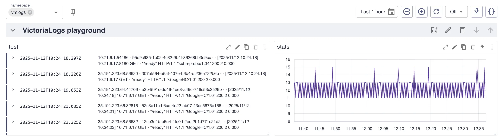
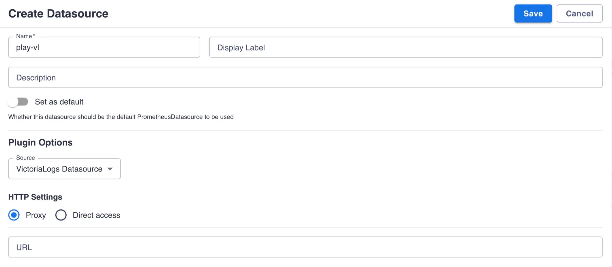
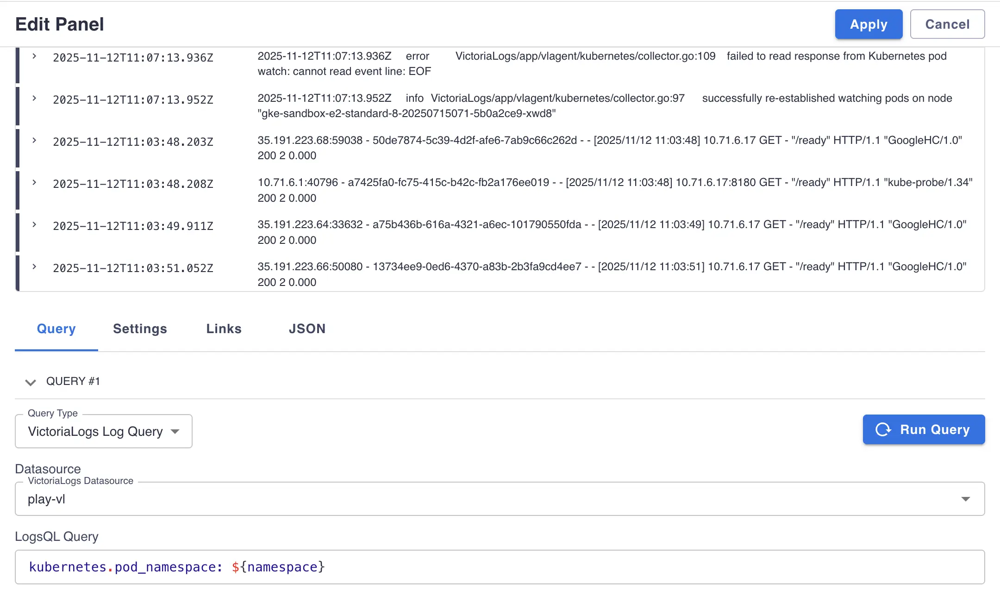

Starting with [Perses](https://perses.dev/) [v0.53.0-beta.2](https://github.com/perses/perses/releases/tag/v0.53.0-beta.2) release introduces first-class integration with VictoriaLogs.

# Plugins setup

## Datasource plugin

* Go to `http://<perses-url>/projects/<project-name>/datasources` and click `ADD DATASOURCE`.
* Fill `Name` field with desired datasource name and select `VictoriaLogs Datasource` in `Source` dropdown.
* Choose `Proxy` or `Direct access` depending on the public availability of your VictoriaLogs instance.
* Click `Save` to submit.

## Variables plugin

* Go to `http://<perses-url>/projects/<project-name>/variables` and click `ADD VARIABLE`.
* Fill `Name` field with desired variable name.
* Select `List` in `Type` dropdown.
* Select `VictoriaLogs Field Values Variable` in `Source` dropdown.
* Select the VictoriaLogs datasource you created above from the `VictoriaLogs Datasource` dropdown.
* Type [LogsQL query](https://docs.victoriametrics.com/victorialogs/logsql/) in `Query` field. The result of this query becomes the source of values for the variable.
* Type a name of field to extract values for into `Field Name` field.
* Click `Save` to submit.

# Create panels

## Logs Panel

* Go to project dashboard page `http://<perses-url>/projects/<project-name>/dashboards/<dashboard-name>`, click `Edit` and then `Panel` buttons.
* Fill `Name` field with desired panel name.
* Select `Logs Table` in `Type` dropdown.
* Select `VictoriaLogs Log Query` in `Query Type` dropdown.
* Select the VictoriaLogs datasource you created above from the `VictoriaLogs Datasource` dropdown.
* Type a valid [LogsQL query](https://docs.victoriametrics.com/victorialogs/logsql/) in `LogsQL Query` field, it may reference a variable defined in variables plugin section using `${var-name}` expression or with specific formats like `${var:pipe}` for regex filters or `${var:csv}` for comma-separated values.

## Time Series Panel

* Go to project dashboard page `http://<perses-url>/projects/<project-name>/dashboards/<dashboard-name>`, click `Edit` and then `Panel` buttons.
* Fill `Name` field with desired panel name.
* Select `Time Series Chart` in `Type` dropdown.
* Select `VictoriaLogs Time Series Query` in `Query Type` dropdown.
* Select the VictoriaLogs datasource you configured above from the `VictoriaLogs Datasource` dropdown.
* Type a valid [LogsQL stats query](https://docs.victoriametrics.com/victorialogs/logsql/#stats) you want to build a graph for in `LogsQL Query` field. Query may reference a variable defined in variables plugin section using `${var-name}` expression or with specific formats like `${var:pipe}` for regex filters or `${var:csv}` for comma-separated values.
* Click `Add` to save a panel.

